# インフラストラクチャ層の設計書

## 1. 概要

インフラストラクチャ層は、KMG 基盤（Foundation）の技術的な実装を提供します。
Spring Framework との統合、メッセージ管理、例外処理、ファイル操作など、アプリケーション全体で使用される共通機能を提供します。

## 2. パッケージ構成

```text
kmg.fund.infrastructure
├── cmn                       # 共通機能
│   ├── msg                   # メッセージ型定義インターフェース
│   │   ├── KmgFundCmnExcMsgTypes.java
│   │   ├── KmgFundCmnGenMsgTypes.java
│   │   ├── KmgFundCmnLogMsgTypes.java
│   │   ├── KmgFundCmnMsgTypes.java
│   │   ├── KmgFundCmnValMsgTypes.java
│   │   └── package-info.java
│   └── package-info.java
├── config                    # 設定機能
│   ├── KmgFundPropertiesLoader.java
│   └── package-info.java
├── context                   # コンテキスト管理
│   ├── KmgMessageSource.java
│   ├── SpringApplicationContextHelper.java
│   └── package-info.java
├── exception                 # 例外処理
│   ├── KmgFundMsgException.java
│   ├── KmgFundValException.java
│   └── package-info.java
├── model                     # モデル
│   ├── val                   # バリデーションモデル
│   │   ├── impl
│   │   │   ├── KmgFundValDataModelImpl.java
│   │   │   ├── KmgFundValsModelImpl.java
│   │   │   └── package-info.java
│   │   └── package-info.java
│   └── package-info.java
├── test                      # テスト支援
│   ├── AbstractKmgJunitTest.java
│   └── package-info.java
├── types                     # 型定義
│   ├── msg                   # メッセージ型実装
│   │   ├── KmgFundGenMsgTypes.java
│   │   ├── KmgFundLogMsgTypes.java
│   │   ├── KmgFundValMsgTypes.java
│   │   └── package-info.java
│   └── package-info.java
├── utils                     # ユーティリティ
│   ├── KmgPoiUtils.java
│   ├── KmgYamlUtils.java
│   └── package-info.java
└── package-info.java
```

## 3. 全体クラス図

```mermaid
classDiagram
    %% kmg-coreからの継承関係
    KmgMsgException <|-- KmgFundMsgException
    KmgValException <|-- KmgFundValException
    KmgValDataModelImpl <|-- KmgFundValDataModelImpl
    KmgValsModelImpl <|-- KmgFundValsModelImpl

    %% Spring統合
    EnvironmentPostProcessor <|.. KmgFundPropertiesLoader
    ApplicationContextAware <|.. SpringApplicationContextHelper
    Component .. KmgMessageSource
    Component .. SpringApplicationContextHelper
    Component .. KmgFundPropertiesLoader

    %% メッセージインターフェース階層
    KmgCmnMsgTypes <|-- KmgFundCmnMsgTypes
    KmgFundCmnMsgTypes <|-- KmgFundCmnExcMsgTypes
    KmgFundCmnMsgTypes <|-- KmgFundCmnGenMsgTypes
    KmgFundCmnMsgTypes <|-- KmgFundCmnLogMsgTypes
    KmgFundCmnExcMsgTypes <|-- KmgFundCmnValMsgTypes

    %% メッセージ実装
    KmgFundCmnGenMsgTypes <|.. KmgFundGenMsgTypes
    KmgFundCmnExcMsgTypes <|.. KmgFundGenMsgTypes
    KmgFundCmnLogMsgTypes <|.. KmgFundLogMsgTypes
    KmgFundCmnValMsgTypes <|.. KmgFundValMsgTypes
    KmgFundCmnExcMsgTypes <|.. KmgFundValMsgTypes

    %% 例外クラス
    class KmgFundMsgException {
        -KmgMessageSource messageSource
        +KmgFundMsgException(KmgFundCmnExcMsgTypes messageTypes)
        +KmgFundMsgException(KmgFundCmnExcMsgTypes messageTypes, Object[] messageArgs)
        +KmgFundMsgException(KmgFundCmnExcMsgTypes messageTypes, Object[] messageArgs, Throwable cause)
        +KmgFundMsgException(KmgFundCmnExcMsgTypes messageTypes, Throwable cause)
        #String createMessage()
        #void createMessageSource()
    }

    class KmgFundValException {
        +KmgFundValException(KmgValsModel validationsModel)
        +KmgFundValException(KmgValsModel validationsModel, Throwable cause)
    }

    %% 設定クラス
    class KmgFundPropertiesLoader {
        -Map~String,Object~ integratedPropertieMap
        -Map~String,Object~ mainPropertieMap
        -Map~String,Object~ kmgFundPropertieMap
        -Map~String,Object~ additionalPropertieMap
        +KmgFundPropertiesLoader()
        +void postProcessEnvironment(ConfigurableEnvironment environment, SpringApplication application)
        #void fromAdditionalProperties(Map~String,Object~ additionalPropertieMap)
        #void integrateProperties(Map~String,Object~ integratedPropertieMap)
        #static void fromPropertieMap(Resource resource, Map~String,Object~ propertieMap)
        -void integrateMessageBasename(Map~String,Object~ propertyMap, String propertyKey)
    }

    %% コンテキストクラス
    class KmgMessageSource {
        -static String CODE_EMBEDDING_FORMAT
        -MessageSource messageSource
        +String getExcMessage(KmgCmnExcMsgTypes type)
        +String getExcMessage(KmgCmnExcMsgTypes type, Object[] args)
        +String getGenMessage(KmgCmnGenMsgTypes type)
        +String getGenMessage(KmgCmnGenMsgTypes type, Object[] args)
        +String getLogMessage(KmgCmnLogMsgTypes type)
        +String getLogMessage(KmgCmnLogMsgTypes type, Object[] args)
        +String getMessage(KmgCmnMsgTypes type, boolean codeEmbeddingFlag)
        +String getMessage(KmgCmnMsgTypes type, Object[] args, boolean codeEmbeddingFlag)
    }

    class SpringApplicationContextHelper {
        -static ApplicationContext applicationContext
        +static ~T~ getBean(Class~T~ beanClass)
        +static ~T~ getBean(String beanName)
        +void setApplicationContext(ApplicationContext applicationContext)
        -SpringApplicationContextHelper()
    }

    %% モデルクラス
    class KmgFundValDataModelImpl {
        -KmgMessageSource messageSource
        +KmgFundValDataModelImpl(KmgFundCmnValMsgTypes messageTypes, Object[] messageArgs)
        #String createMessage()
        #void createMessageSource()
    }

    class KmgFundValsModelImpl {
        +KmgFundValsModelImpl()
    }

    %% ユーティリティクラス
    class KmgPoiUtils {
        +static Cell getCell(Sheet sheet, int rowIndex, int columnIndex)
        +static String getStringValue(Cell cell)
        +static String getStringFormulaValue(Cell cell)
        +static String getStringRangeValue(Cell cell)
        +static boolean isEmptyCell(Cell cell)
        -KmgPoiUtils()
    }

    class KmgYamlUtils {
        +static Map~String,Object~ load(Path path)
        -KmgYamlUtils()
    }

    %% テストクラス
    class AbstractKmgJunitTest {
        +AbstractKmgJunitTest()
        #void verifyKmgMsgException(KmgFundMsgException actualException, Class~?~ expectedCauseClass, String expectedDomainMessage, KmgFundCmnExcMsgTypes expectedMessageTypes)
        #void verifyKmgMsgException(KmgFundMsgException actualException, String expectedDomainMessage, KmgFundCmnExcMsgTypes expectedMessageTypes)
        #void verifyKmgMsgException(KmgMsgException actualException, Class~?~ expectedCauseClass, String expectedDomainMessage, KmgCmnGenMsgTypes expectedMessageTypes)
        #void verifyKmgMsgException(KmgMsgException actualException, String expectedDomainMessage, KmgCmnGenMsgTypes expectedMessageTypes)
    }

    %% 関係性
    KmgFundMsgException --> KmgMessageSource : uses
    KmgFundMsgException --> SpringApplicationContextHelper : uses
    KmgFundPropertiesLoader --> KmgApplicationPropertyFileTypes : uses
    KmgFundPropertiesLoader --> KmgApplicationPropertyKeyTypes : uses
    KmgFundValDataModelImpl --> KmgMessageSource : uses
    KmgFundValDataModelImpl --> SpringApplicationContextHelper : uses
    KmgYamlUtils --> KmgFundMsgException : throws
    KmgYamlUtils --> KmgFundGenMsgTypes : uses
```



## 4. サブパッケージ

インフラストラクチャ層は以下のサブパッケージで構成されます：

### 4.1 共通機能 (cmn)

- メッセージ型定義の基底インターフェース
- kmg-core のメッセージインターフェースを継承
- 詳細: [共通機能層の設計書](./インフラストラクチャ層共通機能層の設計書.md)

### 4.2 設定機能 (config)

- Spring Boot プロパティファイルの統合管理
- 環境後処理による設定の読み込み
- 詳細: [設定機能層の設計書](./インフラストラクチャ層設定機能層の設計書.md)

### 4.3 コンテキスト管理 (context)

- Spring アプリケーションコンテキストへのアクセス
- メッセージソースの管理
- 詳細: [コンテキスト管理層の設計書](./インフラストラクチャ層コンテキスト管理層の設計書.md)

### 4.4 例外処理 (exception)

- KMG 基盤専用の例外クラス
- kmg-core の例外クラスを拡張
- 詳細: [例外処理層の設計書](./インフラストラクチャ層例外処理層の設計書.md)

### 4.5 モデル (model)

- バリデーションモデルの実装
- kmg-core のモデルを拡張
- 詳細: [モデル層の設計書](./インフラストラクチャ層モデル層の設計書.md)

### 4.6 型定義 (types)

- メッセージ型の実装（enum）
- 詳細: [型定義層の設計書](./インフラストラクチャ層型定義層の設計書.md)

### 4.7 ユーティリティ (utils)

- Excel 操作ユーティリティ（Apache POI）
- YAML 操作ユーティリティ
- 詳細: [ユーティリティ層の設計書](./インフラストラクチャ層ユーティリティ層の設計書.md)

### 4.8 テスト支援 (test)

- JUnit テスト基底クラス
- 例外検証メソッド
- 詳細: [テスト支援層の設計書](./インフラストラクチャ層テスト支援層の設計書.md)

## 5. 主要な設計原則

### 5.1 Spring 統合

- `@Component`アノテーションによる Bean 管理
- `EnvironmentPostProcessor`によるプロパティ統合
- `ApplicationContextAware`によるコンテキストアクセス

### 5.2 拡張性

- プロパティローダーのサブクラス化による機能拡張
- メッセージインターフェースの階層化
- ユーティリティクラスの静的メソッド提供

### 5.3 依存性の方向

```text
┌──────────────────────────────────────────┐
│ 例外処理 (exception)                      │
│ ← コンテキスト (context)                  │
│ ← 設定 (config)                           │
└──────────────────────────────────────────┘
         ↑
┌──────────────────────────────────────────┐
│ モデル (model)                            │
│ ← コンテキスト (context)                  │
└──────────────────────────────────────────┘
         ↑
┌──────────────────────────────────────────┐
│ 型定義 (types)                            │
│ ← 共通機能 (cmn)                          │
└──────────────────────────────────────────┘
         ↑
┌──────────────────────────────────────────┐
│ ユーティリティ (utils)                    │
│ ← 例外処理 (exception)                    │
└──────────────────────────────────────────┘
         ↑
┌──────────────────────────────────────────┐
│ テスト支援 (test)                         │
│ ← 例外処理 (exception)                    │
│ ← 型定義 (types)                          │
└──────────────────────────────────────────┘
```

### 5.4 レイヤー間の責務分離

- **共通機能層**: インターフェース定義のみ
- **型定義層**: 具体的な列挙型の実装
- **例外処理層**: 例外クラスの実装
- **コンテキスト管理層**: Spring コンテキストとの橋渡し
- **設定機能層**: プロパティファイルの管理
- **モデル層**: ビジネスロジックに使用するデータモデル
- **ユーティリティ層**: 汎用的な機能の提供
- **テスト支援層**: テストコードで使用する基底機能

## 6. 全体的な使用フロー

### 6.1 起動時の処理フロー


### 6.2 実行時の処理フロー


## 7. 今後の拡張計画

### 7.1 追加予定の機能

1. **キャッシュ機能**

   - メッセージのキャッシュ
   - プロパティのキャッシュ

2. **監視機能**

   - プロパティファイルの変更監視
   - 動的な再読み込み

3. **バリデーション機能**

   - プロパティ値のバリデーション
   - 必須プロパティのチェック

4. **ログ機能の強化**
   - 構造化ログの出力
   - ログレベルの動的変更

### 7.2 追加予定のユーティリティ

- CSV ファイル操作
- JSON ファイル操作
- XML ファイル操作
- プロパティファイル操作

### 7.3 テスト機能の強化

- モック Bean の自動生成
- テストデータの自動生成
- テストレポートの生成
