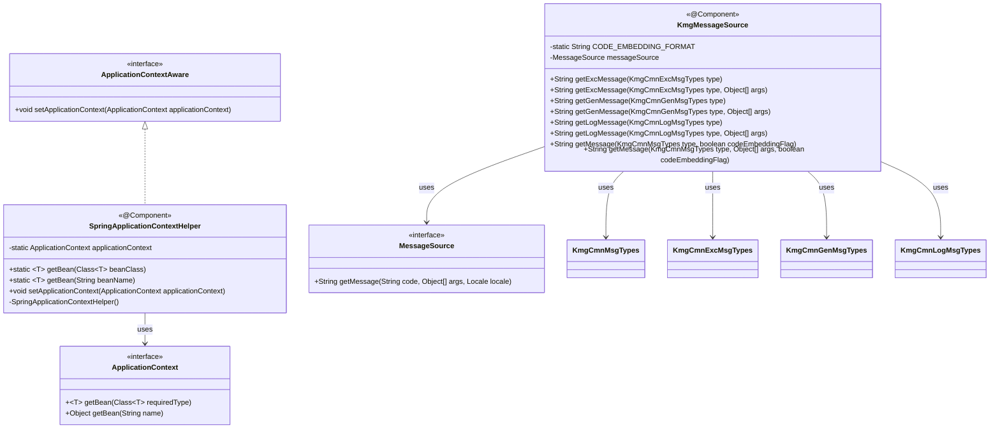
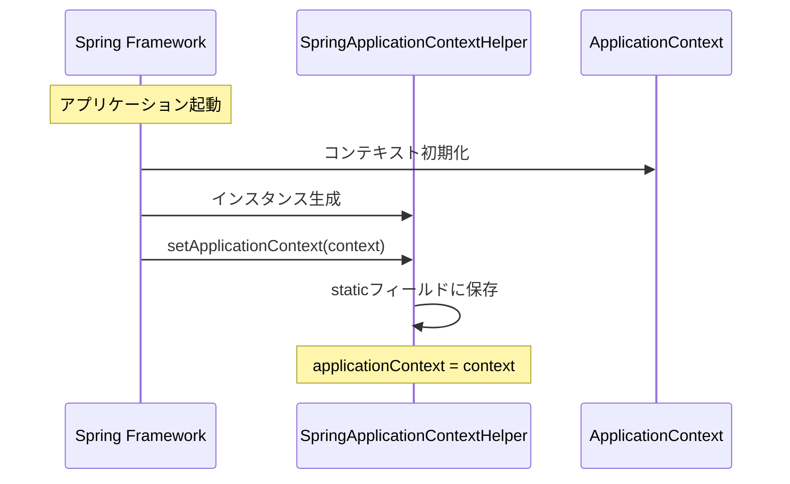
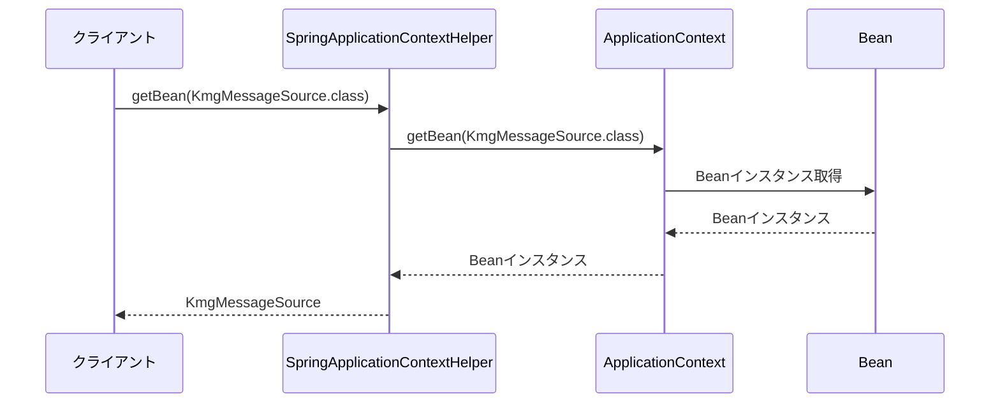
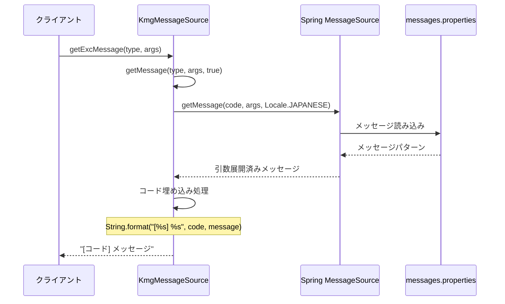
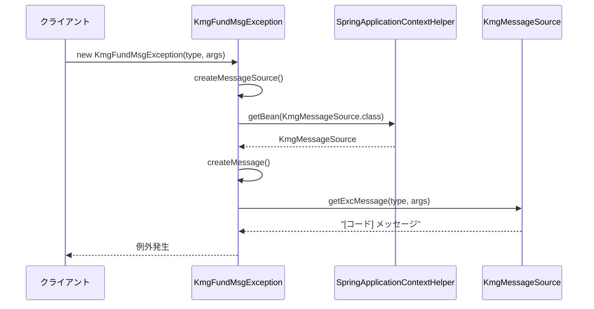

# インフラストラクチャ層コンテキスト管理層の設計書

## 1. 概要

コンテキスト管理層は、Spring アプリケーションコンテキストとメッセージリソースへのアクセスを Helper するクラスを提供します。
Spring 管理外のクラスから Bean を取得したり、国際化対応のメッセージを取得する機能を提供します。

## 2. パッケージ構成

```text
kmg.fund.infrastructure.context
├── KmgMessageSource.java
├── SpringApplicationContextHelper.java
└── package-info.java
```

## 3. クラス図



## 4. SpringApplicationContextHelper の詳細

### 4.1 概要

Spring のアプリケーションコンテキストへアクセスするための静的ヘルパークラスです。
Spring 管理外のクラスから Bean を取得できるようにします。

### 4.2 アノテーション

- `@Component`: Spring 管理 Bean として登録

### 4.3 フィールド

| フィールド名       | 型                 | 修飾子         | 説明                                   |
| ------------------ | ------------------ | -------------- | -------------------------------------- |
| applicationContext | ApplicationContext | private static | アプリケーションコンテキストの静的保持 |

### 4.4 メソッド

#### 4.4.1 getBean（クラス型指定）

```java
public static <T> T getBean(Class<T> beanClass)
```

指定されたクラス型の Bean を取得します。

**パラメータ:**

- `beanClass`: 取得する Bean のクラス型

**戻り値:**

- 指定された型の Bean インスタンス

**使用例:**

```java
KmgMessageSource messageSource =
    SpringApplicationContextHelper.getBean(KmgMessageSource.class);
```

#### 4.4.2 getBean（Bean 名指定）

```java
@SuppressWarnings("unchecked")
public static <T> T getBean(String beanName)
```

指定された名前の Bean を取得します。

**パラメータ:**

- `beanName`: Bean 名

**戻り値:**

- 指定された名前の Bean インスタンス

**使用例:**

```java
MyService myService =
    SpringApplicationContextHelper.getBean("myService");
```

#### 4.4.3 setApplicationContext

```java
@Override
public void setApplicationContext(ApplicationContext applicationContext)
    throws BeansException
```

アプリケーションコンテキストを設定します。
Spring フレームワークによって自動的に呼び出されます。

**パラメータ:**

- `applicationContext`: アプリケーションコンテキスト

#### 4.4.4 コンストラクタ

```java
private SpringApplicationContextHelper()
```

デフォルトコンストラクタ（private）。
静的メソッドのみを提供するため、インスタンス化を防止します。

## 5. KmgMessageSource の詳細

### 5.1 概要

メッセージリソースを管理し、多言語対応のメッセージを提供するクラスです。
Spring の`MessageSource`をラップし、メッセージコードの埋め込みなどの機能を追加します。

### 5.2 アノテーション

- `@Component`: Spring 管理 Bean として登録

### 5.3 定数

| 定数名                | 型     | 値        | 説明                       |
| --------------------- | ------ | --------- | -------------------------- |
| CODE_EMBEDDING_FORMAT | String | "[%s] %s" | コード埋め込みフォーマット |

### 5.4 フィールド

| フィールド名  | 型            | 修飾子     | 説明                          |
| ------------- | ------------- | ---------- | ----------------------------- |
| messageSource | MessageSource | @Autowired | Spring 管理のメッセージソース |

### 5.5 メソッド

#### 5.5.1 getExcMessage（例外用メッセージ）

```java
public String getExcMessage(KmgCmnExcMsgTypes type)
public String getExcMessage(KmgCmnExcMsgTypes type, Object[] args)
```

例外用メッセージを取得します（コード埋め込みあり）。

**パラメータ:**

- `type`: メッセージの種類
- `args`: メッセージの引数（省略可）

**戻り値:**

- `[コード] メッセージ`形式の文字列

**使用例:**

```java
String message = messageSource.getExcMessage(
    KmgFundGenMsgTypes.KMGFUND_GEN24000,
    new Object[] { "/path/to/file.yml" }
);
// => "[KMGFUND_GEN24000] 該当するYAMLファイルがありません。ファイルパス=[/path/to/file.yml]"
```

#### 5.5.2 getGenMessage（一般メッセージ）

```java
public String getGenMessage(KmgCmnGenMsgTypes type)
public String getGenMessage(KmgCmnGenMsgTypes type, Object[] args)
```

一般メッセージを取得します（コード埋め込みなし）。

**パラメータ:**

- `type`: メッセージの種類
- `args`: メッセージの引数（省略可）

**戻り値:**

- メッセージ文字列

**使用例:**

```java
String message = messageSource.getGenMessage(
    KmgFundGenMsgTypes.KMGFUND_GEN24000,
    new Object[] { "/path/to/file.yml" }
);
// => "該当するYAMLファイルがありません。ファイルパス=[/path/to/file.yml]"
```

#### 5.5.3 getLogMessage（ログメッセージ）

```java
public String getLogMessage(KmgCmnLogMsgTypes type)
public String getLogMessage(KmgCmnLogMsgTypes type, Object[] args)
```

ログメッセージを取得します（コード埋め込みあり）。

**パラメータ:**

- `type`: メッセージの種類
- `args`: メッセージの引数（省略可）

**戻り値:**

- `[コード] メッセージ`形式の文字列

#### 5.5.4 getMessage（汎用メッセージ取得）

```java
public String getMessage(KmgCmnMsgTypes type, boolean codeEmbeddingFlag)
public String getMessage(KmgCmnMsgTypes type, Object[] args, boolean codeEmbeddingFlag)
```

メッセージを取得します。コード埋め込みフラグで出力形式を制御します。

**パラメータ:**

- `type`: メッセージの種類
- `args`: メッセージの引数（省略可）
- `codeEmbeddingFlag`: コード埋め込みフラグ
  - `true`: `[コード] メッセージ`形式
  - `false`: `メッセージ`形式

**戻り値:**

- メッセージ文字列

## 6. シーケンス図

### 6.1 Spring 起動時のコンテキスト設定



### 6.2 Bean 取得の流れ



### 6.3 メッセージ取得の流れ



### 6.4 例外発生時のメッセージ取得



## 7. 使用例

### 7.1 Spring 管理外クラスからの Bean 取得

```java
public class NonSpringManagedClass {

    public void doSomething() {
        // Spring管理外のクラスからBeanを取得
        KmgMessageSource messageSource =
            SpringApplicationContextHelper.getBean(KmgMessageSource.class);

        String message = messageSource.getGenMessage(
            KmgFundGenMsgTypes.KMGFUND_GEN24000,
            new Object[] { "/path/to/file" }
        );

        System.out.println(message);
    }
}
```

### 7.2 Bean 名による取得

```java
public class SomeService {

    public void process() {
        // Bean名を指定して取得
        MyRepository repository =
            SpringApplicationContextHelper.getBean("myRepository");

        repository.save(data);
    }
}
```

### 7.3 例外用メッセージの取得

```java
@Service
public class FileService {

    @Autowired
    private KmgMessageSource messageSource;

    public void loadFile(Path path) throws KmgFundMsgException {
        if (!Files.exists(path)) {
            // 例外用メッセージ（コード埋め込みあり）
            String message = messageSource.getExcMessage(
                KmgFundGenMsgTypes.KMGFUND_GEN24000,
                new Object[] { path.toString() }
            );
            // => "[KMGFUND_GEN24000] 該当するYAMLファイルがありません。ファイルパス=[/path/to/file]"

            throw new KmgFundMsgException(
                KmgFundGenMsgTypes.KMGFUND_GEN24000,
                new Object[] { path.toString() }
            );
        }
    }
}
```

### 7.4 一般メッセージの取得

```java
@Service
public class NotificationService {

    @Autowired
    private KmgMessageSource messageSource;

    public void notifyUser(String fileName) {
        // 一般メッセージ（コード埋め込みなし）
        String message = messageSource.getGenMessage(
            KmgFundGenMsgTypes.KMGFUND_GEN24000,
            new Object[] { fileName }
        );
        // => "該当するYAMLファイルがありません。ファイルパス=[file.yml]"

        // ユーザーに表示
        showNotification(message);
    }
}
```

### 7.5 ログメッセージの取得

```java
@Service
public class LoggingService {

    @Autowired
    private KmgMessageSource messageSource;

    private static final Logger logger = LoggerFactory.getLogger(LoggingService.class);

    public void logError(String filePath) {
        // ログメッセージ（コード埋め込みあり）
        String message = messageSource.getLogMessage(
            KmgFundLogMsgTypes.SOME_LOG_MESSAGE,
            new Object[] { filePath }
        );

        logger.error(message);
    }
}
```

### 7.6 条件付きコード埋め込み

```java
@Service
public class MessageService {

    @Autowired
    private KmgMessageSource messageSource;

    public String getMessage(KmgCmnMsgTypes type, Object[] args, boolean forUser) {
        // ユーザー向けの場合はコード埋め込みなし
        // システムログの場合はコード埋め込みあり
        return messageSource.getMessage(type, args, !forUser);
    }
}
```

### 7.7 メッセージリソースファイル

**messages/kmg-fund.properties:**

```properties
# 一般メッセージ
KMGFUND_GEN24000=該当するYAMLファイルがありません。ファイルパス=[{0}]
KMGFUND_GEN24001=YAMLにロードするファイルの読み込みに失敗しました。ファイルパス=[{0}]

# ログメッセージ
KMGFUND_LOG10000=処理を開始しました。処理名=[{0}]
KMGFUND_LOG10001=処理が完了しました。処理名=[{0}], 経過時間=[{1}]ms

# バリデーションメッセージ
KMGFUND_VAL30000=入力値が不正です。フィールド=[{0}], 値=[{1}]
KMGFUND_VAL30001=必須項目が未入力です。フィールド=[{0}]
```

**application.properties:**

```properties
# メッセージベース名の設定
spring.messages.basename=messages/kmg-fund,messages/app
spring.messages.encoding=UTF-8
spring.messages.cache-duration=3600
```

## 8. 設計上の注意点

### 8.1 SpringApplicationContextHelper の使用

**推奨される使用場所:**

- Spring 管理外のクラス
- 静的メソッド内
- ユーティリティクラス

**推奨されない使用場所:**

- Spring 管理 Bean のクラス（`@Autowired`を使用すべき）
- 頻繁に呼び出されるメソッド（パフォーマンス上の理由）

**理由:**

- Spring 管理 Bean では、通常の DI を使用する方が明示的
- ApplicationContext の検索にはコストがかかる

### 8.2 メッセージソースの使用

**メッセージタイプの選択:**

| メッセージタイプ | 使用場所         | コード埋め込み |
| ---------------- | ---------------- | -------------- |
| 例外メッセージ   | 例外のメッセージ | あり           |
| 一般メッセージ   | ユーザー向け表示 | なし           |
| ログメッセージ   | ログ出力         | あり           |

**引数の型:**

- プリミティブ型
- 文字列
- `toString()`が適切に実装されたオブジェクト

### 8.3 スレッドセーフティ

- `SpringApplicationContextHelper`の static フィールドは、起動時に 1 回だけ設定される
- `KmgMessageSource`は Spring 管理 Bean で、スレッドセーフ
- 両クラスとも、マルチスレッド環境で安全に使用可能

### 8.4 パフォーマンス考慮事項

- メッセージソースはキャッシュされる
- 同じメッセージの繰り返し取得は高速
- ApplicationContext の検索は、頻繁に呼ばれる処理には不向き

## 9. 今後の拡張

### 9.1 メッセージキャッシュの強化

```java
@Component
public class CachedKmgMessageSource extends KmgMessageSource {

    private final Map<String, String> messageCache = new ConcurrentHashMap<>();

    @Override
    public String getMessage(KmgCmnMsgTypes type, Object[] args, boolean codeEmbeddingFlag) {
        String cacheKey = createCacheKey(type, args, codeEmbeddingFlag);

        return messageCache.computeIfAbsent(cacheKey,
            k -> super.getMessage(type, args, codeEmbeddingFlag));
    }

    private String createCacheKey(KmgCmnMsgTypes type, Object[] args, boolean flag) {
        return type.getCode() + ":" + Arrays.toString(args) + ":" + flag;
    }
}
```

### 9.2 動的ロケール対応

```java
@Component
public class LocaleAwareKmgMessageSource extends KmgMessageSource {

    public String getMessage(KmgCmnMsgTypes type, Object[] args,
                            boolean codeEmbeddingFlag, Locale locale) {
        // 指定されたロケールでメッセージ取得
        String message = this.messageSource.getMessage(
            type.getCode(), args, locale);

        if (codeEmbeddingFlag) {
            message = String.format(CODE_EMBEDDING_FORMAT,
                type.getCode(), message);
        }

        return message;
    }
}
```

### 9.3 メッセージのフォールバック

```java
@Component
public class FallbackKmgMessageSource extends KmgMessageSource {

    @Override
    public String getMessage(KmgCmnMsgTypes type, Object[] args, boolean codeEmbeddingFlag) {
        try {
            return super.getMessage(type, args, codeEmbeddingFlag);
        } catch (NoSuchMessageException e) {
            // メッセージが見つからない場合のフォールバック
            logger.warn("メッセージが見つかりません: {}", type.getCode());
            return "[" + type.getCode() + "] メッセージが定義されていません";
        }
    }
}
```
