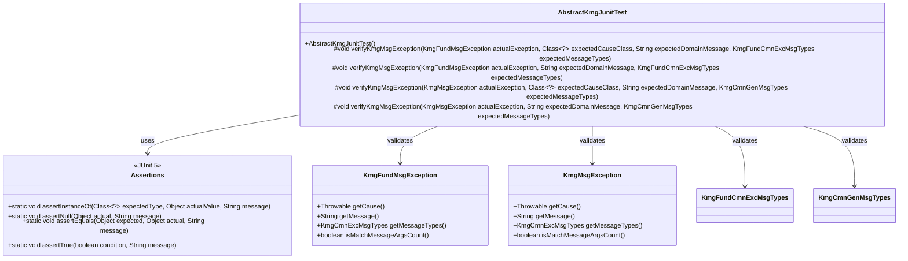
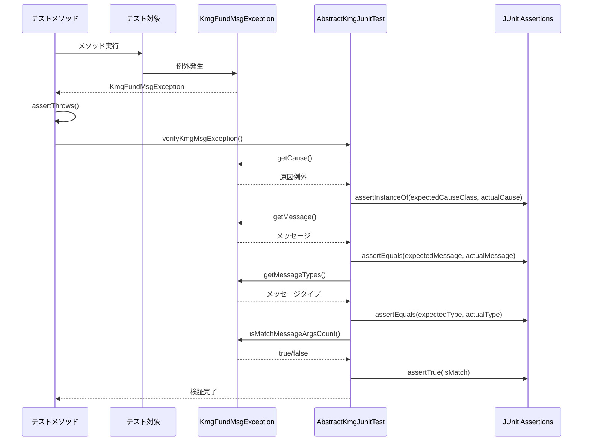

# インフラストラクチャ層テスト支援層の設計書

## 1. 概要

テスト支援層は、JUnit テストで使用する基底クラスと検証メソッドを提供します。
例外の検証を簡素化し、テストコードの可読性と保守性を向上させます。

## 2. パッケージ構成

```text
kmg.fund.infrastructure.test
├── AbstractKmgJunitTest.java
└── package-info.java
```

## 3. クラス図



## 4. AbstractKmgJunitTest の詳細

### 4.1 概要

JUnit テストの抽象基底クラスです。
例外の検証メソッドを提供し、テストコードを簡潔に記述できるようにします。

### 4.2 アノテーション

```java
@SuppressWarnings({
    "nls",          // 文字列のNLS警告を抑制
    "static-method" // 静的メソッドの警告を抑制
})
```

### 4.3 コンストラクタ

```java
public AbstractKmgJunitTest()
```

デフォルトコンストラクタ。
特別な初期化処理はありません。

### 4.4 検証メソッド

#### 4.4.1 KmgFundMsgException の検証（原因あり）

```java
protected void verifyKmgMsgException(
    KmgFundMsgException actualException,
    Class<?> expectedCauseClass,
    String expectedDomainMessage,
    KmgFundCmnExcMsgTypes expectedMessageTypes)
```

KmgFundMsgException を検証します（原因例外のクラスも検証）。

**パラメータ:**

- `actualException`: 実際の例外
- `expectedCauseClass`: 期待する原因のクラス（`null`の場合は原因がないことを検証）
- `expectedDomainMessage`: 期待するドメインメッセージ
- `expectedMessageTypes`: 期待するメッセージの種類

**検証項目:**

1. 原因例外のクラスが期待する型であること
2. メッセージが期待する内容であること
3. メッセージタイプが期待する種類であること
4. メッセージ引数の数が一致していること

**使用例:**

```java
@Test
public void testFileNotFound() {
    Path path = Paths.get("/nonexistent/file.yml");

    KmgFundMsgException exception = assertThrows(
        KmgFundMsgException.class,
        () -> KmgYamlUtils.load(path)
    );

    verifyKmgMsgException(
        exception,
        NoSuchFileException.class,  // 原因はNoSuchFileException
        "[KMGFUND_GEN24000] 該当するYAMLファイルがありません。ファイルパス=[/nonexistent/file.yml]",
        KmgFundGenMsgTypes.KMGFUND_GEN24000
    );
}
```

#### 4.4.2 KmgFundMsgException の検証（原因なし）

```java
protected void verifyKmgMsgException(
    KmgFundMsgException actualException,
    String expectedDomainMessage,
    KmgFundCmnExcMsgTypes expectedMessageTypes)
```

KmgFundMsgException を検証します（原因例外がないことを検証）。

**パラメータ:**

- `actualException`: 実際の例外
- `expectedDomainMessage`: 期待するドメインメッセージ
- `expectedMessageTypes`: 期待するメッセージの種類

**検証項目:**

1. 原因例外が`null`であること
2. メッセージが期待する内容であること
3. メッセージタイプが期待する種類であること
4. メッセージ引数の数が一致していること

**使用例:**

```java
@Test
public void testValidationError() {
    User user = new User();
    user.setName("");  // 空の名前

    KmgFundMsgException exception = assertThrows(
        KmgFundMsgException.class,
        () -> userValidator.validate(user)
    );

    verifyKmgMsgException(
        exception,
        "[KMGFUND_VAL30001] 必須項目が未入力です。フィールド=[name]",
        KmgFundValMsgTypes.KMGFUND_VAL30001
    );
}
```

#### 4.4.3 KmgMsgException の検証（原因あり）

```java
protected void verifyKmgMsgException(
    KmgMsgException actualException,
    Class<?> expectedCauseClass,
    String expectedDomainMessage,
    KmgCmnGenMsgTypes expectedMessageTypes)
```

KmgMsgException（基底クラス）を検証します（原因例外のクラスも検証）。

**パラメータ:**

- `actualException`: 実際の例外
- `expectedCauseClass`: 期待する原因のクラス
- `expectedDomainMessage`: 期待するドメインメッセージ
- `expectedMessageTypes`: 期待するメッセージの種類

**使用例:**

```java
@Test
public void testCoreException() {
    KmgMsgException exception = assertThrows(
        KmgMsgException.class,
        () -> someService.execute()
    );

    verifyKmgMsgException(
        exception,
        IllegalArgumentException.class,
        "エラーメッセージ",
        KmgCoreGenMsgTypes.SOME_MESSAGE_TYPE
    );
}
```

#### 4.4.4 KmgMsgException の検証（原因なし）

```java
protected void verifyKmgMsgException(
    KmgMsgException actualException,
    String expectedDomainMessage,
    KmgCmnGenMsgTypes expectedMessageTypes)
```

KmgMsgException（基底クラス）を検証します（原因例外がないことを検証）。

**パラメータ:**

- `actualException`: 実際の例外
- `expectedDomainMessage`: 期待するドメインメッセージ
- `expectedMessageTypes`: 期待するメッセージの種類

**使用例:**

```java
@Test
public void testSimpleException() {
    KmgMsgException exception = assertThrows(
        KmgMsgException.class,
        () -> someService.validate()
    );

    verifyKmgMsgException(
        exception,
        "エラーメッセージ",
        KmgCoreGenMsgTypes.SOME_MESSAGE_TYPE
    );
}
```

## 5. シーケンス図

### 5.1 例外検証の流れ



## 6. 使用例

### 6.1 基本的な例外検証

```java
public class YamlUtilsTest extends AbstractKmgJunitTest {

    @Test
    public void testLoadFileNotFound() {
        // テストデータの準備
        Path nonExistentPath = Paths.get("/nonexistent/file.yml");

        // 例外の発生を確認
        KmgFundMsgException exception = assertThrows(
            KmgFundMsgException.class,
            () -> KmgYamlUtils.load(nonExistentPath)
        );

        // 例外の検証
        verifyKmgMsgException(
            exception,
            NoSuchFileException.class,
            "[KMGFUND_GEN24000] 該当するYAMLファイルがありません。ファイルパス=[/nonexistent/file.yml]",
            KmgFundGenMsgTypes.KMGFUND_GEN24000
        );
    }
}
```

### 6.2 原因なし例外の検証

```java
public class ValidationTest extends AbstractKmgJunitTest {

    @Autowired
    private UserValidator userValidator;

    @Test
    public void testValidateEmptyName() {
        // テストデータの準備
        User user = new User();
        user.setName("");
        user.setEmail("test@example.com");

        // 例外の発生を確認
        KmgFundValException exception = assertThrows(
            KmgFundValException.class,
            () -> userValidator.validate(user)
        );

        // バリデーションモデルの検証
        KmgValsModel validations = exception.getValidationsModel();
        assertNotNull(validations);
        assertTrue(validations.isNotEmpty());
        assertEquals(1, validations.getDatas().size());

        // 個別のバリデーションデータの検証
        KmgValDataModel valData = validations.getDatas().get(0);
        assertEquals(KmgFundValMsgTypes.KMGFUND_VAL30001, valData.getMessageTypes());
    }
}
```

### 6.3 複数の例外ケースのテスト

```java
public class FileServiceTest extends AbstractKmgJunitTest {

    @Autowired
    private FileService fileService;

    @Test
    public void testFileNotFound() {
        Path path = Paths.get("/nonexistent/file.yml");

        KmgFundMsgException exception = assertThrows(
            KmgFundMsgException.class,
            () -> fileService.loadFile(path)
        );

        verifyKmgMsgException(
            exception,
            NoSuchFileException.class,
            "[KMGFUND_GEN24000] 該当するYAMLファイルがありません。ファイルパス=[/nonexistent/file.yml]",
            KmgFundGenMsgTypes.KMGFUND_GEN24000
        );
    }

    @Test
    public void testFileReadError() throws IOException {
        // 読み込み不可能なファイルを作成
        Path path = Files.createTempFile("test", ".yml");
        path.toFile().setReadable(false);

        try {
            KmgFundMsgException exception = assertThrows(
                KmgFundMsgException.class,
                () -> fileService.loadFile(path)
            );

            verifyKmgMsgException(
                exception,
                AccessDeniedException.class,
                "[KMGFUND_GEN24001] YAMLにロードするファイルの読み込みに失敗しました。ファイルパス=[" + path + "]",
                KmgFundGenMsgTypes.KMGFUND_GEN24001
            );

        } finally {
            path.toFile().setReadable(true);
            Files.deleteIfExists(path);
        }
    }
}
```

### 6.4 パラメータ化テストとの組み合わせ

```java
public class ValidationParameterizedTest extends AbstractKmgJunitTest {

    @ParameterizedTest
    @MethodSource("invalidUsers")
    public void testInvalidUsers(User user, KmgFundCmnValMsgTypes expectedType, String expectedField) {
        KmgFundValException exception = assertThrows(
            KmgFundValException.class,
            () -> userValidator.validate(user)
        );

        KmgValsModel validations = exception.getValidationsModel();
        assertTrue(validations.isNotEmpty());

        KmgValDataModel valData = validations.getDatas().get(0);
        assertEquals(expectedType, valData.getMessageTypes());
        assertTrue(valData.getMessage().contains(expectedField));
    }

    static Stream<Arguments> invalidUsers() {
        return Stream.of(
            Arguments.of(
                new User("", "test@example.com"),
                KmgFundValMsgTypes.KMGFUND_VAL30001,
                "name"
            ),
            Arguments.of(
                new User("Test", ""),
                KmgFundValMsgTypes.KMGFUND_VAL30001,
                "email"
            ),
            Arguments.of(
                new User("Test", "invalid-email"),
                KmgFundValMsgTypes.KMGFUND_VAL30000,
                "email"
            )
        );
    }
}
```

### 6.5 ネストテストでの使用

```java
public class UserServiceTest extends AbstractKmgJunitTest {

    @Nested
    @DisplayName("ユーザー作成テスト")
    class CreateUserTests {

        @Test
        @DisplayName("正常系：ユーザーが作成される")
        public void testCreateUserSuccess() {
            User user = new User("Test", "test@example.com");
            User created = userService.create(user);
            assertNotNull(created.getId());
        }

        @Test
        @DisplayName("異常系：バリデーションエラー")
        public void testCreateUserValidationError() {
            User user = new User("", "test@example.com");

            KmgFundValException exception = assertThrows(
                KmgFundValException.class,
                () -> userService.create(user)
            );

            assertTrue(exception.getValidationsModel().isNotEmpty());
        }
    }

    @Nested
    @DisplayName("ユーザー検索テスト")
    class FindUserTests {

        @Test
        @DisplayName("正常系：ユーザーが見つかる")
        public void testFindUserSuccess() {
            User found = userService.findById(1L);
            assertNotNull(found);
        }

        @Test
        @DisplayName("異常系：ユーザーが見つからない")
        public void testFindUserNotFound() {
            KmgFundMsgException exception = assertThrows(
                KmgFundMsgException.class,
                () -> userService.findById(9999L)
            );

            verifyKmgMsgException(
                exception,
                "[KMGFUND_GEN25000] ユーザーが見つかりません。ID=[9999]",
                KmgFundGenMsgTypes.KMGFUND_GEN25000
            );
        }
    }
}
```

## 7. 設計上の注意点

### 7.1 テストクラスの継承

- テストクラスは`AbstractKmgJunitTest`を継承する
- 基底クラスの検証メソッドを活用する
- 独自の検証メソッドを追加しても良い

### 7.2 例外メッセージの検証

- メッセージの完全一致を検証する
- メッセージコードが埋め込まれている場合は含めて検証
- プレースホルダー部分も実際の値で検証

### 7.3 原因例外の検証

- 原因例外のクラスを検証する
- 原因がない場合は`null`を指定
- 原因例外のメッセージも必要に応じて検証

### 7.4 メッセージ引数の一致確認

- `isMatchMessageArgsCount()`で引数の数を確認
- メッセージパターンと引数の数が一致していることを保証
- 不一致の場合はメッセージ定義を見直す

## 8. 今後の拡張

### 8.1 カスタム検証メソッドの追加

```java
public abstract class AbstractKmgJunitTest {

    /**
     * バリデーション例外の詳細検証
     */
    protected void verifyKmgValException(
        KmgFundValException actualException,
        int expectedErrorCount,
        KmgFundCmnValMsgTypes... expectedTypes) {

        KmgValsModel validations = actualException.getValidationsModel();

        assertEquals(expectedErrorCount, validations.getDatas().size(),
            "バリデーションエラーの数が一致すること");

        List<KmgCmnValMsgTypes> actualTypes = validations.getDatas().stream()
            .map(KmgValDataModel::getMessageTypes)
            .collect(Collectors.toList());

        for (KmgFundCmnValMsgTypes expectedType : expectedTypes) {
            assertTrue(actualTypes.contains(expectedType),
                "期待するバリデーションエラーが含まれること: " + expectedType);
        }
    }
}
```

### 8.2 アサーションメッセージのカスタマイズ

```java
public abstract class AbstractKmgJunitTest {

    /**
     * カスタムメッセージ付き検証
     */
    protected void verifyKmgMsgException(
        KmgFundMsgException actualException,
        String expectedDomainMessage,
        KmgFundCmnExcMsgTypes expectedMessageTypes,
        String assertionMessage) {

        Throwable actualCause = actualException.getCause();
        String actualDomainMessage = actualException.getMessage();
        KmgCmnExcMsgTypes actualMessageTypes = actualException.getMessageTypes();

        assertNull(actualCause, assertionMessage + ": 原因がnullであること");
        assertEquals(expectedDomainMessage, actualDomainMessage,
            assertionMessage + ": メッセージが正しいこと");
        assertEquals(expectedMessageTypes, actualMessageTypes,
            assertionMessage + ": メッセージの種類が正しいこと");
    }
}
```

### 8.3 ログ検証機能

```java
public abstract class AbstractKmgJunitTest {

    @RegisterExtension
    protected LogCaptureExtension logCapture = new LogCaptureExtension();

    /**
     * ログメッセージの検証
     */
    protected void verifyLogMessage(Level level, String expectedMessage) {
        List<String> logs = logCapture.getLogs(level);
        assertTrue(logs.stream().anyMatch(log -> log.contains(expectedMessage)),
            "期待するログメッセージが出力されていること");
    }
}
```

### 8.4 テストデータビルダーの提供

```java
public abstract class AbstractKmgJunitTest {

    /**
     * ユーザーテストデータビルダー
     */
    protected static class UserBuilder {
        private String name = "Test User";
        private String email = "test@example.com";

        public UserBuilder withName(String name) {
            this.name = name;
            return this;
        }

        public UserBuilder withEmail(String email) {
            this.email = email;
            return this;
        }

        public User build() {
            return new User(name, email);
        }
    }

    protected UserBuilder user() {
        return new UserBuilder();
    }
}
```

使用例：

```java
@Test
public void testWithBuilder() {
    User user = user()
        .withName("")
        .withEmail("test@example.com")
        .build();

    // テスト処理
}
```
