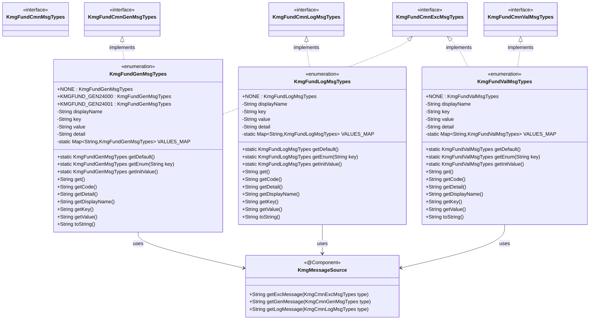
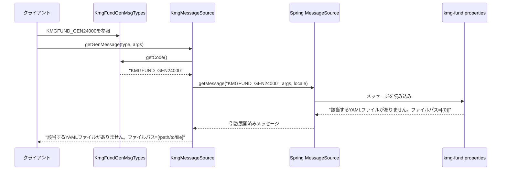

# インフラストラクチャ層型定義層メッセージ型実装の設計書

## 1. 概要

メッセージ型実装層は、KMG 基盤のメッセージ型インターフェースを実装する列挙型を提供します。
`kmg.fund.infrastructure.cmn.msg`パッケージで定義されたインターフェースを実装し、
具体的なメッセージの定義と管理機能を提供します。

このパッケージは、型安全なメッセージ管理を実現し、国際化対応のメッセージリソースと連携します。

## 2. パッケージ構成

```text
kmg.fund.infrastructure.types.msg
├── KmgFundGenMsgTypes.java
├── KmgFundLogMsgTypes.java
├── KmgFundValMsgTypes.java
└── package-info.java
```

## 3. クラス図



## 4. KmgFundGenMsgTypes の詳細

### 4.1 概要

KMG 基盤一般メッセージの種類を定義する列挙型です。
一般メッセージと例外メッセージの両方の用途で使用できます。

### 4.2 アノテーション

```java
@SuppressWarnings({
    "nls",
})
```

- `nls`: 文字列の外部化（国際化）の警告を抑制

### 4.3 実装インターフェース

- `KmgFundCmnGenMsgTypes`: 一般メッセージインターフェース
- `KmgFundCmnExcMsgTypes`: 例外メッセージインターフェース

#### 多重実装の理由

- 同じメッセージを異なるコンテキストで使用可能にするため
- 一般メッセージとして表示したり、例外メッセージとして使用したりできる

### 4.4 列挙定数

| 定数名           | キー               | 説明                                                                  | since |
| ---------------- | ------------------ | --------------------------------------------------------------------- | ----- |
| NONE             | "NONE"             | 指定無し                                                              | 0.1.0 |
| KMGFUND_GEN24000 | "KMGFUND_GEN24000" | 該当する YAML ファイルがありません。ファイルパス=[{0}]                | 0.1.0 |
| KMGFUND_GEN24001 | "KMGFUND_GEN24001" | YAML にロードするファイルの読み込みに失敗しました。ファイルパス=[{0}] | 0.1.0 |

### 4.5 フィールド

| フィールド名 | 型                              | 修飾子         | 説明                                   |
| ------------ | ------------------------------- | -------------- | -------------------------------------- |
| VALUES_MAP   | Map<String, KmgFundGenMsgTypes> | private static | キーから列挙型を取得するためのマップ   |
| displayName  | String                          | private final  | 表示名（メッセージのテンプレート）     |
| key          | String                          | private final  | メッセージのキー（列挙型の名前と同じ） |
| value        | String                          | private final  | メッセージの値（displayName と同じ）   |
| detail       | String                          | private final  | 詳細情報（displayName と同じ）         |

#### VALUES_MAP の用途

- 文字列のキーから列挙型インスタンスを高速に検索
- 静的イニシャライザで全列挙型をマップに登録
- `getEnum(String key)`メソッドで使用

### 4.6 静的メソッド

#### 4.6.1 getDefault

```java
public static KmgFundGenMsgTypes getDefault()
```

デフォルトの種類を返します。

**戻り値:**

- `NONE`: デフォルト値

**使用例:**

```java
KmgFundGenMsgTypes defaultType = KmgFundGenMsgTypes.getDefault();
// => NONE
```

#### 4.6.2 getEnum

```java
public static KmgFundGenMsgTypes getEnum(final String key)
```

キーに該当する種類を返します。
キーが存在しない場合は、指定無し（NONE）を返します。

**パラメータ:**

- `key`: キー（列挙型の名前）

**戻り値:**

- 該当する列挙型インスタンス、存在しない場合は`NONE`

**使用例:**

```java
KmgFundGenMsgTypes type = KmgFundGenMsgTypes.getEnum("KMGFUND_GEN24000");
// => KMGFUND_GEN24000

KmgFundGenMsgTypes invalidType = KmgFundGenMsgTypes.getEnum("INVALID_KEY");
// => NONE
```

#### 4.6.3 getInitValue

```java
public static KmgFundGenMsgTypes getInitValue()
```

初期値の種類を返します。

**戻り値:**

- `NONE`: 初期値

**使用例:**

```java
KmgFundGenMsgTypes initValue = KmgFundGenMsgTypes.getInitValue();
// => NONE
```

### 4.7 インスタンスメソッド

#### 4.7.1 get

```java
@Override
public String get()
```

メッセージのキーを返します。

**戻り値:**

- メッセージのキー（列挙型の名前）

**実装詳細:**

- 内部的に`getKey()`を呼び出す

#### 4.7.2 getCode

```java
@Override
public String getCode()
```

メッセージのコードを返します。

**戻り値:**

- メッセージのコード（列挙型の名前）

**実装詳細:**

- 内部的に`getKey()`を呼び出す

#### 4.7.3 getDetail

```java
@Override
public String getDetail()
```

詳細情報を返します。

**戻り値:**

- 詳細情報（displayName と同じ）

#### 4.7.4 getDisplayName

```java
@Override
public String getDisplayName()
```

表示名を返します。

**戻り値:**

- 表示名（メッセージのテンプレート）

#### 4.7.5 getKey

```java
@Override
public String getKey()
```

メッセージのキーを返します。

**戻り値:**

- メッセージのキー（列挙型の名前）

#### 4.7.6 getValue

```java
@Override
public String getValue()
```

メッセージの値を返します。

**戻り値:**

- メッセージの値（displayName と同じ）

#### 4.7.7 toString

```java
@Override
public String toString()
```

メッセージのキーを返します。

**戻り値:**

- メッセージのキー（列挙型の名前）

**実装詳細:**

- 内部的に`getKey()`を呼び出す

### 4.8 コンストラクタ

```java
KmgFundGenMsgTypes(final String displayName)
```

列挙型のコンストラクタです。

**パラメータ:**

- `displayName`: 表示名（メッセージのテンプレート）

**処理内容:**

1. `displayName`フィールドに引数を設定
2. `key`フィールドに`super.name()`（列挙型の名前）を設定
3. `value`フィールドに`displayName`を設定
4. `detail`フィールドに`displayName`を設定

### 4.9 静的イニシャライザ

```java
static {
    /* 種類のマップにプット */
    for (final KmgFundGenMsgTypes type : KmgFundGenMsgTypes.values()) {
        KmgFundGenMsgTypes.VALUES_MAP.put(type.get(), type);
    }
}
```

**処理内容:**

- クラスロード時に実行される
- 全列挙型インスタンスを`VALUES_MAP`に登録
- キーから列挙型への高速検索を実現

## 5. KmgFundLogMsgTypes の詳細

### 5.1 概要

KMG 基盤ログメッセージの種類を定義する列挙型です。
ログ出力専用のメッセージを定義します。

### 5.2 実装インターフェース

- `KmgFundCmnLogMsgTypes`: ログメッセージインターフェース

### 5.3 列挙定数

| 定数名 | キー   | 説明     | since |
| ------ | ------ | -------- | ----- |
| NONE   | "NONE" | 指定無し | 0.1.0 |

**注:** 現在はプレースホルダーのみ。今後、ログメッセージが追加される予定。

### 5.4 構造

`KmgFundGenMsgTypes`と同じフィールド、メソッド、静的イニシャライザ構成を持ちます。

**違い:**

- 実装インターフェースが`KmgFundCmnLogMsgTypes`のみ
- 例外メッセージとしては使用できない

## 6. KmgFundValMsgTypes の詳細

### 6.1 概要

KMG 基盤バリデーションメッセージの種類を定義する列挙型です。
入力値の検証エラーメッセージを定義し、例外メッセージとしても使用できます。

### 6.2 実装インターフェース

- `KmgFundCmnValMsgTypes`: バリデーションメッセージインターフェース
- `KmgFundCmnExcMsgTypes`: 例外メッセージインターフェース

**多重実装の理由:**

- バリデーションエラーは通常、例外として扱われるため
- バリデーション専用メッセージと例外メッセージの両方の機能を持つ

### 6.3 列挙定数

| 定数名 | キー   | 説明     | since |
| ------ | ------ | -------- | ----- |
| NONE   | "NONE" | 指定無し | 0.1.0 |

**注:** 現在はプレースホルダーのみ。今後、バリデーションメッセージが追加される予定。

### 6.4 構造

`KmgFundGenMsgTypes`と同じフィールド、メソッド、静的イニシャライザ構成を持ちます。

**違い:**

- 実装インターフェースが`KmgFundCmnValMsgTypes`と`KmgFundCmnExcMsgTypes`
- バリデーション専用の用途で使用

## 7. メッセージリソースファイルとの連携

### 7.1 プロパティファイルの配置

メッセージの実際の内容は、プロパティファイルで管理されます。

```text
src/main/resources/
└── messages/
    ├── kmg-fund.properties          （日本語：デフォルト）
    ├── kmg-fund_en.properties       （英語）
    └── kmg-fund_zh.properties       （中国語）
```

### 7.2 プロパティファイルの内容

**messages/kmg-fund.properties:**

```properties
# 一般メッセージ
KMGFUND_GEN24000=該当するYAMLファイルがありません。ファイルパス=[{0}]
KMGFUND_GEN24001=YAMLにロードするファイルの読み込みに失敗しました。ファイルパス=[{0}]

# ログメッセージ
# （将来追加予定）

# バリデーションメッセージ
# （将来追加予定）
```

### 7.3 メッセージ取得のフロー



### 7.4 キーの対応関係

| 列挙型定数       | getCode()の戻り値  | プロパティキー   |
| ---------------- | ------------------ | ---------------- |
| KMGFUND_GEN24000 | "KMGFUND_GEN24000" | KMGFUND_GEN24000 |
| KMGFUND_GEN24001 | "KMGFUND_GEN24001" | KMGFUND_GEN24001 |

**重要な設計:**

- 列挙型の定数名 = メッセージキー
- `super.name()`で列挙型の名前を取得
- プロパティファイルのキーと完全一致

## 8. 使用例

### 8.1 例外でのメッセージ使用

```java
public class YamlFileService {

    public void loadYamlFile(Path filePath) throws KmgFundMsgException {
        if (!Files.exists(filePath)) {
            // ファイル不存在エラー
            throw new KmgFundMsgException(
                KmgFundGenMsgTypes.KMGFUND_GEN24000,
                new Object[] { filePath.toString() }
            );
        }

        try {
            // YAML読み込み処理
            Yaml yaml = new Yaml();
            Map<String, Object> data = yaml.load(Files.newInputStream(filePath));

        } catch (IOException e) {
            // ファイル読み込みエラー
            throw new KmgFundMsgException(
                KmgFundGenMsgTypes.KMGFUND_GEN24001,
                new Object[] { filePath.toString() },
                e
            );
        }
    }
}
```

### 8.2 メッセージソースでの使用

```java
@Service
public class FileNotificationService {

    @Autowired
    private KmgMessageSource messageSource;

    public void notifyFileNotFound(Path filePath) {
        // 一般メッセージとして取得（コード埋め込みなし）
        String message = messageSource.getGenMessage(
            KmgFundGenMsgTypes.KMGFUND_GEN24000,
            new Object[] { filePath.toString() }
        );
        // => "該当するYAMLファイルがありません。ファイルパス=[/path/to/file.yml]"

        // ユーザーに通知
        showNotification(message);
    }

    public void logFileNotFound(Path filePath) {
        // 例外メッセージとして取得（コード埋め込みあり）
        String message = messageSource.getExcMessage(
            KmgFundGenMsgTypes.KMGFUND_GEN24000,
            new Object[] { filePath.toString() }
        );
        // => "[KMGFUND_GEN24000] 該当するYAMLファイルがありません。ファイルパス=[/path/to/file.yml]"

        // ログ出力
        logger.error(message);
    }
}
```

### 8.3 メッセージタイプの判定

```java
@ControllerAdvice
public class GlobalExceptionHandler {

    @Autowired
    private KmgMessageSource messageSource;

    @ExceptionHandler(KmgFundMsgException.class)
    public ResponseEntity<ErrorResponse> handleException(KmgFundMsgException e) {

        KmgCmnExcMsgTypes messageType = e.getMessageTypes();

        // メッセージタイプによる分岐
        if (messageType == KmgFundGenMsgTypes.KMGFUND_GEN24000) {
            // ファイル不存在エラーの特別処理
            return handleFileNotFoundError(e);

        } else if (messageType == KmgFundGenMsgTypes.KMGFUND_GEN24001) {
            // ファイル読み込みエラーの特別処理
            return handleFileReadError(e);

        } else {
            // 汎用エラー処理
            return handleGenericError(e);
        }
    }

    private ResponseEntity<ErrorResponse> handleFileNotFoundError(
            KmgFundMsgException e) {

        ErrorResponse response = new ErrorResponse();
        response.setStatus(HttpStatus.NOT_FOUND);
        response.setMessage(messageSource.getGenMessage(
            (KmgFundCmnGenMsgTypes) e.getMessageTypes(),
            e.getArgs()
        ));

        return new ResponseEntity<>(response, HttpStatus.NOT_FOUND);
    }
}
```

### 8.4 switch 文での使用

```java
public class MessageRouter {

    @Autowired
    private KmgMessageSource messageSource;

    public void routeMessage(KmgFundGenMsgTypes messageType, Object[] args) {

        switch (messageType) {
            case KMGFUND_GEN24000:
                // ファイル不存在の処理
                handleFileNotFound(args);
                break;

            case KMGFUND_GEN24001:
                // ファイル読み込みエラーの処理
                handleFileReadError(args);
                break;

            case NONE:
            default:
                // デフォルト処理
                handleDefault();
                break;
        }
    }

    private void handleFileNotFound(Object[] args) {
        String message = messageSource.getGenMessage(
            KmgFundGenMsgTypes.KMGFUND_GEN24000,
            args
        );
        logger.warn(message);
        // ファイル不存在の追加処理
    }

    private void handleFileReadError(Object[] args) {
        String message = messageSource.getExcMessage(
            KmgFundGenMsgTypes.KMGFUND_GEN24001,
            args
        );
        logger.error(message);
        // ファイル読み込みエラーの追加処理
    }
}
```

### 8.5 メッセージ情報の取得

```java
public class MessageInfoPrinter {

    public void printMessageInfo(KmgFundGenMsgTypes messageType) {

        System.out.println("===== メッセージ情報 =====");
        System.out.println("コード      : " + messageType.getCode());
        System.out.println("キー        : " + messageType.getKey());
        System.out.println("表示名      : " + messageType.getDisplayName());
        System.out.println("値          : " + messageType.getValue());
        System.out.println("詳細        : " + messageType.getDetail());
        System.out.println("toString()  : " + messageType.toString());
        System.out.println("get()       : " + messageType.get());

    }
}
```

**実行結果:**

```text
===== メッセージ情報 =====
コード      : KMGFUND_GEN24000
キー        : KMGFUND_GEN24000
表示名      : 該当するYAMLファイルがありません。ファイルパス=[{0}]
値          : 該当するYAMLファイルがありません。ファイルパス=[{0}]
詳細        : 該当するYAMLファイルがありません。ファイルパス=[{0}]
toString()  : KMGFUND_GEN24000
get()       : KMGFUND_GEN24000
```

### 8.6 列挙型の検索

```java
public class MessageTypeSearcher {

    public KmgFundGenMsgTypes findMessageType(String key) {

        // キーから列挙型を検索
        KmgFundGenMsgTypes messageType = KmgFundGenMsgTypes.getEnum(key);

        if (messageType == KmgFundGenMsgTypes.NONE) {
            logger.warn("メッセージタイプが見つかりません: {}", key);
            return KmgFundGenMsgTypes.getDefault();
        }

        return messageType;
    }

    public List<KmgFundGenMsgTypes> getAllMessageTypes() {

        // すべての列挙型を取得
        return Arrays.asList(KmgFundGenMsgTypes.values());

    }

    public List<String> getAllMessageKeys() {

        // すべてのメッセージキーを取得
        return Arrays.stream(KmgFundGenMsgTypes.values())
            .map(KmgFundGenMsgTypes::getKey)
            .collect(Collectors.toList());

    }
}
```

### 8.7 メッセージの動的生成

```java
public class DynamicMessageGenerator {

    @Autowired
    private KmgMessageSource messageSource;

    public String generateMessage(String messageKey, Object... args) {

        // キーから列挙型を取得
        KmgFundGenMsgTypes messageType = KmgFundGenMsgTypes.getEnum(messageKey);

        if (messageType == KmgFundGenMsgTypes.NONE) {
            return "メッセージが見つかりません: " + messageKey;
        }

        // メッセージを生成
        return messageSource.getGenMessage(messageType, args);

    }

    public Map<String, String> generateAllMessages(Object... args) {

        Map<String, String> messages = new HashMap<>();

        // すべてのメッセージを生成
        for (KmgFundGenMsgTypes type : KmgFundGenMsgTypes.values()) {
            if (type != KmgFundGenMsgTypes.NONE) {
                String message = messageSource.getGenMessage(type, args);
                messages.put(type.getKey(), message);
            }
        }

        return messages;

    }
}
```

## 9. 新しいメッセージの追加方法

### 9.1 手順

#### 1. 列挙型への追加

`KmgFundGenMsgTypes.java`を編集：

```java
@SuppressWarnings({
    "nls",
})
public enum KmgFundGenMsgTypes implements KmgFundCmnGenMsgTypes, KmgFundCmnExcMsgTypes {

    /* 定義：開始 */

    /**
     * 指定無し
     *
     * @since 0.1.0
     */
    NONE("指定無し"),

    /**
     * 該当するYAMLファイルがありません。ファイルパス=[{0}]
     *
     * @since 0.1.0
     */
    KMGFUND_GEN24000("該当するYAMLファイルがありません。ファイルパス=[{0}]"),

    /**
     * YAMLにロードするファイルの読み込みに失敗しました。ファイルパス=[{0}]
     *
     * @since 0.1.0
     */
    KMGFUND_GEN24001("YAMLにロードするファイルの読み込みに失敗しました。ファイルパス=[{0}]"),

    /**
     * YAMLファイルの書き込みに失敗しました。ファイルパス=[{0}]
     *
     * @since 0.1.1
     */
    KMGFUND_GEN24002("YAMLファイルの書き込みに失敗しました。ファイルパス=[{0}]"),

    /**
     * 無効なYAMLフォーマットです。ファイルパス=[{0}], エラー=[{1}]
     *
     * @since 0.1.1
     */
    KMGFUND_GEN24003("無効なYAMLフォーマットです。ファイルパス=[{0}], エラー=[{1}]"),

    /* 定義：終了 */

    ;

    // 既存のフィールドとメソッド
}
```

#### 2. プロパティファイルへの追加

`messages/kmg-fund.properties`を編集：

```properties
# 一般メッセージ
KMGFUND_GEN24000=該当するYAMLファイルがありません。ファイルパス=[{0}]
KMGFUND_GEN24001=YAMLにロードするファイルの読み込みに失敗しました。ファイルパス=[{0}]
KMGFUND_GEN24002=YAMLファイルの書き込みに失敗しました。ファイルパス=[{0}]
KMGFUND_GEN24003=無効なYAMLフォーマットです。ファイルパス=[{0}], エラー=[{1}]
```

#### 3. 英語版プロパティファイルへの追加

`messages/kmg-fund_en.properties`を編集：

```properties
# General Messages
KMGFUND_GEN24000=YAML file not found. File path=[{0}]
KMGFUND_GEN24001=Failed to read YAML file. File path=[{0}]
KMGFUND_GEN24002=Failed to write YAML file. File path=[{0}]
KMGFUND_GEN24003=Invalid YAML format. File path=[{0}], Error=[{1}]
```

#### 4. 使用例の作成

```java
public class YamlWriter {

    public void writeYaml(Path filePath, Map<String, Object> data)
            throws KmgFundMsgException {

        try {
            Yaml yaml = new Yaml();
            String yamlString = yaml.dump(data);
            Files.writeString(filePath, yamlString);

        } catch (IOException e) {
            // 新しいメッセージを使用
            throw new KmgFundMsgException(
                KmgFundGenMsgTypes.KMGFUND_GEN24002,
                new Object[] { filePath.toString() },
                e
            );
        }
    }

    public void validateYaml(Path filePath) throws KmgFundMsgException {

        try {
            Yaml yaml = new Yaml();
            yaml.load(Files.newInputStream(filePath));

        } catch (Exception e) {
            // 新しいメッセージを使用
            throw new KmgFundMsgException(
                KmgFundGenMsgTypes.KMGFUND_GEN24003,
                new Object[] { filePath.toString(), e.getMessage() },
                e
            );
        }
    }
}
```

### 9.2 命名規則

**メッセージキーの形式:**

```text
KMG{MODULE}_{TYPE}{NUMBER}
```

**構成要素:**

| 要素   | 説明               | 例    |
| ------ | ------------------ | ----- |
| MODULE | モジュール名       | FUND  |
| TYPE   | メッセージタイプ   | GEN   |
| NUMBER | 5 桁の連番（範囲） | 24000 |

**メッセージタイプ:**

| タイプ | 説明                     | 範囲        |
| ------ | ------------------------ | ----------- |
| GEN    | 一般メッセージ           | 20000-29999 |
| LOG    | ログメッセージ           | 10000-19999 |
| VAL    | バリデーションメッセージ | 30000-39999 |

**カテゴリ別の範囲（一般メッセージ）:**

| カテゴリ     | 範囲        | 用途                   |
| ------------ | ----------- | ---------------------- |
| ファイル操作 | 24000-24999 | ファイル入出力関連     |
| データベース | 25000-25999 | データベース操作関連   |
| ネットワーク | 26000-26999 | ネットワーク通信関連   |
| 設定         | 27000-27999 | 設定ファイル関連       |
| その他       | 28000-28999 | その他の一般メッセージ |

### 9.3 注意点

**1. Javadoc の記載:**

- メッセージの説明を Javadoc に記載
- `@since`バージョンを明記
- パラメータの説明を含める

**2. プレースホルダーの一貫性:**

- プレースホルダーは`{0}`, `{1}`, `{2}`...の形式
- 列挙型の説明とプロパティファイルで一致させる
- 引数の順序と数を統一

**3. 多言語対応:**

- すべての言語版プロパティファイルに追加
- 翻訳の品質を確保
- デフォルト（日本語）は必須

**4. 既存コードへの影響:**

- 新しいメッセージの追加は既存コードに影響しない
- 互換性を保つ
- テストを実施

## 10. 設計上の注意点

### 10.1 列挙型の不変性

**特徴:**

- 列挙型は不変（immutable）
- スレッドセーフ
- シングルトン保証

**メリット:**

- 並行処理でも安全
- インスタンス比較が高速（`==`演算子で比較可能）
- メモリ効率が良い

### 10.2 VALUES_MAP の役割

**目的:**

- 文字列キーから列挙型インスタンスへの変換
- `getEnum(String key)`メソッドでの高速検索

**実装:**

```java
private static final Map<String, KmgFundGenMsgTypes> VALUES_MAP = new HashMap<>();

static {
    for (final KmgFundGenMsgTypes type : KmgFundGenMsgTypes.values()) {
        KmgFundGenMsgTypes.VALUES_MAP.put(type.get(), type);
    }
}
```

**利点:**

- O(1)の検索時間
- 文字列からの変換が高速
- 外部システムとの連携が容易

### 10.3 メッセージパラメータ

**プレースホルダーの形式:**

```text
{0}, {1}, {2}, ...
```

**使用例:**

```java
// メッセージテンプレート
"該当するYAMLファイルがありません。ファイルパス=[{0}]"

// パラメータ指定
new Object[] { "/path/to/file.yml" }

// 結果
"該当するYAMLファイルがありません。ファイルパス=[/path/to/file.yml]"
```

**注意点:**

- プレースホルダーの番号は 0 から開始
- 引数の数と順序を一致させる
- 引数の型は`toString()`が適切に実装されているものを使用

### 10.4 NONE の扱い

**用途:**

- デフォルト値
- 未指定状態の表現
- エラーハンドリング

**使用例:**

```java
KmgFundGenMsgTypes type = KmgFundGenMsgTypes.getEnum("INVALID_KEY");
if (type == KmgFundGenMsgTypes.NONE) {
    // キーが見つからなかった場合の処理
    logger.warn("不明なメッセージキー: INVALID_KEY");
    // デフォルト処理を実行
}
```

**注意:**

- `NONE`は実際のメッセージとして使用しない
- あくまでプレースホルダー
- ビジネスロジックでの使用は避ける

### 10.5 多重インターフェース実装

**KmgFundGenMsgTypes の実装:**

```java
public enum KmgFundGenMsgTypes
        implements KmgFundCmnGenMsgTypes, KmgFundCmnExcMsgTypes
```

**理由:**

- 一般メッセージとしても例外メッセージとしても使用可能
- 柔軟な使い分けができる
- メッセージの再利用性が高い

**使い分け:**

```java
// 一般メッセージとして使用（コード埋め込みなし）
String genMsg = messageSource.getGenMessage(
    KmgFundGenMsgTypes.KMGFUND_GEN24000,
    args
);
// => "該当するYAMLファイルがありません。ファイルパス=[/path/to/file]"

// 例外メッセージとして使用（コード埋め込みあり）
String excMsg = messageSource.getExcMessage(
    KmgFundGenMsgTypes.KMGFUND_GEN24000,
    args
);
// => "[KMGFUND_GEN24000] 該当するYAMLファイルがありません。ファイルパス=[/path/to/file]"
```

### 10.6 @SuppressWarnings("nls")

**意味:**

- NLS (Native Language Support) 警告の抑制
- 文字列の外部化（国際化）の警告を抑制

**理由:**

- メッセージテンプレートは列挙型に直接記述
- 実際のメッセージはプロパティファイルで管理
- 列挙型の`displayName`はドキュメント目的

**代替案:**

プロパティファイルのみで管理する場合：

```java
// displayNameをnullにする
KMGFUND_GEN24000(null),

// getDisplayName()で動的に取得
@Override
public String getDisplayName() {
    KmgMessageSource msgSrc =
        SpringApplicationContextHelper.getBean(KmgMessageSource.class);
    return msgSrc.getGenMessage(this);
}
```

**現在の設計を採用した理由:**

- コードの可読性
- ドキュメントとしての役割
- Spring コンテキスト不要

## 11. テスト

### 11.1 単体テスト例

```java
@SpringBootTest
public class KmgFundGenMsgTypesTest {

    @Test
    public void testGetDefault() {
        // デフォルト値の確認
        KmgFundGenMsgTypes defaultType = KmgFundGenMsgTypes.getDefault();
        assertThat(defaultType).isEqualTo(KmgFundGenMsgTypes.NONE);
    }

    @Test
    public void testGetEnum_ValidKey() {
        // 有効なキーでの取得
        KmgFundGenMsgTypes type =
            KmgFundGenMsgTypes.getEnum("KMGFUND_GEN24000");
        assertThat(type).isEqualTo(KmgFundGenMsgTypes.KMGFUND_GEN24000);
    }

    @Test
    public void testGetEnum_InvalidKey() {
        // 無効なキーでの取得
        KmgFundGenMsgTypes type =
            KmgFundGenMsgTypes.getEnum("INVALID_KEY");
        assertThat(type).isEqualTo(KmgFundGenMsgTypes.NONE);
    }

    @Test
    public void testGetCode() {
        // コードの取得
        String code = KmgFundGenMsgTypes.KMGFUND_GEN24000.getCode();
        assertThat(code).isEqualTo("KMGFUND_GEN24000");
    }

    @Test
    public void testGetKey() {
        // キーの取得
        String key = KmgFundGenMsgTypes.KMGFUND_GEN24000.getKey();
        assertThat(key).isEqualTo("KMGFUND_GEN24000");
    }

    @Test
    public void testGetDisplayName() {
        // 表示名の取得
        String displayName =
            KmgFundGenMsgTypes.KMGFUND_GEN24000.getDisplayName();
        assertThat(displayName)
            .isEqualTo("該当するYAMLファイルがありません。ファイルパス=[{0}]");
    }

    @Test
    public void testToString() {
        // toString()の確認
        String str = KmgFundGenMsgTypes.KMGFUND_GEN24000.toString();
        assertThat(str).isEqualTo("KMGFUND_GEN24000");
    }

    @Test
    public void testValuesMap() {
        // VALUES_MAPの確認
        for (KmgFundGenMsgTypes type : KmgFundGenMsgTypes.values()) {
            KmgFundGenMsgTypes retrieved =
                KmgFundGenMsgTypes.getEnum(type.getKey());
            assertThat(retrieved).isEqualTo(type);
        }
    }
}
```

### 11.2 統合テスト例

```java
@SpringBootTest
public class KmgFundGenMsgTypesIntegrationTest {

    @Autowired
    private KmgMessageSource messageSource;

    @Test
    public void testGetGenMessage() {
        // 一般メッセージの取得
        String message = messageSource.getGenMessage(
            KmgFundGenMsgTypes.KMGFUND_GEN24000,
            new Object[] { "/path/to/file.yml" }
        );

        assertThat(message)
            .isEqualTo("該当するYAMLファイルがありません。" +
                      "ファイルパス=[/path/to/file.yml]");
    }

    @Test
    public void testGetExcMessage() {
        // 例外メッセージの取得
        String message = messageSource.getExcMessage(
            KmgFundGenMsgTypes.KMGFUND_GEN24000,
            new Object[] { "/path/to/file.yml" }
        );

        assertThat(message)
            .startsWith("[KMGFUND_GEN24000]")
            .contains("該当するYAMLファイルがありません")
            .contains("/path/to/file.yml");
    }

    @Test
    public void testMessageSourceIntegration() {
        // メッセージソースとの統合確認
        for (KmgFundGenMsgTypes type : KmgFundGenMsgTypes.values()) {
            if (type != KmgFundGenMsgTypes.NONE) {
                // メッセージが取得できることを確認
                String message = messageSource.getGenMessage(type);
                assertThat(message).isNotNull().isNotEmpty();
            }
        }
    }
}
```

### 11.3 例外処理テスト

```java
@SpringBootTest
public class KmgFundMsgExceptionTest {

    @Test
    public void testExceptionWithGenMsgTypes() {
        // KmgFundGenMsgTypesを使用した例外
        KmgFundMsgException exception = assertThrows(
            KmgFundMsgException.class,
            () -> {
                throw new KmgFundMsgException(
                    KmgFundGenMsgTypes.KMGFUND_GEN24000,
                    new Object[] { "/test/file.yml" }
                );
            }
        );

        assertThat(exception.getMessage())
            .contains("[KMGFUND_GEN24000]")
            .contains("/test/file.yml");
    }
}
```

## 12. 今後の拡張

### 12.1 ログメッセージの追加

**計画中のログメッセージ:**

```java
public enum KmgFundLogMsgTypes implements KmgFundCmnLogMsgTypes {

    NONE("指定無し"),

    /**
     * 処理を開始しました。処理名=[{0}]
     *
     * @since 0.2.0
     */
    KMGFUND_LOG10000("処理を開始しました。処理名=[{0}]"),

    /**
     * 処理が完了しました。処理名=[{0}], 経過時間=[{1}]ms
     *
     * @since 0.2.0
     */
    KMGFUND_LOG10001("処理が完了しました。処理名=[{0}], 経過時間=[{1}]ms"),

    /**
     * 処理中にエラーが発生しました。処理名=[{0}], エラー=[{1}]
     *
     * @since 0.2.0
     */
    KMGFUND_LOG10002("処理中にエラーが発生しました。処理名=[{0}], エラー=[{1}]"),

    ;
}
```

### 12.2 バリデーションメッセージの追加

**計画中のバリデーションメッセージ:**

```java
public enum KmgFundValMsgTypes
        implements KmgFundCmnValMsgTypes, KmgFundCmnExcMsgTypes {

    NONE("指定無し"),

    /**
     * 入力値が不正です。フィールド=[{0}], 値=[{1}]
     *
     * @since 0.2.0
     */
    KMGFUND_VAL30000("入力値が不正です。フィールド=[{0}], 値=[{1}]"),

    /**
     * 必須項目が未入力です。フィールド=[{0}]
     *
     * @since 0.2.0
     */
    KMGFUND_VAL30001("必須項目が未入力です。フィールド=[{0}]"),

    /**
     * 値が範囲外です。フィールド=[{0}], 値=[{1}], 範囲=[{2}]~[{3}]
     *
     * @since 0.2.0
     */
    KMGFUND_VAL30002("値が範囲外です。フィールド=[{0}], 値=[{1}], 範囲=[{2}]~[{3}]"),

    ;
}
```

### 12.3 メッセージの重要度管理

```java
public enum KmgFundGenMsgTypes
        implements KmgFundCmnGenMsgTypes, KmgFundCmnExcMsgTypes {

    KMGFUND_GEN24000(
        "該当するYAMLファイルがありません。ファイルパス=[{0}]",
        MessageSeverity.ERROR
    ),

    ;

    private final String displayName;
    private final MessageSeverity severity;

    KmgFundGenMsgTypes(String displayName, MessageSeverity severity) {
        this.displayName = displayName;
        this.severity = severity;
        // その他の初期化
    }

    public MessageSeverity getSeverity() {
        return this.severity;
    }
}

public enum MessageSeverity {
    INFO,    // 情報
    WARN,    // 警告
    ERROR,   // エラー
    FATAL    // 致命的エラー
}
```

### 12.4 メッセージカテゴリの導入

```java
public enum KmgFundGenMsgTypes
        implements KmgFundCmnGenMsgTypes, KmgFundCmnExcMsgTypes {

    KMGFUND_GEN24000(
        "該当するYAMLファイルがありません。ファイルパス=[{0}]",
        MessageCategory.FILE_OPERATION
    ),

    ;

    private final String displayName;
    private final MessageCategory category;

    KmgFundGenMsgTypes(String displayName, MessageCategory category) {
        this.displayName = displayName;
        this.category = category;
        // その他の初期化
    }

    public MessageCategory getCategory() {
        return this.category;
    }
}

public enum MessageCategory {
    FILE_OPERATION,      // ファイル操作
    DATABASE_OPERATION,  // データベース操作
    NETWORK_OPERATION,   // ネットワーク操作
    CONFIGURATION,       // 設定
    VALIDATION,          // バリデーション
    GENERAL              // 一般
}
```

### 12.5 動的メッセージフォーマット

```java
public class DynamicMessageFormatter {

    @Autowired
    private KmgMessageSource messageSource;

    public String formatMessage(
            KmgFundGenMsgTypes messageType,
            Map<String, Object> parameters) {

        // パラメータマップから配列を生成
        Object[] args = parameters.values().toArray();

        return messageSource.getGenMessage(messageType, args);
    }

    public String formatMessageWithNamedParams(
            KmgFundGenMsgTypes messageType,
            Map<String, Object> namedParams) {

        // 名前付きパラメータをサポート
        String template = messageType.getDisplayName();

        for (Map.Entry<String, Object> entry : namedParams.entrySet()) {
            template = template.replace(
                "{" + entry.getKey() + "}",
                String.valueOf(entry.getValue())
            );
        }

        return template;
    }
}
```

## 13. 関連ドキュメント

- [インフラストラクチャ層共通メッセージ型定義の設計書](./インフラストラクチャ層共通メッセージ型定義の設計書.md)
  - インターフェース階層の詳細
- [インフラストラクチャ層コンテキスト管理層の設計書](./インフラストラクチャ層コンテキスト管理層の設計書.md)
  - `KmgMessageSource`の使用方法
- [インフラストラクチャ層例外処理層の設計書](./インフラストラクチャ層例外処理層の設計書.md)
  - `KmgFundMsgException`でのメッセージタイプ使用

## 14. まとめ

`kmg.fund.infrastructure.types.msg`パッケージは、KMG 基盤のメッセージ型を実装する列挙型を提供します。

**主要な特徴:**

1. **型安全なメッセージ管理:** 列挙型による型安全性の確保
2. **多重インターフェース実装:** 一般メッセージと例外メッセージの両方で使用可能
3. **高速検索:** VALUES_MAP による O(1)の列挙型検索
4. **国際化対応:** プロパティファイルとの連携
5. **拡張性:** 新しいメッセージの追加が容易

**設計思想:**

- 列挙型の不変性とスレッドセーフ性を活用
- インターフェース分離の原則に従った設計
- メッセージリソースの外部化による国際化対応
- コードとメッセージの分離による保守性向上

**ベストプラクティス:**

- メッセージキーは列挙型の定数名と一致させる
- プレースホルダーは`{0}`, `{1}`...の形式を使用
- Javadoc でメッセージの説明とパラメータを明記
- すべての言語版プロパティファイルを更新
- NONE はプレースホルダーとしてのみ使用
