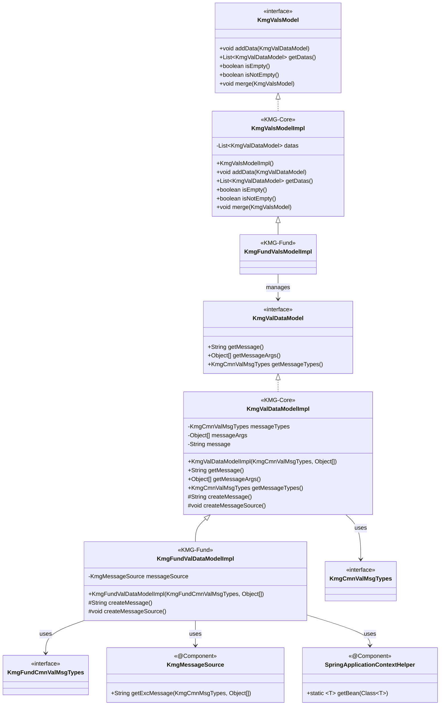
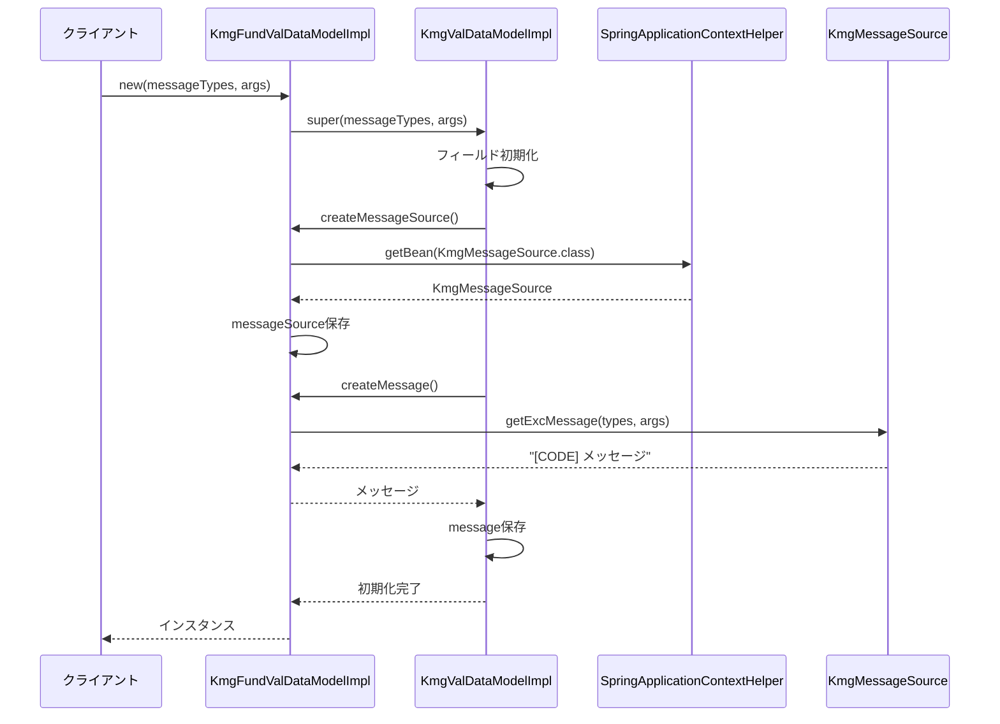
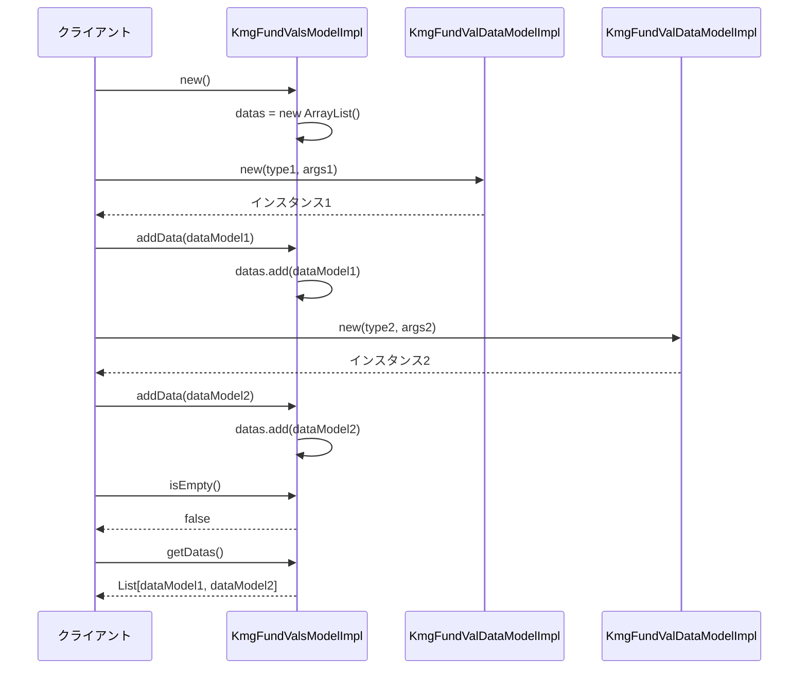
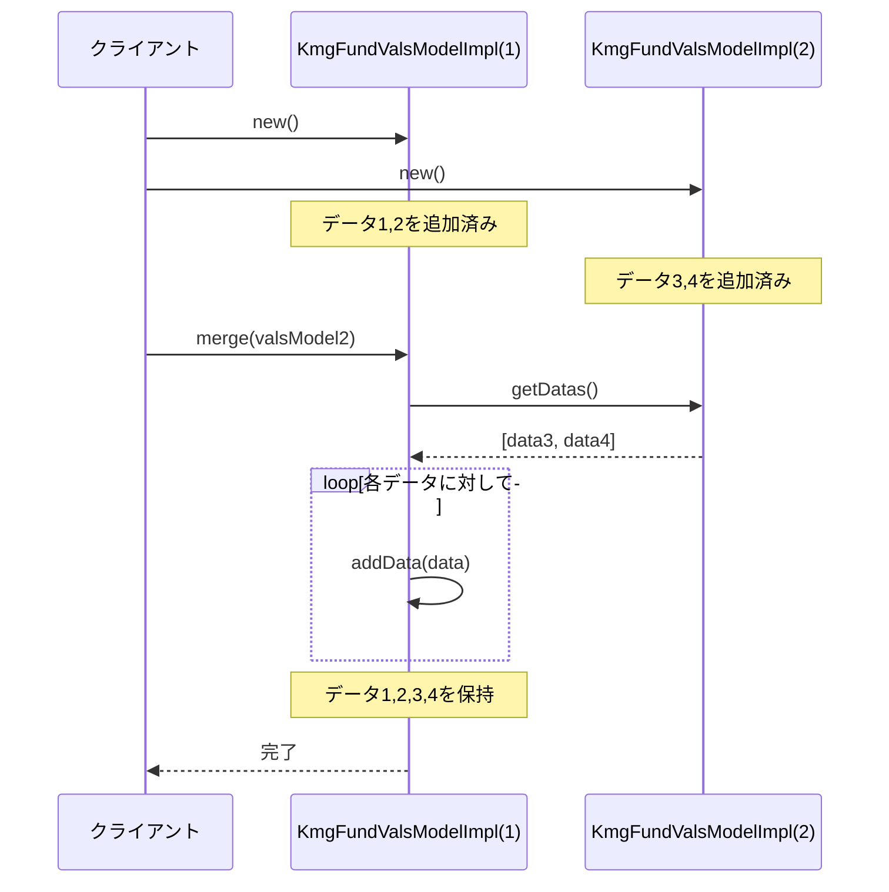

# インフラストラクチャ層モデル層の設計書

## 1. 概要

モデル層は、KMG 基盤のバリデーション機能を提供するモデルクラスを提供します。
バリデーションエラー情報を保持するデータモデルと、複数のバリデーションエラーを集約する集合モデルを提供します。

## 2. パッケージ構成

```text
kmg.fund.infrastructure.model
├── val
│   ├── impl
│   │   ├── KmgFundValDataModelImpl.java
│   │   ├── KmgFundValsModelImpl.java
│   │   └── package-info.java
│   └── package-info.java
└── package-info.java
```

## 3. クラス図



## 4. KmgFundValDataModelImpl の詳細

### 4.1 概要

バリデーションエラー情報を保持するデータモデルの基盤実装クラスです。
KMG-Core の`KmgValDataModelImpl`を継承し、Spring 管理のメッセージソースを使用してメッセージを生成します。

### 4.2 継承関係

- **スーパークラス**: `kmg.core.infrastructure.model.val.impl.KmgValDataModelImpl`
- **実装インターフェース**: `kmg.core.infrastructure.model.val.KmgValDataModel`（継承により）

### 4.3 フィールド

| フィールド名  | 型               | 修飾子  | 説明                          |
| ------------- | ---------------- | ------- | ----------------------------- |
| messageSource | KmgMessageSource | private | Spring 管理のメッセージソース |

**継承フィールド（KmgValDataModelImpl から）:**

| フィールド名 | 型                | 修飾子        | 説明             |
| ------------ | ----------------- | ------------- | ---------------- |
| messageTypes | KmgCmnValMsgTypes | private final | メッセージの種類 |
| messageArgs  | Object[]          | private final | メッセージの引数 |
| message      | String            | private final | メッセージ       |

### 4.4 メソッド

#### 4.4.1 コンストラクタ

```java
public KmgFundValDataModelImpl(
    final KmgFundCmnValMsgTypes messageTypes,
    final Object[] messageArgs)
```

バリデーションデータモデルを初期化します。

**パラメータ:**

- `messageTypes`: メッセージの種類
- `messageArgs`: メッセージの引数（省略可、null も可）

**処理の流れ:**

1. スーパークラスのコンストラクタを呼び出し
2. メッセージソースの作成（`createMessageSource()`）
3. メッセージの作成（`createMessage()`）

**使用例:**

```java
KmgFundValDataModelImpl validationData = new KmgFundValDataModelImpl(
    KmgFundValMsgTypes.KMGFUND_VAL00001,
    new Object[] { "ユーザー名", "必須項目です" }
);
```

#### 4.4.2 createMessage（保護メソッド）

```java
@Override
protected String createMessage()
```

メッセージを作成して返します。

**戻り値:**

- 生成されたメッセージ文字列（コード埋め込み形式）

**実装:**

```java
final String result = this.messageSource.getExcMessage(
    this.getMessageTypes(),
    this.getMessageArgs()
);
return result;
```

#### 4.4.3 createMessageSource（保護メソッド）

```java
@Override
protected void createMessageSource()
```

メッセージソースを作成します。
Spring 管理外のクラスから`SpringApplicationContextHelper`を使用して Bean を取得します。

**実装:**

```java
this.messageSource = SpringApplicationContextHelper.getBean(KmgMessageSource.class);
```

#### 4.4.4 継承メソッド

以下のメソッドは`KmgValDataModelImpl`から継承されます：

- `String getMessage()`: メッセージを返す
- `Object[] getMessageArgs()`: メッセージの引数を返す
- `KmgCmnValMsgTypes getMessageTypes()`: メッセージの種類を返す

## 5. KmgFundValsModelImpl の詳細

### 5.1 概要

複数のバリデーションエラーを集約する集合モデルです。
KMG-Core の`KmgValsModelImpl`を継承し、基本的な機能をそのまま使用します。

### 5.2 継承関係

- **スーパークラス**: `kmg.core.infrastructure.model.val.impl.KmgValsModelImpl`
- **実装インターフェース**: `kmg.core.infrastructure.model.val.KmgValsModel`（継承により）

### 5.3 フィールド

**継承フィールド（KmgValsModelImpl から）:**

| フィールド名 | 型                      | 修飾子        | 説明                         |
| ------------ | ----------------------- | ------------- | ---------------------------- |
| datas        | List\<KmgValDataModel\> | private final | バリデーションデータのリスト |

### 5.4 メソッド

#### 5.4.1 コンストラクタ

```java
public KmgFundValsModelImpl()
```

バリデーション集合モデルを初期化します。
内部のデータリストを空の`ArrayList`として初期化します。

**使用例:**

```java
KmgFundValsModelImpl validations = new KmgFundValsModelImpl();
```

#### 5.4.2 継承メソッド

以下のメソッドは`KmgValsModelImpl`から継承されます：

##### addData

```java
public void addData(final KmgValDataModel data)
```

バリデーションデータを追加します。

**パラメータ:**

- `data`: 追加するバリデーションデータ（null の場合は何もしない）

##### getDatas

```java
public List<KmgValDataModel> getDatas()
```

バリデーションデータのリストを返します。

**戻り値:**

- バリデーションデータのリスト

##### isEmpty

```java
public boolean isEmpty()
```

バリデーションデータが空か判定します。

**戻り値:**

- `true`: 空、`false`: 空ではない

##### isNotEmpty

```java
public boolean isNotEmpty()
```

バリデーションデータが空ではないか判定します。

**戻り値:**

- `true`: 空ではない、`false`: 空である

##### merge

```java
public void merge(final KmgValsModel valsModel)
```

別のバリデーション集合モデルをマージします。

**パラメータ:**

- `valsModel`: マージするバリデーション集合モデル

## 6. シーケンス図

### 6.1 バリデーションデータモデルの生成



### 6.2 バリデーション集合モデルの使用



### 6.3 バリデーション集合のマージ



## 7. 使用例

### 7.1 単一のバリデーションエラー生成

```java
public class UserService {

    public void validateUser(String username) {
        if (username == null || username.isEmpty()) {
            // バリデーションエラーを生成
            KmgFundValDataModelImpl validationError = new KmgFundValDataModelImpl(
                KmgFundValMsgTypes.KMGFUND_VAL30001,
                new Object[] { "ユーザー名" }
            );

            // メッセージを取得
            String errorMessage = validationError.getMessage();
            // => "[KMGFUND_VAL30001] 必須項目が未入力です。フィールド=[ユーザー名]"

            System.out.println(errorMessage);
        }
    }
}
```

### 7.2 複数のバリデーションエラーの集約

```java
public class UserValidator {

    public KmgFundValsModelImpl validateUser(User user) {
        KmgFundValsModelImpl validations = new KmgFundValsModelImpl();

        // ユーザー名のチェック
        if (user.getUsername() == null || user.getUsername().isEmpty()) {
            validations.addData(new KmgFundValDataModelImpl(
                KmgFundValMsgTypes.KMGFUND_VAL30001,
                new Object[] { "ユーザー名" }
            ));
        }

        // メールアドレスのチェック
        if (user.getEmail() == null || !user.getEmail().contains("@")) {
            validations.addData(new KmgFundValDataModelImpl(
                KmgFundValMsgTypes.KMGFUND_VAL30000,
                new Object[] { "メールアドレス", user.getEmail() }
            ));
        }

        // 年齢のチェック
        if (user.getAge() < 0 || user.getAge() > 150) {
            validations.addData(new KmgFundValDataModelImpl(
                KmgFundValMsgTypes.KMGFUND_VAL30000,
                new Object[] { "年齢", user.getAge() }
            ));
        }

        return validations;
    }
}
```

### 7.3 バリデーション結果の確認と処理

```java
public class UserController {

    @Autowired
    private UserValidator userValidator;

    public void registerUser(User user) throws KmgFundMsgException {
        // バリデーション実行
        KmgFundValsModelImpl validations = userValidator.validateUser(user);

        // エラーがある場合
        if (validations.isNotEmpty()) {
            // エラーメッセージを収集
            List<String> errorMessages = validations.getDatas().stream()
                .map(KmgValDataModel::getMessage)
                .collect(Collectors.toList());

            // ログ出力
            errorMessages.forEach(msg ->
                logger.error("バリデーションエラー: {}", msg)
            );

            // 例外スロー
            throw new KmgFundMsgException(
                KmgFundGenMsgTypes.KMGFUND_GEN40000,
                new Object[] { errorMessages.size() }
            );
        }

        // バリデーション成功時の処理
        saveUser(user);
    }
}
```

### 7.4 バリデーション集合のマージ

```java
public class ComplexValidator {

    @Autowired
    private UserValidator userValidator;

    @Autowired
    private AddressValidator addressValidator;

    public KmgFundValsModelImpl validateUserWithAddress(User user, Address address) {
        // ユーザーのバリデーション
        KmgFundValsModelImpl userValidations = userValidator.validateUser(user);

        // 住所のバリデーション
        KmgFundValsModelImpl addressValidations = addressValidator.validateAddress(address);

        // バリデーション結果をマージ
        userValidations.merge(addressValidations);

        return userValidations;
    }
}
```

### 7.5 カスタムバリデーションロジック

```java
public class PasswordValidator {

    public KmgFundValsModelImpl validatePassword(String password) {
        KmgFundValsModelImpl validations = new KmgFundValsModelImpl();

        // 長さチェック
        if (password.length() < 8) {
            validations.addData(new KmgFundValDataModelImpl(
                KmgFundValMsgTypes.KMGFUND_VAL30002,
                new Object[] { "パスワード", "8文字以上" }
            ));
        }

        // 大文字チェック
        if (!password.matches(".*[A-Z].*")) {
            validations.addData(new KmgFundValDataModelImpl(
                KmgFundValMsgTypes.KMGFUND_VAL30003,
                new Object[] { "パスワード", "大文字を含む必要があります" }
            ));
        }

        // 数字チェック
        if (!password.matches(".*[0-9].*")) {
            validations.addData(new KmgFundValDataModelImpl(
                KmgFundValMsgTypes.KMGFUND_VAL30003,
                new Object[] { "パスワード", "数字を含む必要があります" }
            ));
        }

        return validations;
    }
}
```

### 7.6 Web API でのレスポンス変換

```java
@RestController
public class UserApiController {

    @Autowired
    private UserValidator userValidator;

    @PostMapping("/api/users")
    public ResponseEntity<?> createUser(@RequestBody User user) {
        // バリデーション実行
        KmgFundValsModelImpl validations = userValidator.validateUser(user);

        if (validations.isNotEmpty()) {
            // エラーレスポンスの作成
            Map<String, Object> errorResponse = new HashMap<>();
            errorResponse.put("status", "error");
            errorResponse.put("errors", validations.getDatas().stream()
                .map(data -> Map.of(
                    "code", data.getMessageTypes().getCode(),
                    "message", data.getMessage(),
                    "args", data.getMessageArgs()
                ))
                .collect(Collectors.toList())
            );

            return ResponseEntity.badRequest().body(errorResponse);
        }

        // 正常処理
        User savedUser = userService.save(user);
        return ResponseEntity.ok(savedUser);
    }
}
```

## 8. 設計上の注意点

### 8.1 メッセージソースの取得タイミング

**KmgFundValDataModelImpl の特徴:**

- コンストラクタ実行時に`SpringApplicationContextHelper`を使用してメッセージソースを取得
- Spring 管理外のクラスからでも使用可能
- メッセージはインスタンス生成時に確定（不変）

**注意点:**

- Spring 起動前には使用不可
- メッセージソースの Bean が登録されている必要がある

### 8.2 KMG-Core と KMG-Fund の関係

**KMG-Core（基盤）:**

- `KmgValDataModelImpl`: `KmgMessageUtils`を使用
- プロパティファイルベースのメッセージ管理

**KMG-Fund（基盤拡張）:**

- `KmgFundValDataModelImpl`: `KmgMessageSource`（Spring 管理 Bean）を使用
- Spring コンテキスト管理のメッセージソースを利用

**使い分け:**

| 環境              | 使用クラス              | 理由                         |
| ----------------- | ----------------------- | ---------------------------- |
| Spring 管理環境   | KmgFundValDataModelImpl | DI、国際化対応、拡張性が高い |
| Spring 非管理環境 | KmgValDataModelImpl     | 依存が少ない、シンプル       |

### 8.3 バリデーションエラーの設計パターン

**データモデルの不変性:**

- メッセージタイプ、引数、メッセージは final フィールド
- 一度生成したら変更不可
- スレッドセーフ

**集合モデルの可変性:**

- データリストは可変（追加・マージ可能）
- スレッドセーフではない（単一スレッドでの使用を想定）

### 8.4 パフォーマンス考慮事項

**メッセージ生成コスト:**

- インスタンス生成時に 1 回だけメッセージを生成
- 以降は生成済みメッセージを返すだけ（高速）

**SpringApplicationContextHelper の使用:**

- Bean 取得にはコストがかかる
- インスタンス生成ごとに呼び出される
- 大量のバリデーションエラーを生成する場合は注意

**推奨:**

```java
// 良い例：必要な時だけ生成
if (isInvalid(value)) {
    validations.addData(new KmgFundValDataModelImpl(type, args));
}

// 避けるべき例：常に生成してから判定
KmgFundValDataModelImpl error = new KmgFundValDataModelImpl(type, args);
if (isInvalid(value)) {
    validations.addData(error);
}
```

### 8.5 メッセージタイプの選択

**KmgFundCmnValMsgTypes:**

- バリデーション専用のメッセージタイプ
- KMG-Fund の共通バリデーションメッセージを定義

**メッセージ定義の規約:**

```properties
# messages/kmg-fund.properties
KMGFUND_VAL30000=入力値が不正です。フィールド=[{0}], 値=[{1}]
KMGFUND_VAL30001=必須項目が未入力です。フィールド=[{0}]
KMGFUND_VAL30002={0}は{1}である必要があります。
KMGFUND_VAL30003={0}の形式が不正です。{1}
```

### 8.6 null セーフティ

**addData メソッド:**

```java
public void addData(final KmgValDataModel data) {
    if (data == null) {
        return;  // nullの場合は何もしない
    }
    this.datas.add(data);
}
```

- null チェック実装済み
- null 追加時は無視される（エラーにならない）

## 9. 今後の拡張

### 9.1 バリデーションレベルの追加

```java
public class LeveledKmgFundValDataModelImpl extends KmgFundValDataModelImpl {

    public enum ValidationLevel {
        ERROR,   // エラー（処理を中断）
        WARNING, // 警告（処理は続行）
        INFO     // 情報（参考情報）
    }

    private final ValidationLevel level;

    public LeveledKmgFundValDataModelImpl(
            KmgFundCmnValMsgTypes messageTypes,
            Object[] messageArgs,
            ValidationLevel level) {
        super(messageTypes, messageArgs);
        this.level = level;
    }

    public ValidationLevel getLevel() {
        return this.level;
    }
}
```

### 9.2 フィールドパス対応

```java
public class FieldAwareKmgFundValDataModelImpl extends KmgFundValDataModelImpl {

    private final String fieldPath;  // 例: "user.address.zipCode"

    public FieldAwareKmgFundValDataModelImpl(
            KmgFundCmnValMsgTypes messageTypes,
            Object[] messageArgs,
            String fieldPath) {
        super(messageTypes, messageArgs);
        this.fieldPath = fieldPath;
    }

    public String getFieldPath() {
        return this.fieldPath;
    }
}
```

### 9.3 バリデーションコンテキストの追加

```java
public class ContextualKmgFundValsModelImpl extends KmgFundValsModelImpl {

    private final Map<String, Object> context = new HashMap<>();

    public void addContext(String key, Object value) {
        this.context.put(key, value);
    }

    public Object getContext(String key) {
        return this.context.get(key);
    }

    public Map<String, Object> getAllContext() {
        return Collections.unmodifiableMap(this.context);
    }
}
```

### 9.4 グループバリデーション

```java
public class GroupedKmgFundValsModelImpl extends KmgFundValsModelImpl {

    private final Map<String, List<KmgValDataModel>> groupedDatas = new HashMap<>();

    public void addDataToGroup(String group, KmgValDataModel data) {
        groupedDatas.computeIfAbsent(group, k -> new ArrayList<>()).add(data);
        super.addData(data);
    }

    public List<KmgValDataModel> getDatasByGroup(String group) {
        return groupedDatas.getOrDefault(group, Collections.emptyList());
    }

    public Set<String> getGroups() {
        return groupedDatas.keySet();
    }
}
```

### 9.5 Bean Validation 連携

```java
public class BeanValidationAdapter {

    @Autowired
    private Validator validator;

    public KmgFundValsModelImpl validate(Object bean) {
        KmgFundValsModelImpl validations = new KmgFundValsModelImpl();

        Set<ConstraintViolation<Object>> violations = validator.validate(bean);

        for (ConstraintViolation<Object> violation : violations) {
            validations.addData(new KmgFundValDataModelImpl(
                KmgFundValMsgTypes.KMGFUND_VAL30000,
                new Object[] {
                    violation.getPropertyPath().toString(),
                    violation.getInvalidValue()
                }
            ));
        }

        return validations;
    }
}
```

### 9.6 JSON 出力の標準化

```java
public class KmgFundValsModelJsonSerializer extends JsonSerializer<KmgFundValsModelImpl> {

    @Override
    public void serialize(
            KmgFundValsModelImpl value,
            JsonGenerator gen,
            SerializerProvider serializers) throws IOException {

        gen.writeStartObject();
        gen.writeNumberField("errorCount", value.getDatas().size());
        gen.writeArrayFieldStart("errors");

        for (KmgValDataModel data : value.getDatas()) {
            gen.writeStartObject();
            gen.writeStringField("code", data.getMessageTypes().getCode());
            gen.writeStringField("message", data.getMessage());
            gen.writeArrayFieldStart("args");
            for (Object arg : data.getMessageArgs()) {
                gen.writeObject(arg);
            }
            gen.writeEndArray();
            gen.writeEndObject();
        }

        gen.writeEndArray();
        gen.writeEndObject();
    }
}
```

## 10. まとめ

KMG 基盤のモデル層は、以下の特徴を持つバリデーション機能を提供します：

**主な特徴:**

1. **Spring 連携**: コンテキスト管理層を活用したメッセージ管理
2. **階層構造**: KMG-Core と KMG-Fund の適切な責務分離
3. **不変性と可変性**: データモデルは不変、集合モデルは可変
4. **拡張性**: 継承により機能拡張が容易
5. **国際化対応**: メッセージソースを通じた多言語対応

**適用シーン:**

- 入力値のバリデーション
- ビジネスルールチェック
- データ整合性検証
- エラー情報の集約と報告

このモデル層を活用することで、一貫性のあるバリデーション処理とエラーハンドリングを実現できます。
