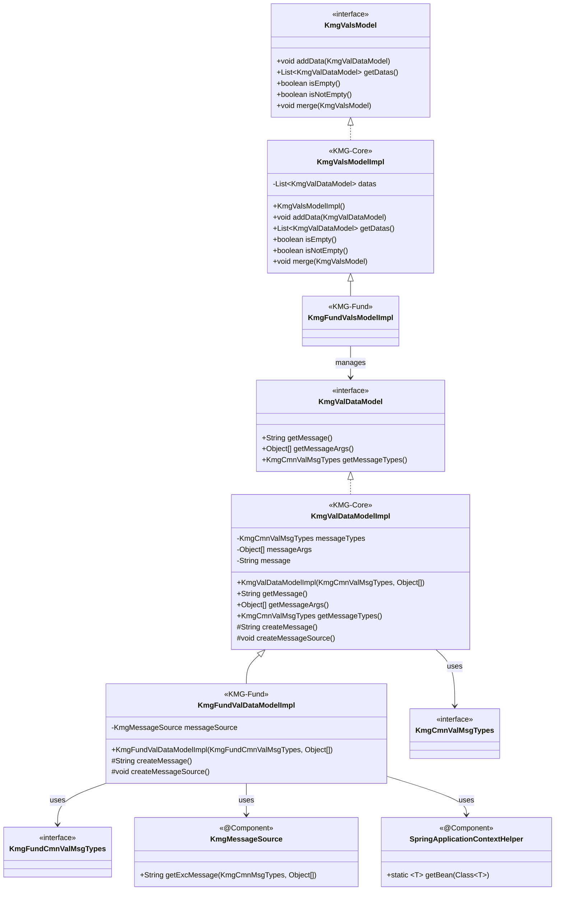

# インフラストラクチャ層モデル層の設計書

## 1. 概要

モデル層は、KMG 基盤のバリデーション機能を提供するモデルクラスを提供します。
バリデーションエラー情報を保持するデータモデルと、複数のバリデーションエラーを集約する集合モデルを提供します。

## 2. パッケージ構成

```text
kmg.fund.infrastructure.model
├── val
│   ├── impl
│   │   ├── KmgFundValDataModelImpl.java
│   │   ├── KmgFundValsModelImpl.java
│   │   └── package-info.java
│   └── package-info.java
└── package-info.java
```

## 3. クラス図



## 4. バリデーションモデルの詳細

モデル層は、バリデーション機能を提供する以下のクラスで構成されます：

### 4.1 KmgFundValDataModelImpl

バリデーションエラー情報を保持するデータモデルの基盤実装クラスです。

**詳細:** [インフラストラクチャ層モデル層バリデーション層の設計書](./インフラストラクチャ層モデル層バリデーション層の設計書.md)

**実装詳細:** [インフラストラクチャ層モデル層バリデーション層実装層の設計書](./インフラストラクチャ層モデル層バリデーション層実装層の設計書.md)

### 4.2 KmgFundValsModelImpl

複数のバリデーションエラーを集約する集合モデルです。

**詳細:** [インフラストラクチャ層モデル層バリデーション層の設計書](./インフラストラクチャ層モデル層バリデーション層の設計書.md)

**実装詳細:** [インフラストラクチャ層モデル層バリデーション層実装層の設計書](./インフラストラクチャ層モデル層バリデーション層実装層の設計書.md)

## 5. シーケンス図とフロー

バリデーションモデルの生成フローと使用パターンの詳細は、以下のドキュメントを参照してください。

**詳細:** [インフラストラクチャ層モデル層バリデーション層実装層の設計書](./インフラストラクチャ層モデル層バリデーション層実装層の設計書.md)

## 6. 使用例

バリデーション機能の詳細な使用例は、以下のドキュメントを参照してください。

**詳細:**

- [インフラストラクチャ層モデル層バリデーション層の設計書](./インフラストラクチャ層モデル層バリデーション層の設計書.md)
- [インフラストラクチャ層モデル層バリデーション層実装層の設計書](./インフラストラクチャ層モデル層バリデーション層実装層の設計書.md)

## 7. 設計上の注意点

設計上の注意点の詳細は、以下のドキュメントを参照してください。

**詳細:** [インフラストラクチャ層モデル層バリデーション層実装層の設計書](./インフラストラクチャ層モデル層バリデーション層実装層の設計書.md)

## 8. 今後の拡張

今後の拡張計画については、以下のドキュメントを参照してください。

**詳細:** [インフラストラクチャ層モデル層バリデーション層の設計書](./インフラストラクチャ層モデル層バリデーション層の設計書.md)

## 9. まとめ

KMG 基盤のモデル層は、以下の特徴を持つバリデーション機能を提供します：

**主な特徴:**

1. **Spring 連携**: コンテキスト管理層を活用したメッセージ管理
2. **階層構造**: KMG-Core と KMG-Fund の適切な責務分離
3. **不変性と可変性**: データモデルは不変、集合モデルは可変
4. **拡張性**: 継承により機能拡張が容易
5. **国際化対応**: メッセージソースを通じた多言語対応

**適用シーン:**

- 入力値のバリデーション
- ビジネスルールチェック
- データ整合性検証
- エラー情報の集約と報告

このモデル層を活用することで、一貫性のあるバリデーション処理とエラーハンドリングを実現できます。
