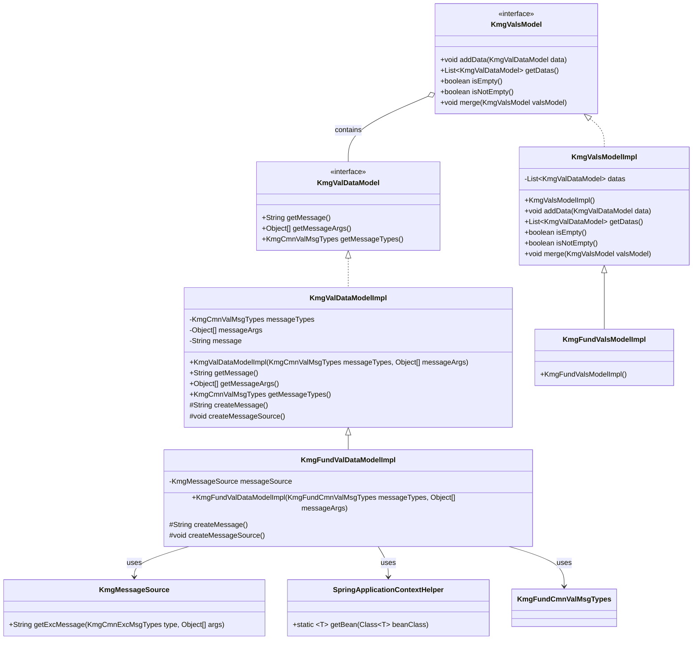
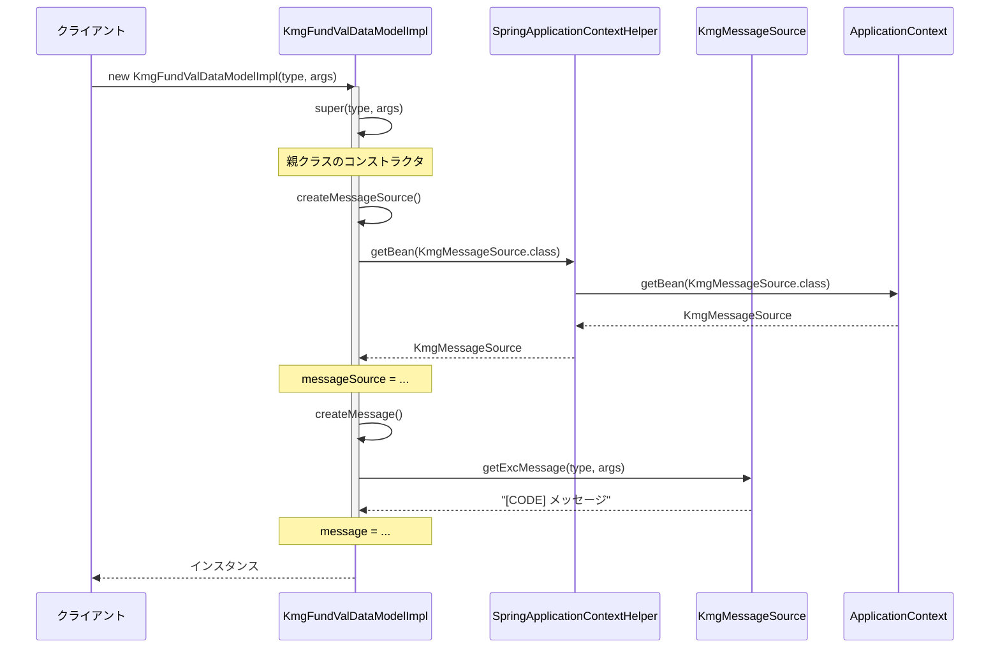
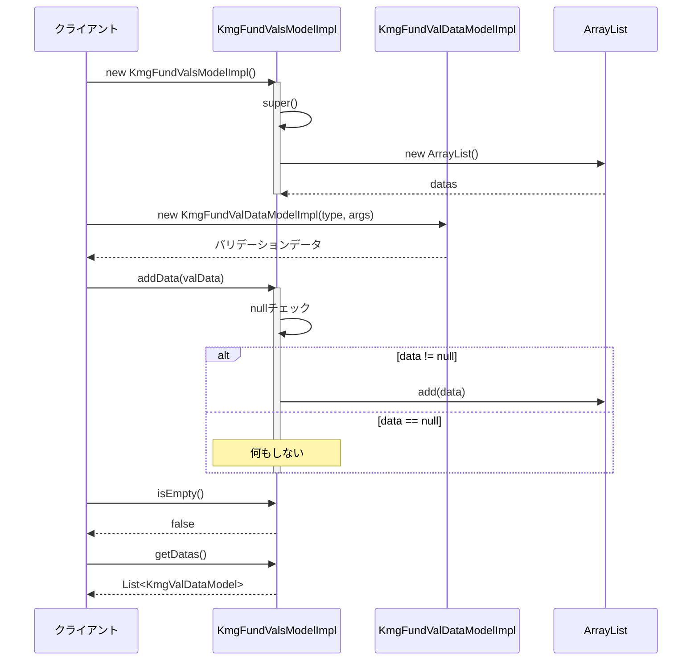
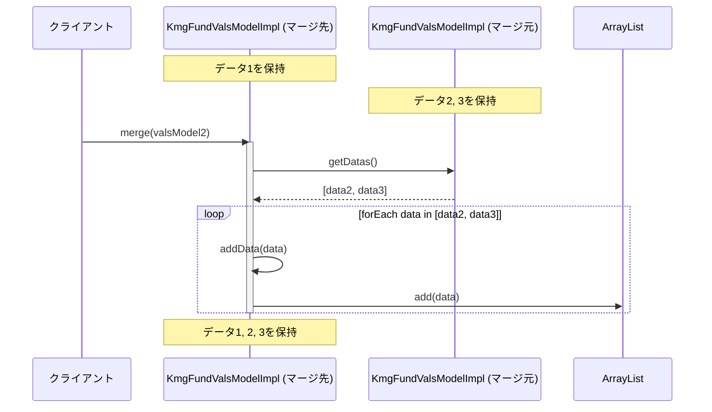

# インフラストラクチャ層モデル層バリデーション層の設計書

## 1. 概要

バリデーションモデル層は、バリデーション結果を管理するためのモデルクラスを提供します。
バリデーションエラーメッセージを保持し、複数のバリデーション結果を集約して管理する機能を提供します。

## 2. パッケージ構成

```text
kmg.fund.infrastructure.model.val
├── impl
│   ├── KmgFundValDataModelImpl.java
│   ├── KmgFundValsModelImpl.java
│   └── package-info.java
└── package-info.java
```

## 3. クラス図



## 4. KmgFundValDataModelImpl の詳細

### 4.1 概要

バリデーションエラーデータを保持するモデルクラスです。
メッセージの種類と引数から、国際化対応のバリデーションエラーメッセージを生成します。

### 4.2 継承関係

- 親クラス: `KmgValDataModelImpl` (kmg-core)
- 実装インターフェース: `KmgValDataModel` (kmg-core)

### 4.3 フィールド

| フィールド名  | 型               | 修飾子  | 説明                   |
| ------------- | ---------------- | ------- | ---------------------- |
| messageSource | KmgMessageSource | private | KMG メッセージリソース |

**継承されたフィールド（親クラスより）:**

| フィールド名 | 型                | 修飾子        | 説明             |
| ------------ | ----------------- | ------------- | ---------------- |
| messageTypes | KmgCmnValMsgTypes | private final | メッセージの種類 |
| messageArgs  | Object[]          | private final | メッセージの引数 |
| message      | String            | private final | メッセージ       |

### 4.4 メソッド

#### 4.4.1 コンストラクタ

```java
public KmgFundValDataModelImpl(
    final KmgFundCmnValMsgTypes messageTypes,
    final Object[] messageArgs
)
```

バリデーションデータモデルを初期化します。

**パラメータ:**

- `messageTypes`: メッセージの種類
- `messageArgs`: メッセージの引数

**処理フロー:**

1. 親クラスのコンストラクタを呼び出し
2. `createMessageSource()` によりメッセージソースを初期化
3. `createMessage()` によりメッセージを生成

#### 4.4.2 createMessage（protected）

```java
@Override
protected String createMessage()
```

メッセージを作成して返します。

**戻り値:**

- 生成されたメッセージ文字列

**実装詳細:**

```java
final String result = this.messageSource.getExcMessage(
    this.getMessageTypes(),
    this.getMessageArgs()
);
```

- `KmgMessageSource.getExcMessage()` を使用してメッセージを取得
- 例外用メッセージとしてコード埋め込み形式で取得

#### 4.4.3 createMessageSource（protected）

```java
@Override
protected void createMessageSource()
```

メッセージソースを作成します。

**実装詳細:**

```java
this.messageSource = SpringApplicationContextHelper.getBean(KmgMessageSource.class);
```

- `SpringApplicationContextHelper` を使用して Bean を取得
- Spring 管理外のクラスでもメッセージソースを利用可能

## 5. KmgFundValsModelImpl の詳細

### 5.1 概要

複数のバリデーションデータを集約して管理するモデルクラスです。
バリデーション結果の追加、マージ、状態確認などの機能を提供します。

### 5.2 継承関係

- 親クラス: `KmgValsModelImpl` (kmg-core)
- 実装インターフェース: `KmgValsModel` (kmg-core)

### 5.3 フィールド

**継承されたフィールド（親クラスより）:**

| フィールド名 | 型                      | 修飾子        | 説明           |
| ------------ | ----------------------- | ------------- | -------------- |
| datas        | List\<KmgValDataModel\> | private final | データのリスト |

### 5.4 メソッド

#### 5.4.1 コンストラクタ

```java
public KmgFundValsModelImpl()
```

バリデーション集合モデルを初期化します。

**処理:**

- 親クラスのコンストラクタを呼び出し、空のリストを初期化

#### 5.4.2 継承されたメソッド

親クラス `KmgValsModelImpl` から以下のメソッドを継承:

##### addData(KmgValDataModel data)

```java
public void addData(final KmgValDataModel data)
```

バリデーションデータを追加します。

- パラメータ: `data` - 追加するバリデーションデータ
- null チェックを実施し、null の場合は追加しない

##### getDatas()

```java
public List<KmgValDataModel> getDatas()
```

保持しているバリデーションデータのリストを返します。

- 戻り値: バリデーションデータのリスト

##### isEmpty()

```java
public boolean isEmpty()
```

バリデーションデータが空か判定します。

- 戻り値: true=空、false=空ではない

##### isNotEmpty()

```java
public boolean isNotEmpty()
```

バリデーションデータが空ではないか判定します。

- 戻り値: true=空ではない、false=空

##### merge(KmgValsModel valsModel)

```java
public void merge(final KmgValsModel valsModel)
```

別のバリデーション集合モデルをマージします。

- パラメータ: `valsModel` - マージするバリデーション集合モデル
- 内部実装: `valsModel.getDatas().forEach(this::addData)`

## 6. シーケンス図

### 6.1 バリデーションデータモデルの生成



### 6.2 バリデーション集合モデルへの追加



### 6.3 バリデーション集合のマージ



## 7. 使用例

### 7.1 単一バリデーションエラーの作成

```java
import kmg.fund.infrastructure.model.val.impl.KmgFundValDataModelImpl;
import kmg.fund.infrastructure.types.msg.KmgFundValMsgTypes;

public class ValidationExample {

    public void validateAge(int age) {
        if (age < 0) {
            // バリデーションエラーデータの作成
            KmgFundValDataModelImpl valData = new KmgFundValDataModelImpl(
                KmgFundValMsgTypes.KMGFUND_VAL30001,
                new Object[] { "年齢", age }
            );

            // メッセージ取得
            String message = valData.getMessage();
            // => "[KMGFUND_VAL30001] 入力値が不正です。フィールド=[年齢], 値=[-1]"

            System.out.println(message);
        }
    }
}
```

### 7.2 複数バリデーションエラーの集約

```java
import kmg.core.infrastructure.model.val.KmgValDataModel;
import kmg.fund.infrastructure.model.val.impl.KmgFundValDataModelImpl;
import kmg.fund.infrastructure.model.val.impl.KmgFundValsModelImpl;
import kmg.fund.infrastructure.types.msg.KmgFundValMsgTypes;

public class FormValidationExample {

    public KmgFundValsModelImpl validateForm(UserForm form) {
        // バリデーション集合モデルの作成
        KmgFundValsModelImpl valsModel = new KmgFundValsModelImpl();

        // 名前の検証
        if (form.getName() == null || form.getName().isEmpty()) {
            KmgValDataModel valData = new KmgFundValDataModelImpl(
                KmgFundValMsgTypes.KMGFUND_VAL30000,
                new Object[] { "名前" }
            );
            valsModel.addData(valData);
        }

        // 年齢の検証
        if (form.getAge() < 0 || form.getAge() > 150) {
            KmgValDataModel valData = new KmgFundValDataModelImpl(
                KmgFundValMsgTypes.KMGFUND_VAL30001,
                new Object[] { "年齢", form.getAge() }
            );
            valsModel.addData(valData);
        }

        // メールアドレスの検証
        if (!form.getEmail().contains("@")) {
            KmgValDataModel valData = new KmgFundValDataModelImpl(
                KmgFundValMsgTypes.KMGFUND_VAL30001,
                new Object[] { "メールアドレス", form.getEmail() }
            );
            valsModel.addData(valData);
        }

        return valsModel;
    }
}
```

### 7.3 バリデーション結果の判定と表示

```java
import java.util.List;
import kmg.core.infrastructure.model.val.KmgValDataModel;
import kmg.fund.infrastructure.model.val.impl.KmgFundValsModelImpl;

public class ValidationResultHandler {

    public void handleValidationResult(KmgFundValsModelImpl valsModel) {
        // バリデーションエラーの有無確認
        if (valsModel.isNotEmpty()) {
            // エラーメッセージの表示
            List<KmgValDataModel> errors = valsModel.getDatas();

            System.out.println("バリデーションエラーが発生しました:");
            for (KmgValDataModel error : errors) {
                System.out.println("- " + error.getMessage());
            }

            // 例:
            // バリデーションエラーが発生しました:
            // - [KMGFUND_VAL30000] 必須項目が未入力です。フィールド=[名前]
            // - [KMGFUND_VAL30001] 入力値が不正です。フィールド=[年齢], 値=[200]
            // - [KMGFUND_VAL30001] 入力値が不正です。フィールド=[メールアドレス], 値=[invalid-email]

        } else {
            System.out.println("バリデーション成功");
        }
    }
}
```

### 7.4 バリデーション集合のマージ

```java
import kmg.fund.infrastructure.model.val.impl.KmgFundValsModelImpl;

public class ValidationMergeExample {

    public KmgFundValsModelImpl validateUser(User user) {
        // ユーザー基本情報のバリデーション
        KmgFundValsModelImpl basicVals = validateBasicInfo(user);

        // ユーザーアドレス情報のバリデーション
        KmgFundValsModelImpl addressVals = validateAddress(user.getAddress());

        // ユーザー連絡先情報のバリデーション
        KmgFundValsModelImpl contactVals = validateContact(user.getContact());

        // すべてのバリデーション結果をマージ
        basicVals.merge(addressVals);
        basicVals.merge(contactVals);

        return basicVals;
    }

    private KmgFundValsModelImpl validateBasicInfo(User user) {
        // 基本情報のバリデーション処理
        KmgFundValsModelImpl valsModel = new KmgFundValsModelImpl();
        // ... バリデーション処理 ...
        return valsModel;
    }

    private KmgFundValsModelImpl validateAddress(Address address) {
        // アドレス情報のバリデーション処理
        KmgFundValsModelImpl valsModel = new KmgFundValsModelImpl();
        // ... バリデーション処理 ...
        return valsModel;
    }

    private KmgFundValsModelImpl validateContact(Contact contact) {
        // 連絡先情報のバリデーション処理
        KmgFundValsModelImpl valsModel = new KmgFundValsModelImpl();
        // ... バリデーション処理 ...
        return valsModel;
    }
}
```

### 7.5 サービス層での使用例

```java
import org.springframework.stereotype.Service;
import kmg.fund.infrastructure.model.val.impl.KmgFundValsModelImpl;
import kmg.fund.infrastructure.exception.KmgFundMsgException;
import kmg.fund.infrastructure.types.msg.KmgFundGenMsgTypes;

@Service
public class UserRegistrationService {

    public void registerUser(UserForm form) throws KmgFundMsgException {
        // バリデーション実行
        KmgFundValsModelImpl valsModel = validateUserForm(form);

        // バリデーションエラーがある場合は例外を投げる
        if (valsModel.isNotEmpty()) {
            // 最初のエラーメッセージを取得
            String firstErrorMessage = valsModel.getDatas().get(0).getMessage();

            throw new KmgFundMsgException(
                KmgFundGenMsgTypes.KMGFUND_GEN30000,
                new Object[] { firstErrorMessage }
            );
        }

        // ユーザー登録処理
        doRegisterUser(form);
    }

    private KmgFundValsModelImpl validateUserForm(UserForm form) {
        // バリデーション処理
        KmgFundValsModelImpl valsModel = new KmgFundValsModelImpl();
        // ... バリデーション処理 ...
        return valsModel;
    }

    private void doRegisterUser(UserForm form) {
        // 実際の登録処理
    }
}
```

### 7.6 バリデーションメッセージリソース

**messages/kmg-fund-val.properties:**

```properties
# バリデーションメッセージ
KMGFUND_VAL30000=必須項目が未入力です。フィールド=[{0}]
KMGFUND_VAL30001=入力値が不正です。フィールド=[{0}], 値=[{1}]
KMGFUND_VAL30002=値が最小値を下回っています。フィールド=[{0}], 値=[{1}], 最小値=[{2}]
KMGFUND_VAL30003=値が最大値を超えています。フィールド=[{0}], 値=[{1}], 最大値=[{2}]
KMGFUND_VAL30004=文字列長が不正です。フィールド=[{0}], 長さ=[{1}], 期待値=[{2}]
KMGFUND_VAL30005=フォーマットが不正です。フィールド=[{0}], 値=[{1}], 期待フォーマット=[{2}]
KMGFUND_VAL30006=重複しています。フィールド=[{0}], 値=[{1}]
KMGFUND_VAL30007=存在しません。フィールド=[{0}], 値=[{1}]
```

## 8. 設計上の注意点

### 8.1 コア層との関係

**継承構造:**

- `KmgFundValDataModelImpl` は `KmgValDataModelImpl` (コア層) を継承
- `KmgFundValsModelImpl` は `KmgValsModelImpl` (コア層) を継承

**差分実装:**

- コア層: `KmgMessageUtils` (静的ユーティリティ) を使用
- 基盤層: `KmgMessageSource` (Spring Bean) を使用

**理由:**

- 基盤層は Spring コンテキストを活用し、DI による柔軟な構成を実現
- コア層は Spring 非依存で、シンプルな実装を維持

### 8.2 メッセージソースの初期化

**重要:**

- `KmgFundValDataModelImpl` のコンストラクタ内で `createMessageSource()` が呼ばれる
- `SpringApplicationContextHelper.getBean()` で Bean を取得
- Spring 管理外のクラスでもメッセージソースを利用可能

**注意点:**

- Spring コンテキストが初期化される前は使用不可
- テストでは `SpringApplicationContextHelper` のモック化が必要

### 8.3 null データの扱い

**仕様:**

- `KmgValsModelImpl.addData(null)` は何もしない（例外を投げない）
- null チェックにより安全性を確保

**使用例:**

```java
KmgFundValsModelImpl valsModel = new KmgFundValsModelImpl();
valsModel.addData(null);  // 処理されない
System.out.println(valsModel.isEmpty());  // true
```

### 8.4 データの可変性

**注意:**

- `getDatas()` は内部リストへの参照を返す
- 呼び出し側で直接リストを変更できてしまう

**推奨事項:**

```java
// 悪い例
List<KmgValDataModel> datas = valsModel.getDatas();
datas.clear();  // 内部状態が変更される

// 良い例
List<KmgValDataModel> datas = valsModel.getDatas();
for (KmgValDataModel data : datas) {
    // 読み取りのみ
    System.out.println(data.getMessage());
}
```

### 8.5 マージ操作の特性

**仕様:**

- `merge()` は相手側のデータを自分側に追加
- 元の ValsModel は変更されない

**動作:**

```java
KmgFundValsModelImpl valsModel1 = new KmgFundValsModelImpl();
valsModel1.addData(data1);  // サイズ: 1

KmgFundValsModelImpl valsModel2 = new KmgFundValsModelImpl();
valsModel2.addData(data2);
valsModel2.addData(data3);  // サイズ: 2

valsModel1.merge(valsModel2);
// valsModel1のサイズ: 3 (data1, data2, data3)
// valsModel2のサイズ: 2 (data2, data3) - 変更なし
```

### 8.6 メッセージタイプの制約

**型制約:**

- `KmgFundValDataModelImpl` は `KmgFundCmnValMsgTypes` を受け取る
- `KmgFundCmnValMsgTypes` は `KmgCmnValMsgTypes` を継承

**使用可能なメッセージタイプ:**

- `KmgFundValMsgTypes` (推奨)
- その他の `KmgFundCmnValMsgTypes` を実装した enum

### 8.7 スレッドセーフティ

**現状:**

- `KmgFundValsModelImpl` は内部で `ArrayList` を使用
- スレッドセーフではない

**マルチスレッド環境での使用:**

```java
// 悪い例（スレッドセーフでない）
KmgFundValsModelImpl valsModel = new KmgFundValsModelImpl();
CompletableFuture.runAsync(() -> valsModel.addData(data1));
CompletableFuture.runAsync(() -> valsModel.addData(data2));

// 良い例（同期化）
KmgFundValsModelImpl valsModel = new KmgFundValsModelImpl();
synchronized (valsModel) {
    valsModel.addData(data1);
    valsModel.addData(data2);
}
```

## 9. 今後の拡張

### 9.1 スレッドセーフな実装

```java
import java.util.concurrent.CopyOnWriteArrayList;
import kmg.core.infrastructure.model.val.KmgValDataModel;

/**
 * スレッドセーフなバリデーション集合モデル
 */
public class KmgFundThreadSafeValsModelImpl extends KmgFundValsModelImpl {

    /**
     * スレッドセーフなデータリスト
     */
    private final List<KmgValDataModel> threadSafeDatas;

    /**
     * コンストラクタ
     */
    public KmgFundThreadSafeValsModelImpl() {
        super();
        this.threadSafeDatas = new CopyOnWriteArrayList<>();
    }

    @Override
    public void addData(final KmgValDataModel data) {
        if (data == null) {
            return;
        }
        this.threadSafeDatas.add(data);
    }

    @Override
    public List<KmgValDataModel> getDatas() {
        return new ArrayList<>(this.threadSafeDatas);
    }

    @Override
    public boolean isEmpty() {
        return this.threadSafeDatas.isEmpty();
    }
}
```

### 9.2 不変リストを返すバリデーション集合

```java
import java.util.Collections;
import java.util.List;

/**
 * 不変リストを返すバリデーション集合モデル
 */
public class KmgFundImmutableValsModelImpl extends KmgFundValsModelImpl {

    @Override
    public List<KmgValDataModel> getDatas() {
        // 不変リストを返す（外部から変更不可）
        return Collections.unmodifiableList(super.getDatas());
    }
}
```

### 9.3 カスタムバリデーション結果ハンドラ

```java
import java.util.function.Consumer;

/**
 * バリデーション結果ハンドラ
 */
public class ValidationResultHandler {

    /**
     * バリデーションエラーをコンソールに出力
     */
    public static Consumer<KmgValDataModel> consoleErrorHandler() {
        return data -> System.err.println(data.getMessage());
    }

    /**
     * バリデーションエラーをログに出力
     */
    public static Consumer<KmgValDataModel> logErrorHandler(Logger logger) {
        return data -> logger.error(data.getMessage());
    }

    /**
     * バリデーションエラーをリストに収集
     */
    public static Consumer<KmgValDataModel> collectErrorHandler(List<String> errors) {
        return data -> errors.add(data.getMessage());
    }

    /**
     * バリデーション結果を処理
     */
    public static void handle(KmgFundValsModelImpl valsModel, Consumer<KmgValDataModel> handler) {
        valsModel.getDatas().forEach(handler);
    }
}

// 使用例
ValidationResultHandler.handle(
    valsModel,
    ValidationResultHandler.consoleErrorHandler()
);
```

### 9.4 フィールド別バリデーション結果の管理

```java
import java.util.HashMap;
import java.util.Map;

/**
 * フィールド別バリデーション集合モデル
 */
public class KmgFundFieldValsModelImpl extends KmgFundValsModelImpl {

    /**
     * フィールド別のバリデーションエラー
     */
    private final Map<String, List<KmgValDataModel>> fieldErrors;

    /**
     * コンストラクタ
     */
    public KmgFundFieldValsModelImpl() {
        super();
        this.fieldErrors = new HashMap<>();
    }

    /**
     * フィールドにバリデーションエラーを追加
     *
     * @param fieldName フィールド名
     * @param data      バリデーションデータ
     */
    public void addFieldData(String fieldName, KmgValDataModel data) {
        this.fieldErrors
            .computeIfAbsent(fieldName, k -> new ArrayList<>())
            .add(data);
        super.addData(data);
    }

    /**
     * 指定フィールドのバリデーションエラーを取得
     *
     * @param fieldName フィールド名
     * @return バリデーションエラーのリスト
     */
    public List<KmgValDataModel> getFieldErrors(String fieldName) {
        return this.fieldErrors.getOrDefault(fieldName, Collections.emptyList());
    }

    /**
     * 指定フィールドにエラーがあるか
     *
     * @param fieldName フィールド名
     * @return true=エラーあり、false=エラーなし
     */
    public boolean hasFieldError(String fieldName) {
        return this.fieldErrors.containsKey(fieldName)
            && !this.fieldErrors.get(fieldName).isEmpty();
    }
}
```

### 9.5 バリデーション結果の JSON 変換

```java
import com.fasterxml.jackson.databind.ObjectMapper;
import com.fasterxml.jackson.databind.node.ArrayNode;
import com.fasterxml.jackson.databind.node.ObjectNode;

/**
 * バリデーション結果JSON変換ユーティリティ
 */
public class ValidationJsonConverter {

    private static final ObjectMapper mapper = new ObjectMapper();

    /**
     * バリデーション結果をJSON文字列に変換
     *
     * @param valsModel バリデーション集合モデル
     * @return JSON文字列
     */
    public static String toJson(KmgFundValsModelImpl valsModel) {
        ObjectNode root = mapper.createObjectNode();
        root.put("hasError", valsModel.isNotEmpty());
        root.put("errorCount", valsModel.getDatas().size());

        ArrayNode errors = mapper.createArrayNode();
        for (KmgValDataModel data : valsModel.getDatas()) {
            ObjectNode error = mapper.createObjectNode();
            error.put("code", data.getMessageTypes().getCode());
            error.put("message", data.getMessage());
            errors.add(error);
        }
        root.set("errors", errors);

        return root.toPrettyString();
    }
}

// 使用例
String json = ValidationJsonConverter.toJson(valsModel);
// {
//   "hasError": true,
//   "errorCount": 2,
//   "errors": [
//     {
//       "code": "KMGFUND_VAL30000",
//       "message": "[KMGFUND_VAL30000] 必須項目が未入力です。フィールド=[名前]"
//     },
//     {
//       "code": "KMGFUND_VAL30001",
//       "message": "[KMGFUND_VAL30001] 入力値が不正です。フィールド=[年齢], 値=[200]"
//     }
//   ]
// }
```

## 10. テストガイドライン

### 10.1 テストのポイント

**KmgFundValDataModelImpl のテスト:**

1. コンストラクタによるインスタンス生成
2. メッセージの正常な生成
3. メッセージタイプと引数の保持
4. SpringApplicationContextHelper のモック化

**KmgFundValsModelImpl のテスト:**

1. 空のインスタンス生成
2. データの追加（単一、複数）
3. null データの追加（準正常系）
4. isEmpty/isNotEmpty の判定
5. マージ操作（正常、空のモデル）
6. データリストの取得

### 10.2 テストの必須モック

```java
// SpringApplicationContextHelper のモック化
try (MockedStatic<SpringApplicationContextHelper> mockedStatic
    = Mockito.mockStatic(SpringApplicationContextHelper.class)) {

    mockedStatic.when(() -> SpringApplicationContextHelper.getBean(KmgMessageSource.class))
        .thenReturn(mockMessageSource);

    // テスト実行
}
```

### 10.3 テストデータの例

```java
// メッセージタイプ
KmgFundValMsgTypes.NONE
KmgFundValMsgTypes.KMGFUND_VAL30000  // 必須項目未入力
KmgFundValMsgTypes.KMGFUND_VAL30001  // 入力値不正

// メッセージ引数
new Object[] { "フィールド名" }
new Object[] { "フィールド名", "不正な値" }

// 期待メッセージ
"[KMGFUND_VAL30000] 必須項目が未入力です。フィールド=[名前]"
```

## 11. 関連ドキュメント

- [インフラストラクチャ層コンテキスト管理層の設計書](./インフラストラクチャ層コンテキスト管理層の設計書.md)
  - `KmgMessageSource`、`SpringApplicationContextHelper` の詳細
- KMG コア層バリデーションモデルの設計書（kmg-core）
  - `KmgValDataModel`、`KmgValsModel` インターフェース仕様
  - `KmgValDataModelImpl`、`KmgValsModelImpl` 実装仕様
