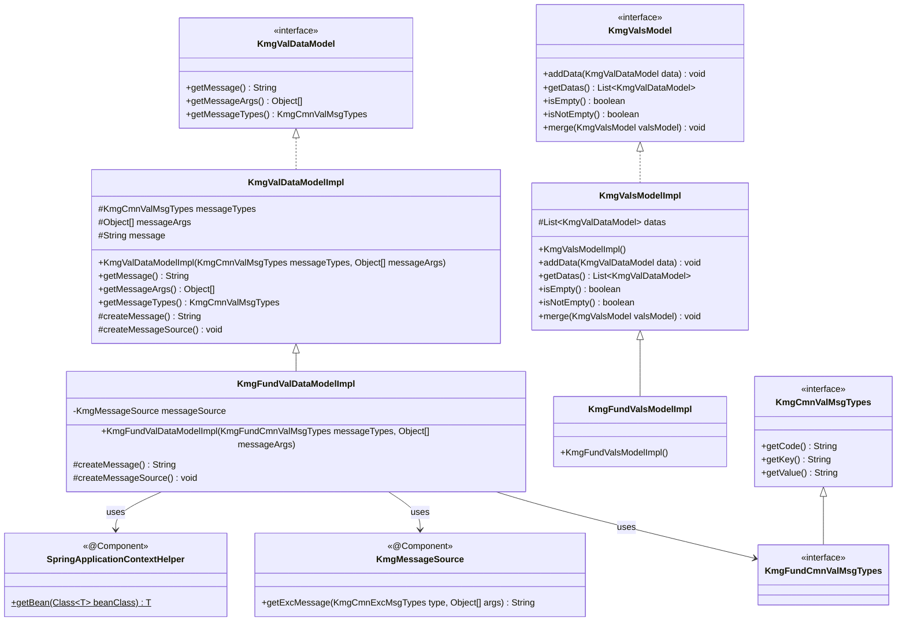
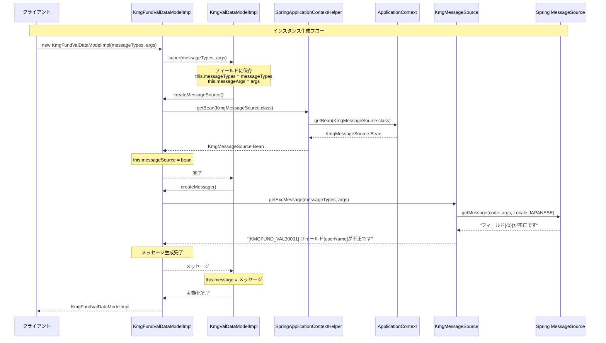
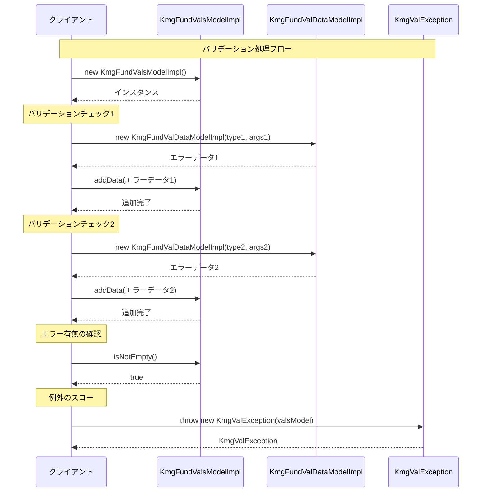
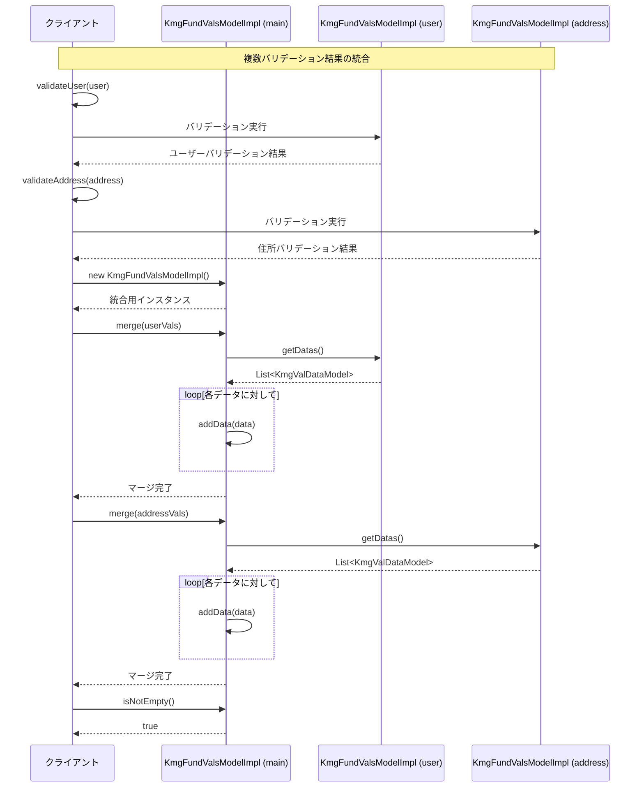

# インフラストラクチャ層モデル層バリデーション層実装層の設計書

## 1. 概要

バリデーション層実装層は、KMG 基盤（kmg-fund）におけるバリデーション処理の具体的な実装を提供します。
このパッケージは、KMG コア（kmg-core）のバリデーションモデルを継承し、Spring 管理下でのメッセージ解決機能を追加した基盤固有の実装を提供します。

### 1.1 主要な責務

- Spring アプリケーションコンテキストを利用したメッセージ生成
- KMG 基盤固有のバリデーションデータモデルの提供
- KMG 基盤固有のバリデーション集合モデルの提供
- 国際化対応のエラーメッセージ生成

### 1.2 KMG コアとの関係

本パッケージは、`kmg.core.infrastructure.model.val.impl` パッケージのクラスを継承し、Spring 依存の機能を追加します：

- **KMG コア**: `KmgMessageUtils` を使用した静的メッセージ取得
- **KMG 基盤**: `SpringApplicationContextHelper` と `KmgMessageSource` を使用した Spring 管理下でのメッセージ取得

## 2. パッケージ構成

```text
kmg.fund.infrastructure.model.val.impl
├── KmgFundValDataModelImpl.java   # バリデーションデータモデル実装
├── KmgFundValsModelImpl.java      # バリデーション集合モデル実装
└── package-info.java              # パッケージ情報
```

## 3. クラス図



## 4. クラス詳細

### 4.1 KmgFundValDataModelImpl

KMG 基盤バリデーションデータモデルの実装クラスです。
親クラス `KmgValDataModelImpl` を継承し、Spring 管理下でのメッセージ生成機能を提供します。

#### 4.1.1 クラス情報

| 項目       | 内容                                     |
| ---------- | ---------------------------------------- |
| パッケージ | kmg.fund.infrastructure.model.val.impl   |
| 継承元     | kmg.core...val.impl.KmgValDataModelImpl  |
| 実装 IF    | kmg.core...val.KmgValDataModel（間接的） |
| 作成者     | KenichiroArai                            |
| バージョン | 0.1.0                                    |

#### 4.1.2 フィールド

| フィールド名  | 型               | 修飾子  | 説明                   |
| ------------- | ---------------- | ------- | ---------------------- |
| messageSource | KmgMessageSource | private | KMG メッセージリソース |

##### 継承フィールド（親クラス）

| フィールド名 | 型                | 修飾子        | 説明                 |
| ------------ | ----------------- | ------------- | -------------------- |
| messageTypes | KmgCmnValMsgTypes | private final | メッセージの種類     |
| messageArgs  | Object[]          | private final | メッセージの引数     |
| message      | String            | private final | 生成されたメッセージ |

#### 4.1.3 コンストラクタ

```java
public KmgFundValDataModelImpl(
    final KmgFundCmnValMsgTypes messageTypes,
    final Object[] messageArgs)
```

**パラメータ:**

- `messageTypes`: メッセージの種類（KMG 基盤のバリデーションメッセージタイプ）
- `messageArgs`: メッセージの引数

**処理内容:**

1. 親クラスのコンストラクタを呼び出し（`super(messageTypes, messageArgs)`）
2. 親クラス内で以下が実行される：
   - `createMessageSource()` の呼び出し → Spring Bean の取得
   - `createMessage()` の呼び出し → メッセージ生成

#### 4.1.4 メソッド

##### createMessage()

```java
@Override
protected String createMessage()
```

メッセージを作成して返します（オーバーライド）。

**戻り値:**

- メッセージ文字列

**処理内容:**

- `KmgMessageSource.getExcMessage()` を使用してメッセージを生成
- コード埋め込み形式：`[メッセージコード] メッセージ内容`

**親クラスとの違い:**

- **親クラス**: `KmgMessageUtils.getExcMessage()` を使用（静的メソッド）
- **本クラス**: `KmgMessageSource.getExcMessage()` を使用（Spring Bean）

##### createMessageSource()

```java
@Override
protected void createMessageSource()
```

メッセージソースを作成します（オーバーライド）。

**処理内容:**

- `SpringApplicationContextHelper.getBean(KmgMessageSource.class)` を呼び出し
- 取得した Bean を `messageSource` フィールドに設定

**親クラスとの違い:**

- **親クラス**: 処理なし（`KmgMessageUtils` を使用するため）
- **本クラス**: Spring Bean を取得して設定

#### 4.1.5 継承メソッド（親クラス）

| メソッド名        | 戻り値            | 説明                   |
| ----------------- | ----------------- | ---------------------- |
| getMessage()      | String            | メッセージを返す       |
| getMessageArgs()  | Object[]          | メッセージの引数を返す |
| getMessageTypes() | KmgCmnValMsgTypes | メッセージの種類を返す |

#### 4.1.6 設計上の特徴

1. **テンプレートメソッドパターン**

   - 親クラスが処理の骨格を定義
   - サブクラスが具体的な実装を提供
   - `createMessage()` と `createMessageSource()` がフックメソッド

2. **Spring 依存の分離**

   - コア層（kmg-core）: Spring 非依存
   - 基盤層（kmg-fund）: Spring 依存
   - 継承により機能を段階的に追加

3. **イミュータブル設計**

   - すべてのフィールドが final（親クラス）
   - 生成後の変更不可
   - スレッドセーフ

### 4.2 KmgFundValsModelImpl

KMG 基盤バリデーション集合モデルの実装クラスです。
親クラス `KmgValsModelImpl` を継承し、追加機能なしで単純に継承しています。

#### 4.2.1 クラス情報

| 項目       | 内容                                   |
| ---------- | -------------------------------------- |
| パッケージ | kmg.fund.infrastructure.model.val.impl |
| 継承元     | kmg.core...val.impl.KmgValsModelImpl   |
| 実装 IF    | kmg.core...val.KmgValsModel（間接的）  |
| 作成者     | KenichiroArai                          |
| バージョン | 0.1.0                                  |

#### 4.2.2 実装内容

```java
public class KmgFundValsModelImpl extends KmgValsModelImpl {
    // 処理なし
}
```

**設計意図:**

- 将来的な拡張のためのクラス階層の確立
- KMG 基盤固有の型として識別可能
- 親クラスの機能をそのまま利用

#### 4.2.3 継承メソッド（親クラス）

| メソッド名                    | 戻り値                      | 説明                           |
| ----------------------------- | --------------------------- | ------------------------------ |
| addData(KmgValDataModel data) | void                        | バリデーションデータを追加     |
| getDatas()                    | List&lt;KmgValDataModel&gt; | データのリストを返す           |
| isEmpty()                     | boolean                     | データが空か判定               |
| isNotEmpty()                  | boolean                     | データが空ではないか判定       |
| merge(KmgValsModel valsModel) | void                        | 他のバリデーション集合をマージ |

#### 4.2.4 継承フィールド（親クラス）

| フィールド名 | 型                          | 修飾子        | 説明                         |
| ------------ | --------------------------- | ------------- | ---------------------------- |
| datas        | List&lt;KmgValDataModel&gt; | private final | バリデーションデータのリスト |

## 5. シーケンス図

### 5.1 バリデーションデータモデルの生成



### 5.2 バリデーション集合の使用



### 5.3 複数バリデーション結果のマージ



## 6. 使用例

### 6.1 基本的なバリデーションエラーの作成

```java
import kmg.fund.infrastructure.model.val.impl.KmgFundValDataModelImpl;
import kmg.fund.infrastructure.types.msg.KmgFundValMsgTypes;

// バリデーションデータの作成
KmgFundValMsgTypes msgType = KmgFundValMsgTypes.KMGFUND_VAL30000;
Object[] msgArgs = new Object[]{"userName", "123@#$"};
KmgFundValDataModelImpl valData = new KmgFundValDataModelImpl(msgType, msgArgs);

// メッセージの取得
String message = valData.getMessage();
// => "[KMGFUND_VAL30000] 入力値が不正です。フィールド=[userName], 値=[123@#$]"
```

### 6.2 複数のバリデーションエラーの集約

```java
import kmg.fund.infrastructure.model.val.impl.KmgFundValsModelImpl;
import kmg.fund.infrastructure.types.msg.KmgFundValMsgTypes;

// バリデーション集合の作成
KmgFundValsModelImpl valsModel = new KmgFundValsModelImpl();

// 複数のエラーを追加
if (StringUtils.isEmpty(userName)) {
    valsModel.addData(new KmgFundValDataModelImpl(
        KmgFundValMsgTypes.KMGFUND_VAL30001,
        new Object[]{"ユーザー名"}
    ));
}

if (age < 0 || age > 150) {
    valsModel.addData(new KmgFundValDataModelImpl(
        KmgFundValMsgTypes.KMGFUND_VAL30000,
        new Object[]{"年齢", age}
    ));
}

if (email == null || !email.contains("@")) {
    valsModel.addData(new KmgFundValDataModelImpl(
        KmgFundValMsgTypes.KMGFUND_VAL30000,
        new Object[]{"メールアドレス", email}
    ));
}

// エラーの有無を確認
if (valsModel.isNotEmpty()) {
    // エラーがある場合の処理
    List<KmgValDataModel> errors = valsModel.getDatas();
    for (KmgValDataModel error : errors) {
        System.out.println(error.getMessage());
    }
}
```

### 6.3 バリデーション例外の発生

```java
import kmg.core.infrastructure.exception.KmgValException;
import kmg.fund.infrastructure.model.val.impl.KmgFundValsModelImpl;
import kmg.fund.infrastructure.types.msg.KmgFundValMsgTypes;

public void validateUserInput(UserInput input) throws KmgValException {

    // バリデーション集合の作成
    KmgFundValsModelImpl valsModel = new KmgFundValsModelImpl();

    // 各種バリデーションチェック
    if (StringUtils.isEmpty(input.getUserId())) {
        valsModel.addData(new KmgFundValDataModelImpl(
            KmgFundValMsgTypes.KMGFUND_VAL30001,
            new Object[]{"ユーザーID"}
        ));
    }

    if (input.getAge() < 18) {
        valsModel.addData(new KmgFundValDataModelImpl(
            KmgFundValMsgTypes.KMGFUND_VAL30000,
            new Object[]{"年齢", input.getAge()}
        ));
    }

    // エラーがあれば例外をスロー
    if (valsModel.isNotEmpty()) {
        throw new KmgValException(valsModel);
    }
}
```

### 6.4 バリデーション結果のマージ

```java
import kmg.fund.infrastructure.model.val.impl.KmgFundValsModelImpl;

public class UserRegistrationService {

    public void registerUser(User user) throws KmgValException {

        // 各項目のバリデーション
        KmgFundValsModelImpl userVals = validateUserProfile(user);
        KmgFundValsModelImpl addressVals = validateAddress(user.getAddress());
        KmgFundValsModelImpl paymentVals = validatePaymentInfo(user.getPayment());

        // すべてのバリデーション結果を統合
        KmgFundValsModelImpl allVals = new KmgFundValsModelImpl();
        allVals.merge(userVals);
        allVals.merge(addressVals);
        allVals.merge(paymentVals);

        // 統合結果をチェック
        if (allVals.isNotEmpty()) {
            throw new KmgValException(allVals);
        }

        // バリデーションOKの場合の処理
        saveUser(user);
    }

    private KmgFundValsModelImpl validateUserProfile(User user) {
        KmgFundValsModelImpl vals = new KmgFundValsModelImpl();
        // ユーザープロフィールのバリデーション
        return vals;
    }

    private KmgFundValsModelImpl validateAddress(Address address) {
        KmgFundValsModelImpl vals = new KmgFundValsModelImpl();
        // 住所のバリデーション
        return vals;
    }

    private KmgFundValsModelImpl validatePaymentInfo(Payment payment) {
        KmgFundValsModelImpl vals = new KmgFundValsModelImpl();
        // 支払情報のバリデーション
        return vals;
    }
}
```

### 6.5 バリデーション例外のハンドリング

```java
import kmg.core.infrastructure.exception.KmgValException;
import kmg.core.infrastructure.model.val.KmgValDataModel;
import kmg.core.infrastructure.model.val.KmgValsModel;

public class UserController {

    public Response createUser(UserRequest request) {
        try {
            // バリデーションを含む処理
            userService.registerUser(request.toUser());
            return Response.success("ユーザー登録が完了しました");

        } catch (KmgValException e) {
            // バリデーションエラーの取得
            KmgValsModel valsModel = e.getValidationsModel();

            // エラーメッセージのリスト作成
            List<String> errorMessages = new ArrayList<>();
            for (KmgValDataModel error : valsModel.getDatas()) {
                errorMessages.add(error.getMessage());
            }

            // エラーレスポンスを返却
            return Response.error(errorMessages);
        }
    }
}
```

### 6.6 Spring サービスでの使用例

```java
import org.springframework.stereotype.Service;
import kmg.fund.infrastructure.model.val.impl.KmgFundValDataModelImpl;
import kmg.fund.infrastructure.model.val.impl.KmgFundValsModelImpl;

@Service
public class ProductValidationService {

    /**
     * 商品情報のバリデーション
     */
    public KmgFundValsModelImpl validateProduct(Product product) {

        KmgFundValsModelImpl valsModel = new KmgFundValsModelImpl();

        // 商品名チェック
        if (StringUtils.isEmpty(product.getName())) {
            valsModel.addData(new KmgFundValDataModelImpl(
                KmgFundValMsgTypes.KMGFUND_VAL30001,
                new Object[]{"商品名"}
            ));
        }

        // 価格チェック
        if (product.getPrice() == null || product.getPrice() <= 0) {
            valsModel.addData(new KmgFundValDataModelImpl(
                KmgFundValMsgTypes.KMGFUND_VAL30000,
                new Object[]{"価格", product.getPrice()}
            ));
        }

        // 在庫数チェック
        if (product.getStock() < 0) {
            valsModel.addData(new KmgFundValDataModelImpl(
                KmgFundValMsgTypes.KMGFUND_VAL30000,
                new Object[]{"在庫数", product.getStock()}
            ));
        }

        return valsModel;
    }
}
```

## 7. 設計上の注意点

### 7.1 Spring 依存性の考慮

**使用可能な場所:**

- Spring 管理 Bean クラス内
- Spring ApplicationContext が初期化済みの環境

**使用できない場所:**

- Spring コンテキスト初期化前
- 静的初期化ブロック内
- Spring 管理外の完全独立クラス

**理由:**

- `SpringApplicationContextHelper.getBean()` が ApplicationContext に依存
- コンテキスト未初期化時は Bean を取得できない

### 7.2 KmgCore との使い分け

| 項目               | KMG コア（kmg-core）    | KMG 基盤（kmg-fund）                  |
| ------------------ | ----------------------- | ------------------------------------- |
| **Spring 依存**    | なし                    | あり                                  |
| **メッセージ取得** | KmgMessageUtils（静的） | KmgMessageSource（Bean）              |
| **使用場面**       | Spring 非依存の処理     | Spring 管理下の処理                   |
| **国際化対応**     | 基本的な対応            | Spring MessageSource による完全な対応 |
| **拡張性**         | 限定的                  | Spring 機能を活用可能                 |

**推奨事項:**

- Spring 環境では `KmgFundValDataModelImpl` を使用
- Spring 非依存が必要な場合のみ `KmgValDataModelImpl` を使用

### 7.3 メッセージソースの初期化タイミング

```java
// コンストラクタ内で初期化される
public KmgFundValDataModelImpl(
    final KmgFundCmnValMsgTypes messageTypes,
    final Object[] messageArgs) {

    super(messageTypes, messageArgs);
    // ↑この中で createMessageSource() が呼ばれる
}
```

**注意点:**

1. コンストラクタ呼び出し時に Spring Bean を取得
2. ApplicationContext が初期化済みである必要がある
3. 初期化失敗時は例外がスローされる

### 7.4 スレッドセーフティ

- **KmgFundValDataModelImpl**: スレッドセーフ

  - すべてのフィールドが final（親クラス）
  - イミュータブル設計

- **KmgFundValsModelImpl**: スレッドセーフ **ではない**
  - 内部の List は可変
  - 同時アクセスには同期化が必要

**マルチスレッド環境での使用:**

```java
// 各スレッドで個別のインスタンスを使用
KmgFundValsModelImpl valsModel = new KmgFundValsModelImpl();

// または同期化
synchronized (valsModel) {
    valsModel.addData(data);
}
```

### 7.5 パフォーマンス考慮事項

**メッセージ生成のコスト:**

- コンストラクタで即座にメッセージを生成
- Spring Bean の取得コストが発生
- 大量のバリデーションエラーが予想される場合は注意

**最適化の提案:**

```java
// 頻繁に使用する場合はキャッシュを検討
private static KmgMessageSource messageSourceCache;

@Override
protected void createMessageSource() {
    if (messageSourceCache == null) {
        messageSourceCache = SpringApplicationContextHelper
            .getBean(KmgMessageSource.class);
    }
    this.messageSource = messageSourceCache;
}
```

### 7.6 null 安全性

- **KmgFundValDataModelImpl**: null 引数は推奨されない

  - messageTypes が null の場合、親クラスで NPE 発生の可能性

- **KmgFundValsModelImpl**: addData()は null 安全
  - null 追加は無視される（親クラスの実装）

**推奨コーディング:**

```java
// null チェックを行う
if (messageTypes != null && messageArgs != null) {
    valsModel.addData(new KmgFundValDataModelImpl(messageTypes, messageArgs));
}
```

## 8. テスト観点

### 8.1 KmgFundValDataModelImpl のテスト

#### 8.1.1 正常系テスト

**コンストラクタテスト:**

```java
@Test
public void testConstructor_normal() {
    // SpringApplicationContextHelperのモック化
    try (MockedStatic<SpringApplicationContextHelper> mockedStatic
        = Mockito.mockStatic(SpringApplicationContextHelper.class)) {

        mockedStatic.when(() -> SpringApplicationContextHelper
            .getBean(KmgMessageSource.class))
            .thenReturn(mockMessageSource);

        // モックメッセージソースの設定
        Mockito.when(mockMessageSource.getExcMessage(messageTypes, messageArgs))
            .thenReturn(expectedMessage);

        // テスト対象の実行
        KmgFundValDataModelImpl testTarget
            = new KmgFundValDataModelImpl(messageTypes, messageArgs);

        // 検証
        assertNotNull(testTarget);
        assertEquals(expectedMessage, testTarget.getMessage());
    }
}
```

**メッセージ生成テスト:**

```java
@Test
public void testCreateMessage_normal() {
    // メッセージが正常に作成されることを検証
    // KmgMessageSource.getExcMessage()が呼ばれることを検証
}
```

#### 8.1.2 異常系テスト

**Spring Bean 取得失敗:**

```java
@Test
public void testConstructor_beanNotFound() {
    // Bean取得失敗時の例外処理を検証
}
```

**null パラメータ:**

```java
@Test
public void testConstructor_nullMessageTypes() {
    // null messageTypes の処理を検証
}
```

### 8.2 KmgFundValsModelImpl のテスト

#### 8.2.1 継承動作の検証

**基本機能テスト:**

```java
@Test
public void testInheritedFunctionality() {
    KmgFundValsModelImpl valsModel = new KmgFundValsModelImpl();

    // 親クラスのメソッドが正常に動作することを確認
    assertTrue(valsModel.isEmpty());

    valsModel.addData(valData);
    assertFalse(valsModel.isEmpty());
    assertTrue(valsModel.isNotEmpty());
}
```

### 8.3 統合テスト

**実際の Spring 環境でのテスト:**

```java
@SpringBootTest
public class ValidationIntegrationTest {

    @Test
    public void testValidationWithRealSpringContext() {
        // 実際のSpringコンテキストでの動作を検証
        KmgFundValDataModelImpl valData
            = new KmgFundValDataModelImpl(messageTypes, messageArgs);

        // メッセージが正しく取得されることを確認
        String message = valData.getMessage();
        assertNotNull(message);
        assertTrue(message.startsWith("["));
    }
}
```

**バリデーション例外との連携テスト:**

```java
@Test
public void testKmgValException() {
    KmgFundValsModelImpl valsModel = new KmgFundValsModelImpl();
    valsModel.addData(valData1);
    valsModel.addData(valData2);

    assertThrows(KmgValException.class, () -> {
        if (valsModel.isNotEmpty()) {
            throw new KmgValException(valsModel);
        }
    });
}
```

### 8.4 テストカバレッジ目標

| クラス                  | カバレッジ目標 | 重点項目                               |
| ----------------------- | -------------- | -------------------------------------- |
| KmgFundValDataModelImpl | 100%           | createMessage(), createMessageSource() |
| KmgFundValsModelImpl    | 継承動作の確認 | 親クラスのメソッドが正常に動作すること |

## 9. 今後の拡張

### 9.1 非同期バリデーション対応

```java
public class AsyncKmgFundValDataModelImpl extends KmgFundValDataModelImpl {

    private CompletableFuture<String> messageFuture;

    public AsyncKmgFundValDataModelImpl(
            KmgFundCmnValMsgTypes messageTypes,
            Object[] messageArgs) {
        super(messageTypes, messageArgs);
    }

    @Override
    protected String createMessage() {
        messageFuture = CompletableFuture.supplyAsync(() ->
            super.createMessage()
        );
        return messageFuture.join();
    }

    public CompletableFuture<String> getMessageAsync() {
        return messageFuture;
    }
}
```

### 9.2 フィールド別エラー管理

```java
public class FieldAwareKmgFundValsModelImpl extends KmgFundValsModelImpl {

    private final Map<String, List<KmgValDataModel>> errorsByField;

    public FieldAwareKmgFundValsModelImpl() {
        super();
        this.errorsByField = new HashMap<>();
    }

    public void addFieldError(String fieldName, KmgValDataModel data) {
        super.addData(data);
        errorsByField.computeIfAbsent(fieldName, k -> new ArrayList<>())
                    .add(data);
    }

    public List<KmgValDataModel> getErrorsByField(String fieldName) {
        return errorsByField.getOrDefault(fieldName, Collections.emptyList());
    }

    public boolean hasFieldErrors(String fieldName) {
        return errorsByField.containsKey(fieldName)
            && !errorsByField.get(fieldName).isEmpty();
    }
}
```

### 9.3 バリデーションルールの拡張

```java
public class RuleBasedKmgFundValDataModelImpl extends KmgFundValDataModelImpl {

    private final String ruleName;
    private final ValidationSeverity severity;

    public RuleBasedKmgFundValDataModelImpl(
            String ruleName,
            ValidationSeverity severity,
            KmgFundCmnValMsgTypes messageTypes,
            Object[] messageArgs) {

        super(messageTypes, messageArgs);
        this.ruleName = ruleName;
        this.severity = severity;
    }

    public String getRuleName() {
        return ruleName;
    }

    public ValidationSeverity getSeverity() {
        return severity;
    }

    public enum ValidationSeverity {
        ERROR,
        WARNING,
        INFO
    }
}
```

### 9.4 キャッシュ機能の追加

```java
public class CachedKmgFundValDataModelImpl extends KmgFundValDataModelImpl {

    private static final Map<String, String> messageCache
        = new ConcurrentHashMap<>();

    public CachedKmgFundValDataModelImpl(
            KmgFundCmnValMsgTypes messageTypes,
            Object[] messageArgs) {
        super(messageTypes, messageArgs);
    }

    @Override
    protected String createMessage() {
        String cacheKey = createCacheKey();

        return messageCache.computeIfAbsent(cacheKey,
            k -> super.createMessage());
    }

    private String createCacheKey() {
        return getMessageTypes().getCode() + ":"
            + Arrays.toString(getMessageArgs());
    }
}
```

### 9.5 JSON/XML 出力対応

```java
public class SerializableKmgFundValsModelImpl extends KmgFundValsModelImpl {

    public String toJson() {
        ObjectMapper mapper = new ObjectMapper();
        Map<String, Object> result = new HashMap<>();

        List<Map<String, Object>> errors = new ArrayList<>();
        for (KmgValDataModel data : getDatas()) {
            Map<String, Object> error = new HashMap<>();
            error.put("code", data.getMessageTypes().getCode());
            error.put("message", data.getMessage());
            error.put("args", data.getMessageArgs());
            errors.add(error);
        }

        result.put("errors", errors);
        result.put("count", errors.size());

        return mapper.writeValueAsString(result);
    }

    public String toXml() {
        // XML形式での出力実装
        return "<?xml version=\"1.0\"?>...";
    }
}
```

## 10. まとめ

### 10.1 設計の特徴

本パッケージは以下の特徴を持つ堅牢な設計となっています：

1. **階層的な設計**

   - KMG コア層で基本機能を提供
   - KMG 基盤層で Spring 機能を追加
   - 責務の明確な分離

2. **Spring 統合**

   - SpringApplicationContextHelper による Bean 取得
   - KmgMessageSource による国際化対応
   - Spring 管理下での柔軟なメッセージ管理

3. **テンプレートメソッドパターン**

   - 親クラスが処理の骨格を定義
   - サブクラスが具体的な実装を提供
   - 拡張性の高い設計

4. **イミュータビリティ**

   - バリデーションデータモデルは不変
   - スレッドセーフな実装
   - 予測可能な動作

5. **使いやすさ**
   - 直感的な API 設計
   - null 安全な実装
   - 明確なエラーメッセージ

### 10.2 使用シーン

**適用場面:**

- Spring Boot アプリケーション
- Web アプリケーションの入力バリデーション
- ビジネスロジックの検証
- API リクエストの妥当性確認

**主な利点:**

- 一貫したバリデーションエラー処理
- 国際化対応のエラーメッセージ
- 複数のバリデーション結果の統合
- Spring DI との自然な統合

### 10.3 保守性

**保守のポイント:**

1. メッセージ定義の一元管理（properties ファイル）
2. インターフェースベースの実装による変更容易性
3. 継承による段階的な機能追加
4. 明確なドキュメント化

### 10.4 今後の発展

- 非同期バリデーション
- より詳細なエラー情報（フィールド名、ルール名等）
- バリデーション結果のシリアライズ
- パフォーマンス最適化（キャッシュ等）

このパッケージにより、KMG 基盤を使用するアプリケーションは、堅牢で保守性の高いバリデーション処理を実現できます。
