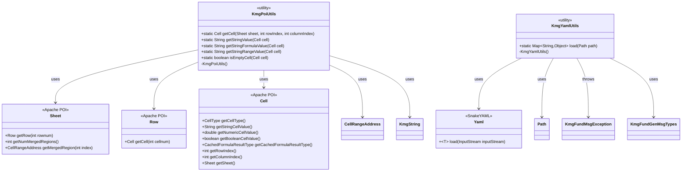
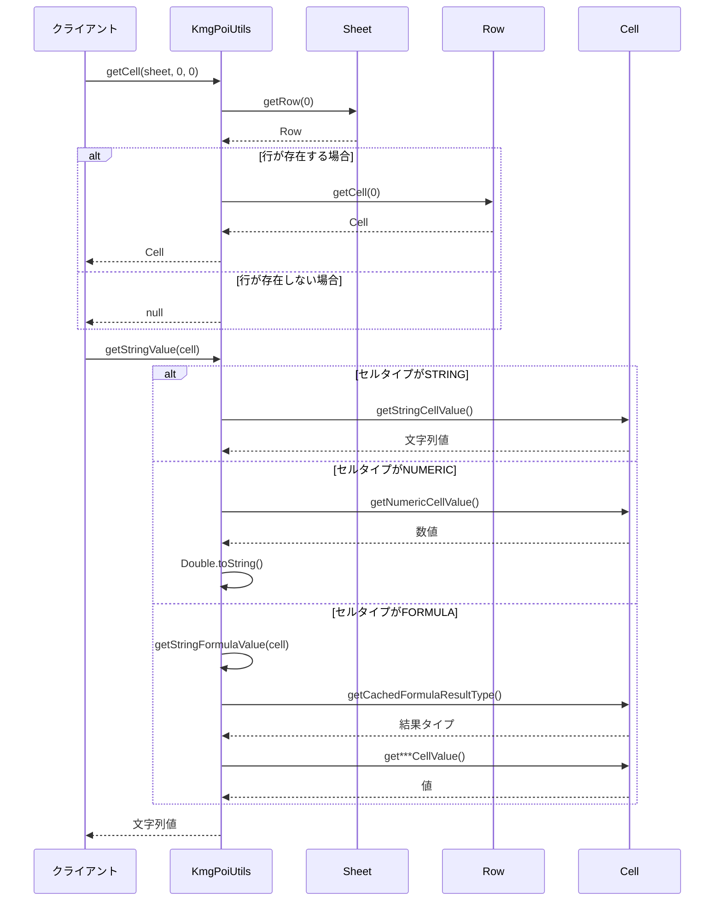
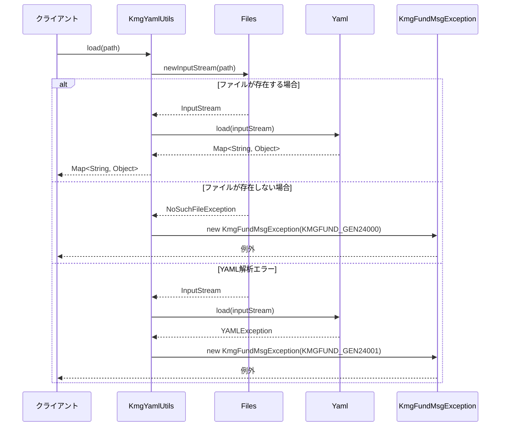

# インフラストラクチャ層ユーティリティ層の設計書

## 1. 概要

ユーティリティ層は、ファイル操作に関する汎用的な機能を提供します。
Excel 操作（Apache POI）と YAML 操作の 2 つのユーティリティクラスを含んでいます。

## 2. パッケージ構成

```text
kmg.fund.infrastructure.utils
├── KmgPoiUtils.java
├── KmgYamlUtils.java
└── package-info.java
```

## 3. クラス図



## 4. KmgPoiUtils の詳細

### 4.1 概要

Apache POI を使用した Excel ファイル操作のユーティリティクラスです。
セル値の取得、数式の評価、結合セルの処理などの機能を提供します。

### 4.2 メソッド

#### 4.2.1 getCell

```java
public static Cell getCell(Sheet sheet, int rowIndex, int columnIndex)
```

指定された位置のセルを取得します。

**パラメータ:**

- `sheet`: シート
- `rowIndex`: 行番号（0 始まり）
- `columnIndex`: カラム番号（0 始まり）

**戻り値:**

- セルオブジェクト（セルが存在しない場合は`null`）

**使用例:**

```java
Sheet sheet = workbook.getSheetAt(0);
Cell cell = KmgPoiUtils.getCell(sheet, 0, 0);  // A1セル
```

#### 4.2.2 getStringValue

```java
public static String getStringValue(Cell cell)
```

セルの値を文字列として取得します。
セルタイプに応じて適切に変換します。

**パラメータ:**

- `cell`: セル

**戻り値:**

- セルの値（文字列）

**処理:**

| セルタイプ    | 処理内容                                                  |
| ------------- | --------------------------------------------------------- |
| STRING        | 文字列値を返す                                            |
| NUMERIC       | 数値を Double.toString()で文字列化                        |
| BOOLEAN       | 真偽値を Boolean.toString()で文字列化                     |
| FORMULA       | 数式を評価して結果を返す（`getStringFormulaValue`を使用） |
| BLANK         | 結合セルの値を返す（`getStringRangeValue`を使用）         |
| ERROR, \_NONE | null を返す                                               |

**使用例:**

```java
Cell cell = KmgPoiUtils.getCell(sheet, 0, 0);
String value = KmgPoiUtils.getStringValue(cell);

if (value != null) {
    System.out.println("セル値: " + value);
}
```

#### 4.2.3 getStringFormulaValue

```java
public static String getStringFormulaValue(Cell cell)
```

数式セルの計算結果を文字列として取得します。

**パラメータ:**

- `cell`: 数式セル

**戻り値:**

- 数式の計算結果（文字列）

**処理:**

| 結果タイプ                    | 処理内容                              |
| ----------------------------- | ------------------------------------- |
| STRING                        | 文字列値を返す                        |
| NUMERIC                       | 数値を Double.toString()で文字列化    |
| BOOLEAN                       | 真偽値を Boolean.toString()で文字列化 |
| BLANK, ERROR, FORMULA, \_NONE | null を返す                           |

**使用例:**

```java
Cell cell = KmgPoiUtils.getCell(sheet, 0, 0);
if (cell.getCellType() == CellType.FORMULA) {
    String result = KmgPoiUtils.getStringFormulaValue(cell);
    System.out.println("数式の結果: " + result);
}
```

#### 4.2.4 getStringRangeValue

```java
public static String getStringRangeValue(Cell cell)
```

結合セルの値を取得します。
結合セルの左上のセル値を返します。

**パラメータ:**

- `cell`: 結合セル

**戻り値:**

- 結合セルの値（左上セルの値）

**処理フロー:**

1. セルの行番号・列番号を取得
2. シートの結合領域を走査
3. 該当する結合領域を見つける
4. 結合領域の左上セルの値を取得

**使用例:**

```java
Cell cell = KmgPoiUtils.getCell(sheet, 0, 0);
if (cell.getCellType() == CellType.BLANK) {
    // 結合セルの可能性がある
    String value = KmgPoiUtils.getStringRangeValue(cell);
    if (value != null) {
        System.out.println("結合セル値: " + value);
    }
}
```

#### 4.2.5 isEmptyCell

```java
public static boolean isEmptyCell(Cell cell)
```

セルが空かどうかを判定します。

**パラメータ:**

- `cell`: セル

**戻り値:**

- `true`: 空、`false`: 空ではない

**判定基準:**

- セルが`null`の場合: 空
- セル値が空文字列の場合: 空
- 上記以外: 空ではない

**使用例:**

```java
Cell cell = KmgPoiUtils.getCell(sheet, 0, 0);
if (KmgPoiUtils.isEmptyCell(cell)) {
    System.out.println("セルは空です");
} else {
    System.out.println("セル値: " + KmgPoiUtils.getStringValue(cell));
}
```

## 5. KmgYamlUtils の詳細

### 5.1 概要

SnakeYAML を使用した YAML ファイルの読み込みと解析を行うユーティリティクラスです。

### 5.2 メソッド

#### 5.2.1 load

```java
public static Map<String, Object> load(Path path) throws KmgFundMsgException
```

YAML ファイルを読み込み、マップ形式で返します。

**パラメータ:**

- `path`: YAML ファイルのパス

**戻り値:**

- マップ形式のデータ

**例外:**

- `KmgFundMsgException`: 入出力処理に失敗した場合

**発生する例外の種類:**

| 例外                | メッセージタイプ | 説明                 |
| ------------------- | ---------------- | -------------------- |
| NoSuchFileException | KMGFUND_GEN24000 | ファイルが存在しない |
| YAMLException       | KMGFUND_GEN24001 | YAML 解析エラー      |
| IOException         | KMGFUND_GEN24001 | 入出力エラー         |

**使用例:**

```java
try {
    Path yamlPath = Paths.get("config.yml");
    Map<String, Object> config = KmgYamlUtils.load(yamlPath);

    String appName = (String) config.get("application.name");
    Integer port = (Integer) config.get("server.port");

    System.out.println("アプリ名: " + appName);
    System.out.println("ポート: " + port);

} catch (KmgFundMsgException e) {
    logger.error("YAML読み込みエラー: {}", e.getMessage(), e);
}
```

## 6. シーケンス図

### 6.1 Excel 読み込みの流れ



### 6.2 YAML 読み込みの流れ



## 7. 使用例

### 7.1 Excel ファイルの読み込み

```java
public class ExcelReader {

    public List<Map<String, String>> readExcel(Path excelPath) throws IOException {
        List<Map<String, String>> result = new ArrayList<>();

        try (InputStream is = Files.newInputStream(excelPath);
             Workbook workbook = WorkbookFactory.create(is)) {

            Sheet sheet = workbook.getSheetAt(0);

            // ヘッダー行の読み込み
            List<String> headers = new ArrayList<>();
            for (int col = 0; col < 10; col++) {
                Cell cell = KmgPoiUtils.getCell(sheet, 0, col);
                if (KmgPoiUtils.isEmptyCell(cell)) {
                    break;
                }
                headers.add(KmgPoiUtils.getStringValue(cell));
            }

            // データ行の読み込み
            for (int row = 1; row <= sheet.getLastRowNum(); row++) {
                Map<String, String> rowData = new HashMap<>();

                for (int col = 0; col < headers.size(); col++) {
                    Cell cell = KmgPoiUtils.getCell(sheet, row, col);
                    String value = KmgPoiUtils.getStringValue(cell);
                    rowData.put(headers.get(col), value);
                }

                result.add(rowData);
            }
        }

        return result;
    }
}
```

### 7.2 結合セルの処理

```java
public class MergedCellReader {

    public String readMergedCell(Sheet sheet, int rowIndex, int columnIndex) {
        Cell cell = KmgPoiUtils.getCell(sheet, rowIndex, columnIndex);

        if (cell == null) {
            return null;
        }

        // 通常のセル値を取得（結合セルも自動的に処理される）
        return KmgPoiUtils.getStringValue(cell);
    }

    public void printCellInfo(Sheet sheet, int rowIndex, int columnIndex) {
        Cell cell = KmgPoiUtils.getCell(sheet, rowIndex, columnIndex);

        if (KmgPoiUtils.isEmptyCell(cell)) {
            System.out.println("空のセルです");
        } else {
            String value = KmgPoiUtils.getStringValue(cell);
            System.out.println("セル値: " + value);
        }
    }
}
```

### 7.3 数式セルの処理

```java
public class FormulaReader {

    public void readFormulaCell(Sheet sheet, int rowIndex, int columnIndex) {
        Cell cell = KmgPoiUtils.getCell(sheet, rowIndex, columnIndex);

        if (cell == null) {
            return;
        }

        if (cell.getCellType() == CellType.FORMULA) {
            // 数式の内容
            String formula = cell.getCellFormula();
            System.out.println("数式: " + formula);

            // 数式の結果
            String result = KmgPoiUtils.getStringFormulaValue(cell);
            System.out.println("結果: " + result);
        } else {
            // 通常のセル値
            String value = KmgPoiUtils.getStringValue(cell);
            System.out.println("値: " + value);
        }
    }
}
```

### 7.4 YAML ファイルの読み込み

```java
public class YamlConfigReader {

    public ApplicationConfig loadConfig(Path configPath) throws KmgFundMsgException {
        Map<String, Object> yaml = KmgYamlUtils.load(configPath);

        ApplicationConfig config = new ApplicationConfig();
        config.setName((String) yaml.get("name"));
        config.setVersion((String) yaml.get("version"));

        @SuppressWarnings("unchecked")
        Map<String, Object> database = (Map<String, Object>) yaml.get("database");
        if (database != null) {
            config.setDbUrl((String) database.get("url"));
            config.setDbUser((String) database.get("username"));
            config.setDbPassword((String) database.get("password"));
        }

        return config;
    }
}
```

**config.yml:**

```yaml
name: MyApplication
version: 1.0.0

database:
  url: jdbc:postgresql://localhost:5432/mydb
  username: user
  password: pass

features:
  - feature1
  - feature2
  - feature3
```

### 7.5 YAML 読み込みのエラーハンドリング

```java
public class SafeYamlReader {

    private static final Logger logger = LoggerFactory.getLogger(SafeYamlReader.class);

    public Map<String, Object> loadConfigSafely(Path configPath) {
        try {
            return KmgYamlUtils.load(configPath);

        } catch (KmgFundMsgException e) {
            logger.error("YAML読み込みエラー: {}", e.getMessage(), e);

            // メッセージタイプによって処理を分岐
            if (e.getMessageTypes() == KmgFundGenMsgTypes.KMGFUND_GEN24000) {
                // ファイルが存在しない場合
                logger.warn("設定ファイルが見つかりません。デフォルト設定を使用します。");
                return getDefaultConfig();

            } else if (e.getMessageTypes() == KmgFundGenMsgTypes.KMGFUND_GEN24001) {
                // 読み込みエラーの場合
                logger.error("設定ファイルの読み込みに失敗しました。");
                throw new RuntimeException("設定ファイルが不正です", e);
            }
        }

        return Collections.emptyMap();
    }

    private Map<String, Object> getDefaultConfig() {
        Map<String, Object> config = new HashMap<>();
        config.put("name", "DefaultApp");
        config.put("version", "1.0.0");
        return config;
    }
}
```

### 7.6 複数 YAML ファイルのマージ

```java
public class YamlMerger {

    public Map<String, Object> loadAndMerge(Path... paths) throws KmgFundMsgException {
        Map<String, Object> result = new LinkedHashMap<>();

        for (Path path : paths) {
            try {
                Map<String, Object> yaml = KmgYamlUtils.load(path);
                result.putAll(yaml);

            } catch (KmgFundMsgException e) {
                if (e.getMessageTypes() == KmgFundGenMsgTypes.KMGFUND_GEN24000) {
                    // ファイルが存在しない場合はスキップ
                    continue;
                } else {
                    // その他のエラーは再スロー
                    throw e;
                }
            }
        }

        return result;
    }
}
```

## 8. 設計上の注意点

### 8.1 KmgPoiUtils の使用上の注意

**空セルの扱い:**

- `getCell()`は行が存在しない場合に`null`を返す
- `isEmptyCell()`を使用して空セルを判定する
- 空セルに対する`getStringValue()`は`null`を返す

**結合セルの扱い:**

- 結合セルの場合、左上のセルのみ値を持つ
- その他のセルは`BLANK`タイプになる
- `getStringValue()`は自動的に結合セルを処理する

**数式セルの扱い:**

- 数式セルは計算結果をキャッシュしている
- `getStringFormulaValue()`はキャッシュされた結果を返す
- 再計算が必要な場合は、Evaluator を使用する

### 8.2 KmgYamlUtils の使用上の注意

**パフォーマンス:**

- YAML ファイルは毎回パースされる
- 頻繁に読み込む場合はキャッシュを検討する

**型の扱い:**

- YAML の値は`Object`型で返される
- 適切な型へのキャストが必要
- `@SuppressWarnings("unchecked")`を適切に使用する

**例外処理:**

- `KmgFundMsgException`は必ずキャッチする
- メッセージタイプで原因を判別できる

## 9. 今後の拡張

### 9.1 Excel ファイル書き込み機能

```java
public class KmgPoiUtils {

    public static void setCellValue(Sheet sheet, int rowIndex, int columnIndex, String value) {
        Row row = sheet.getRow(rowIndex);
        if (row == null) {
            row = sheet.createRow(rowIndex);
        }

        Cell cell = row.getCell(columnIndex);
        if (cell == null) {
            cell = row.createCell(columnIndex);
        }

        cell.setCellValue(value);
    }
}
```

### 9.2 YAML 書き込み機能

```java
public class KmgYamlUtils {

    public static void save(Path path, Map<String, Object> data) throws KmgFundMsgException {
        Yaml yaml = new Yaml();

        try (OutputStream outputStream = Files.newOutputStream(path)) {
            yaml.dump(data, new OutputStreamWriter(outputStream, StandardCharsets.UTF_8));

        } catch (IOException e) {
            throw new KmgFundMsgException(
                KmgFundGenMsgTypes.KMGFUND_GEN24002,
                new Object[] { path.toString() },
                e
            );
        }
    }
}
```

### 9.3 CSV ファイル操作

```java
public class KmgCsvUtils {

    public static List<List<String>> read(Path path) throws KmgFundMsgException {
        // CSV読み込み処理
    }

    public static void write(Path path, List<List<String>> data) throws KmgFundMsgException {
        // CSV書き込み処理
    }
}
```
