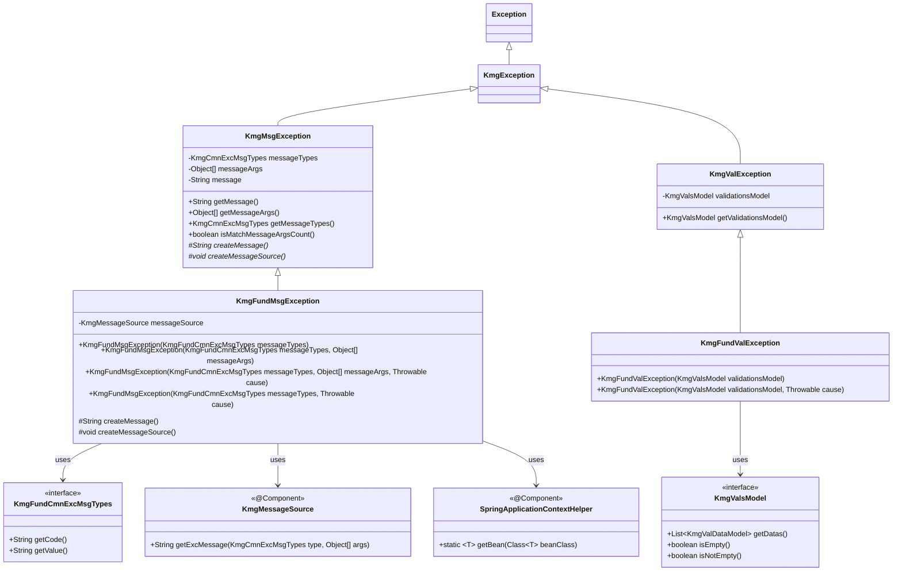
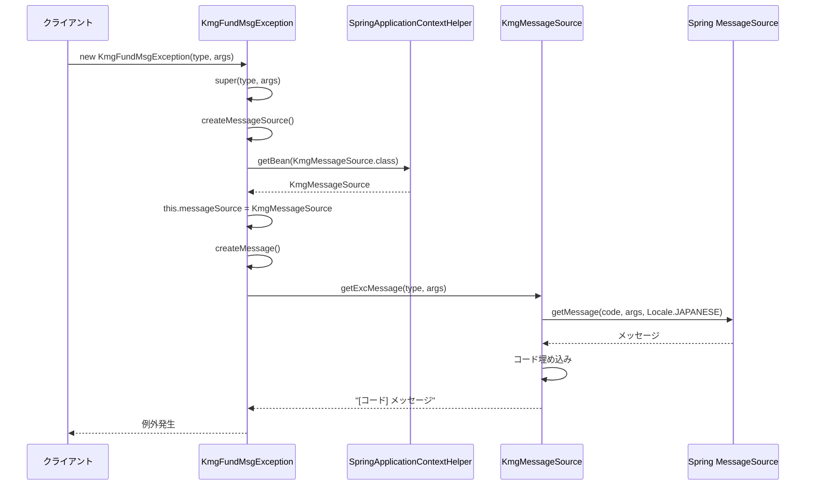
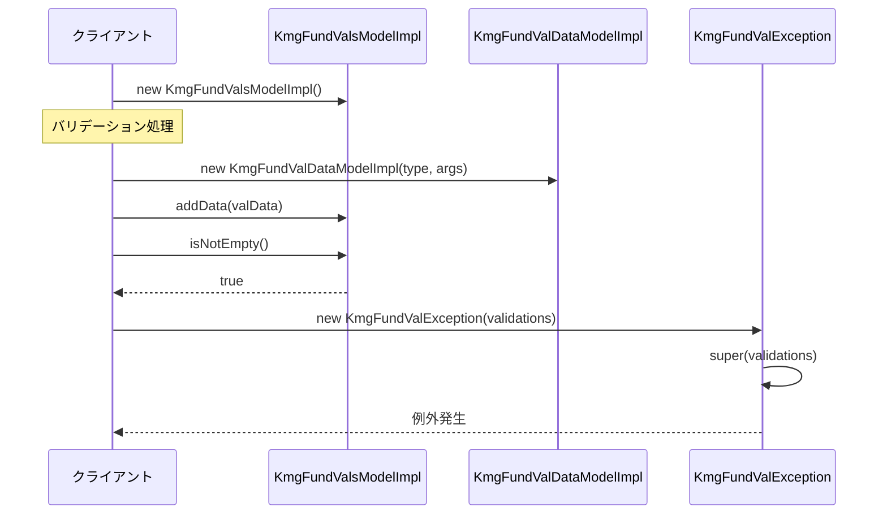

# インフラストラクチャ層例外処理層の設計書

## 1. 概要

例外処理層は、KMG 基盤（Foundation）専用の例外クラスを提供します。
kmg-core の例外クラスを継承し、Spring 管理のメッセージソースと統合された例外処理を実現します。

## 2. パッケージ構成

```text
kmg.fund.infrastructure.exception
├── KmgFundMsgException.java
├── KmgFundValException.java
└── package-info.java
```

## 3. クラス図



## 4. KmgFundMsgException の詳細

### 4.1 概要

KMG 基盤のメッセージ付き例外クラスです。
`KmgMsgException`を継承し、Spring 管理の`KmgMessageSource`を使用してメッセージを生成します。

### 4.2 フィールド

| フィールド名  | 型               | 説明                          |
| ------------- | ---------------- | ----------------------------- |
| messageSource | KmgMessageSource | Spring 管理のメッセージソース |

### 4.3 コンストラクタ

#### 4.3.1 メッセージタイプのみ

```java
public KmgFundMsgException(KmgFundCmnExcMsgTypes messageTypes)
```

メッセージタイプのみを指定するコンストラクタ。

**パラメータ:**

- `messageTypes`: メッセージの種類

**使用例:**

```java
throw new KmgFundMsgException(KmgFundGenMsgTypes.KMGFUND_GEN24000);
```

#### 4.3.2 メッセージタイプと引数

```java
public KmgFundMsgException(
    KmgFundCmnExcMsgTypes messageTypes,
    Object[] messageArgs)
```

メッセージタイプと引数を指定するコンストラクタ。

**パラメータ:**

- `messageTypes`: メッセージの種類
- `messageArgs`: メッセージの引数

**使用例:**

```java
throw new KmgFundMsgException(
    KmgFundGenMsgTypes.KMGFUND_GEN24000,
    new Object[] { "/path/to/file.yml" }
);
```

#### 4.3.3 メッセージタイプ、引数、原因

```java
public KmgFundMsgException(
    KmgFundCmnExcMsgTypes messageTypes,
    Object[] messageArgs,
    Throwable cause)
```

メッセージタイプ、引数、原因を指定するコンストラクタ。

**パラメータ:**

- `messageTypes`: メッセージの種類
- `messageArgs`: メッセージの引数
- `cause`: 原因例外

**使用例:**

```java
try {
    // 何らかの処理
} catch (IOException e) {
    throw new KmgFundMsgException(
        KmgFundGenMsgTypes.KMGFUND_GEN24001,
        new Object[] { "/path/to/file.yml" },
        e
    );
}
```

#### 4.3.4 メッセージタイプと原因

```java
public KmgFundMsgException(
    KmgFundCmnExcMsgTypes messageTypes,
    Throwable cause)
```

メッセージタイプと原因を指定するコンストラクタ。

**パラメータ:**

- `messageTypes`: メッセージの種類
- `cause`: 原因例外

**使用例:**

```java
try {
    // 何らかの処理
} catch (Exception e) {
    throw new KmgFundMsgException(
        KmgFundGenMsgTypes.KMGFUND_GEN24001,
        e
    );
}
```

### 4.4 メソッド

#### 4.4.1 createMessage（保護メソッド）

```java
@Override
protected String createMessage()
```

メッセージを作成して返します。
`KmgMessageSource`を使用してメッセージを生成します。

**戻り値:**

- `[コード] メッセージ`形式の文字列

**処理内容:**

1. メッセージソースから例外用メッセージを取得
2. メッセージコードが自動的に埋め込まれる

#### 4.4.2 createMessageSource（保護メソッド）

```java
@Override
protected void createMessageSource()
```

メッセージソースを作成します。
`SpringApplicationContextHelper`を使用して Bean を取得します。

**処理内容:**

1. SpringApplicationContextHelper から`KmgMessageSource`を取得
2. フィールドに設定

## 5. KmgFundValException の詳細

### 5.1 概要

KMG 基盤のバリデーション例外クラスです。
`KmgValException`を継承し、バリデーションエラー情報を保持します。

### 5.2 コンストラクタ

#### 5.2.1 バリデーションモデルのみ

```java
public KmgFundValException(KmgValsModel validationsModel)
```

バリデーションモデルを指定するコンストラクタ。

**パラメータ:**

- `validationsModel`: KMG バリデーション集合モデル

**使用例:**

```java
KmgFundValsModelImpl validations = new KmgFundValsModelImpl();
// バリデーション処理
if (validations.isNotEmpty()) {
    throw new KmgFundValException(validations);
}
```

#### 5.2.2 バリデーションモデルと原因

```java
public KmgFundValException(
    KmgValsModel validationsModel,
    Throwable cause)
```

バリデーションモデルと原因を指定するコンストラクタ。

**パラメータ:**

- `validationsModel`: KMG バリデーション集合モデル
- `cause`: 原因例外

**使用例:**

```java
try {
    KmgFundValsModelImpl validations = new KmgFundValsModelImpl();
    // バリデーション処理
    if (validations.isNotEmpty()) {
        throw new KmgFundValException(validations);
    }
} catch (Exception e) {
    throw new KmgFundValException(validations, e);
}
```

## 6. シーケンス図

### 6.1 KmgFundMsgException の生成と投げる



### 6.2 KmgFundValException の生成と投げる



## 7. 使用例

### 7.1 ファイル不存在エラー

```java
public class FileReader {

    public String readFile(Path filePath) throws KmgFundMsgException {
        if (!Files.exists(filePath)) {
            throw new KmgFundMsgException(
                KmgFundGenMsgTypes.KMGFUND_GEN24000,
                new Object[] { filePath.toString() }
            );
        }

        try {
            return Files.readString(filePath);
        } catch (IOException e) {
            throw new KmgFundMsgException(
                KmgFundGenMsgTypes.KMGFUND_GEN24001,
                new Object[] { filePath.toString() },
                e
            );
        }
    }
}
```

### 7.2 バリデーションエラー

```java
public class UserValidator {

    public void validate(User user) throws KmgFundValException {
        KmgFundValsModelImpl validations = new KmgFundValsModelImpl();

        // 名前のバリデーション
        if (KmgString.isEmpty(user.getName())) {
            validations.addData(new KmgFundValDataModelImpl(
                KmgFundValMsgTypes.KMGFUND_VAL30001,
                new Object[] { "name" }
            ));
        }

        // メールアドレスのバリデーション
        if (KmgString.isEmpty(user.getEmail())) {
            validations.addData(new KmgFundValDataModelImpl(
                KmgFundValMsgTypes.KMGFUND_VAL30001,
                new Object[] { "email" }
            ));
        } else if (!isValidEmail(user.getEmail())) {
            validations.addData(new KmgFundValDataModelImpl(
                KmgFundValMsgTypes.KMGFUND_VAL30000,
                new Object[] { "email", user.getEmail() }
            ));
        }

        // エラーがある場合は例外を投げる
        if (validations.isNotEmpty()) {
            throw new KmgFundValException(validations);
        }
    }

    private boolean isValidEmail(String email) {
        // メールアドレスのバリデーションロジック
        return email.contains("@");
    }
}
```

### 7.3 例外のキャッチとハンドリング

```java
public class FileService {

    private static final Logger logger = LoggerFactory.getLogger(FileService.class);

    public void processFile(Path filePath) {
        try {
            String content = readFile(filePath);
            // ファイル処理

        } catch (KmgFundMsgException e) {
            logger.error("ファイル処理エラー: {}", e.getMessage(), e);

            // メッセージタイプで処理を分岐
            if (e.getMessageTypes() == KmgFundGenMsgTypes.KMGFUND_GEN24000) {
                // ファイルが存在しない場合
                handleFileNotFound(filePath);

            } else if (e.getMessageTypes() == KmgFundGenMsgTypes.KMGFUND_GEN24001) {
                // 読み込みエラーの場合
                handleReadError(filePath, e.getCause());
            }
        }
    }

    private String readFile(Path filePath) throws KmgFundMsgException {
        // ファイル読み込み処理
        return "";
    }

    private void handleFileNotFound(Path filePath) {
        logger.warn("ファイルが見つかりません: {}", filePath);
    }

    private void handleReadError(Path filePath, Throwable cause) {
        logger.error("ファイル読み込みエラー: {}", filePath, cause);
    }
}
```

### 7.4 バリデーション例外のハンドリング

```java
@RestController
public class UserController {

    @PostMapping("/users")
    public ResponseEntity<User> createUser(@RequestBody User user) {
        try {
            userValidator.validate(user);
            User savedUser = userService.save(user);
            return ResponseEntity.ok(savedUser);

        } catch (KmgFundValException e) {
            // バリデーションエラーのレスポンス作成
            List<String> errors = new ArrayList<>();

            for (KmgValDataModel valData : e.getValidationsModel().getDatas()) {
                errors.add(valData.getMessage());
            }

            return ResponseEntity.badRequest()
                .body(new ErrorResponse(errors));
        }
    }
}
```

### 7.5 例外チェーンの構築

```java
public class DataProcessor {

    public void processData(Path dataPath) throws KmgFundMsgException {
        try {
            // ファイル読み込み
            Map<String, Object> data = loadYamlFile(dataPath);

            // データ処理
            processYamlData(data);

        } catch (KmgFundMsgException e) {
            // 既存の例外を再スロー（そのまま）
            throw e;

        } catch (Exception e) {
            // 予期しない例外を KmgFundMsgException でラップ
            throw new KmgFundMsgException(
                KmgFundGenMsgTypes.KMGFUND_GEN24001,
                new Object[] { dataPath.toString() },
                e
            );
        }
    }

    private Map<String, Object> loadYamlFile(Path path) throws KmgFundMsgException {
        return KmgYamlUtils.load(path);
    }

    private void processYamlData(Map<String, Object> data) {
        // データ処理ロジック
    }
}
```

### 7.6 例外情報の取得と活用

```java
public class ExceptionHandler {

    public void handleException(KmgFundMsgException exception) {
        // 例外のメッセージ
        String message = exception.getMessage();
        System.out.println("メッセージ: " + message);

        // メッセージタイプ
        KmgCmnExcMsgTypes messageType = exception.getMessageTypes();
        System.out.println("メッセージコード: " + messageType.getCode());

        // メッセージ引数
        Object[] messageArgs = exception.getMessageArgs();
        if (messageArgs != null) {
            System.out.println("引数: " + Arrays.toString(messageArgs));
        }

        // 原因例外
        Throwable cause = exception.getCause();
        if (cause != null) {
            System.out.println("原因: " + cause.getClass().getSimpleName());
            System.out.println("原因メッセージ: " + cause.getMessage());
        }

        // メッセージ引数の数の一致確認
        boolean isMatch = exception.isMatchMessageArgsCount();
        System.out.println("引数の数は一致: " + isMatch);
    }
}
```

## 8. 設計上の注意点

### 8.1 例外の使い分け

| 例外クラス          | 使用場面                                           |
| ------------------- | -------------------------------------------------- |
| KmgFundMsgException | 一般的なエラー、ファイル操作エラー、設定エラーなど |
| KmgFundValException | バリデーションエラー                               |

### 8.2 メッセージタイプの選択

- 例外メッセージには必ず適切な`KmgFundCmnExcMsgTypes`を指定
- メッセージは`messages.properties`で定義
- メッセージコードは一意にする

### 8.3 原因例外の保持

- キャッチした例外は原因として保持
- スタックトレースを失わないようにする
- デバッグが容易になる

### 8.4 メッセージ引数の管理

- 引数の数はメッセージパターンと一致させる
- `isMatchMessageArgsCount()`で確認可能
- 引数は適切な型で渡す（`toString()`が呼ばれる）

## 9. 今後の拡張

### 9.1 構造化例外情報

```java
public class KmgFundMsgException extends KmgMsgException {

    private Map<String, Object> additionalInfo;

    public void addInfo(String key, Object value) {
        if (additionalInfo == null) {
            additionalInfo = new HashMap<>();
        }
        additionalInfo.put(key, value);
    }

    public Map<String, Object> getAdditionalInfo() {
        return additionalInfo != null ?
            Collections.unmodifiableMap(additionalInfo) :
            Collections.emptyMap();
    }
}
```

### 9.2 例外のカテゴリ分類

```java
public enum KmgExceptionCategory {
    FILE_OPERATION,
    DATABASE_OPERATION,
    VALIDATION,
    CONFIGURATION,
    NETWORK,
    UNKNOWN
}

public class KmgFundMsgException extends KmgMsgException {

    private KmgExceptionCategory category;

    public KmgExceptionCategory getCategory() {
        // メッセージタイプから自動判定
        return determineCategory(getMessageTypes());
    }
}
```

### 9.3 例外ハンドラの統一

```java
@ControllerAdvice
public class GlobalExceptionHandler {

    @ExceptionHandler(KmgFundMsgException.class)
    public ResponseEntity<ErrorResponse> handleKmgFundMsgException(
        KmgFundMsgException e) {

        ErrorResponse response = new ErrorResponse(
            e.getMessageTypes().getCode(),
            e.getMessage(),
            e.getAdditionalInfo()
        );

        return ResponseEntity.status(determineStatus(e))
            .body(response);
    }

    @ExceptionHandler(KmgFundValException.class)
    public ResponseEntity<ValidationErrorResponse> handleKmgFundValException(
        KmgFundValException e) {

        ValidationErrorResponse response = new ValidationErrorResponse();

        for (KmgValDataModel valData : e.getValidationsModel().getDatas()) {
            response.addError(
                valData.getMessageTypes().getCode(),
                valData.getMessage()
            );
        }

        return ResponseEntity.badRequest().body(response);
    }
}
```
