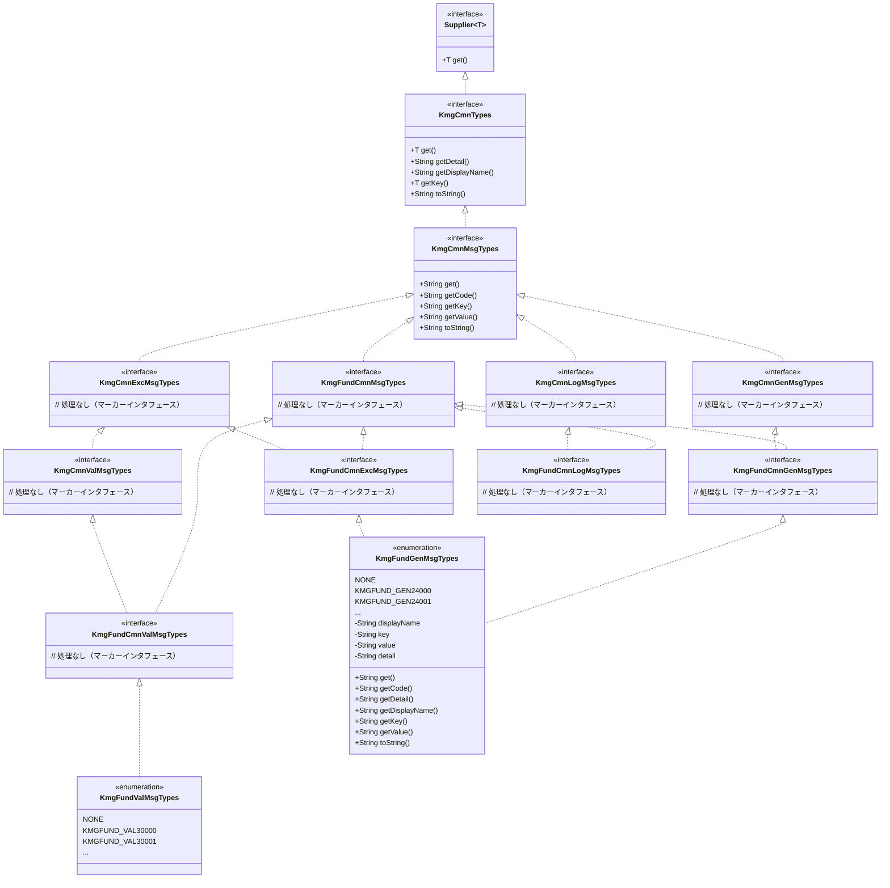
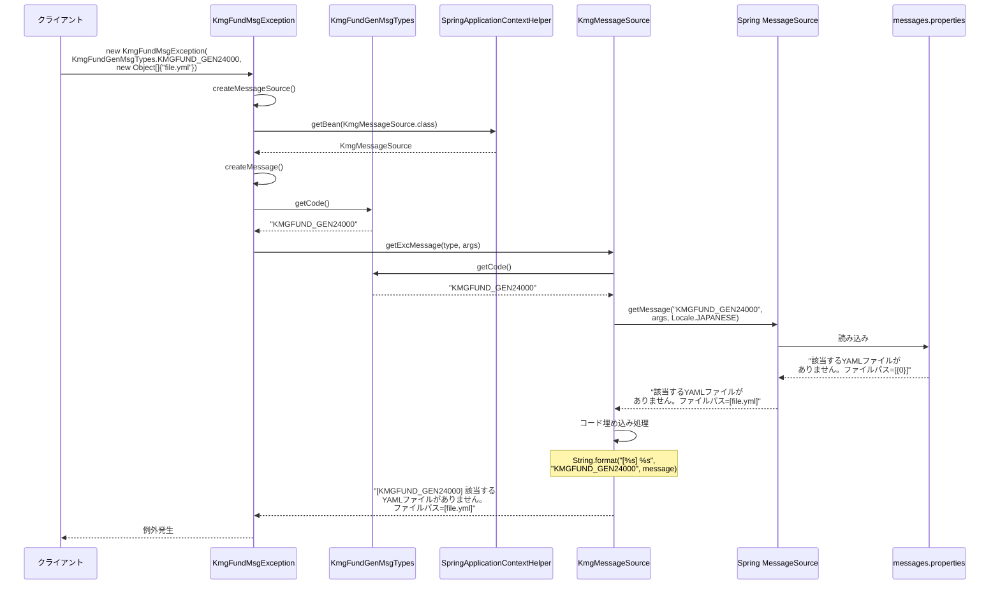
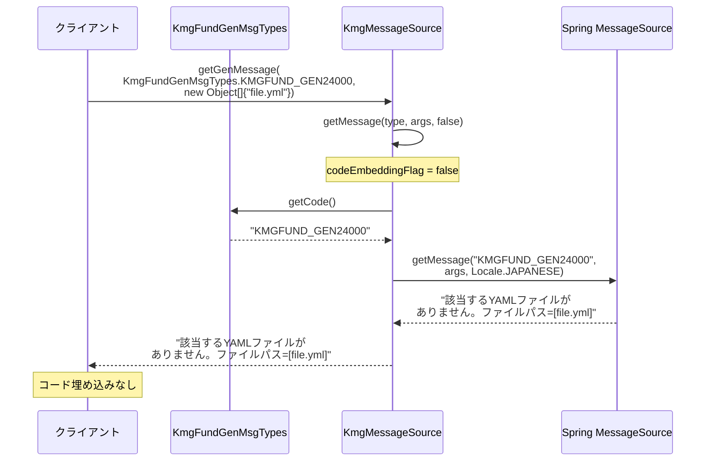

# インフラストラクチャ層共通メッセージ型定義の設計書

## 1. 概要

共通メッセージ型定義層は、KMG 基盤（Foundation）で使用されるメッセージの種類を定義するインタフェース群を提供します。
kmg-core の共通メッセージインタフェースを継承し、基盤固有のメッセージタイプを定義するための基底インタフェースとして機能します。

## 2. パッケージ構成

```text
kmg.fund.infrastructure.cmn.msg
├── KmgFundCmnMsgTypes.java        # 共通メッセージ型の基底インタフェース
├── KmgFundCmnExcMsgTypes.java     # 例外メッセージ型のインタフェース
├── KmgFundCmnGenMsgTypes.java     # 一般メッセージ型のインタフェース
├── KmgFundCmnLogMsgTypes.java     # ログメッセージ型のインタフェース
├── KmgFundCmnValMsgTypes.java     # バリデーションメッセージ型のインタフェース
└── package-info.java
```

## 3. クラス図



## 4. インタフェース詳細

### 4.1 KmgFundCmnMsgTypes

#### 4.1.1 概要

KMG 基盤の全メッセージタイプの基底インタフェースです。
kmg-core の`KmgCmnMsgTypes`を継承し、KMG 基盤固有のメッセージタイプを定義するための基底として機能します。

#### 4.1.2 継承関係

```java
public interface KmgFundCmnMsgTypes extends KmgCmnMsgTypes
```

**親インタフェース:**

- `KmgCmnMsgTypes`: kmg-core の共通メッセージタイプ

#### 4.1.3 特徴

- マーカーインタフェースとして機能（メソッド定義なし）
- 基盤固有のメッセージタイプを識別するための型として使用
- 全ての基盤メッセージインタフェースの親となる

### 4.2 KmgFundCmnExcMsgTypes

#### 4.2.1 概要

KMG 基盤の例外メッセージタイプを表すインタフェースです。
例外発生時に使用されるメッセージの種類を識別します。

#### 4.2.2 継承関係

```java
public interface KmgFundCmnExcMsgTypes
    extends KmgFundCmnMsgTypes, KmgCmnExcMsgTypes
```

**親インタフェース:**

- `KmgFundCmnMsgTypes`: 基盤共通メッセージタイプ
- `KmgCmnExcMsgTypes`: kmg-core の例外メッセージタイプ

#### 4.2.3 用途

- `KmgFundMsgException`のメッセージタイプとして使用
- 例外メッセージはコード埋め込みあり（`[コード] メッセージ`形式）
- システムログやエラーハンドリングに使用

#### 4.2.4 使用例

```java
public enum KmgFundGenMsgTypes
    implements KmgFundCmnGenMsgTypes, KmgFundCmnExcMsgTypes {

    KMGFUND_GEN24000("該当するYAMLファイルがありません。ファイルパス=[{0}]"),
    KMGFUND_GEN24001("YAMLにロードするファイルの読み込みに失敗しました。ファイルパス=[{0}]");
}

// 例外での使用
throw new KmgFundMsgException(
    KmgFundGenMsgTypes.KMGFUND_GEN24000,
    new Object[] { filePath }
);
```

### 4.3 KmgFundCmnGenMsgTypes

#### 4.3.1 概要

KMG 基盤の一般メッセージタイプを表すインタフェースです。
ユーザー向け表示など、コード埋め込みが不要なメッセージに使用されます。

#### 4.3.2 継承関係

```java
public interface KmgFundCmnGenMsgTypes
    extends KmgFundCmnMsgTypes, KmgCmnGenMsgTypes
```

**親インタフェース:**

- `KmgFundCmnMsgTypes`: 基盤共通メッセージタイプ
- `KmgCmnGenMsgTypes`: kmg-core の一般メッセージタイプ

#### 4.3.3 用途

- ユーザー向け通知メッセージ
- UI 表示用メッセージ
- コード埋め込みなし（メッセージのみ）

#### 4.3.4 使用例

```java
// 一般メッセージ取得
KmgMessageSource messageSource =
    SpringApplicationContextHelper.getBean(KmgMessageSource.class);

String message = messageSource.getGenMessage(
    KmgFundGenMsgTypes.KMGFUND_GEN24000,
    new Object[] { "/path/to/file" }
);
// => "該当するYAMLファイルがありません。ファイルパス=[/path/to/file]"
```

### 4.4 KmgFundCmnLogMsgTypes

#### 4.4.1 概要

KMG 基盤のログメッセージタイプを表すインタフェースです。
ログ出力専用のメッセージを識別します。

#### 4.4.2 継承関係

```java
public interface KmgFundCmnLogMsgTypes
    extends KmgFundCmnMsgTypes, KmgCmnLogMsgTypes
```

**親インタフェース:**

- `KmgFundCmnMsgTypes`: 基盤共通メッセージタイプ
- `KmgCmnLogMsgTypes`: kmg-core のログメッセージタイプ

#### 4.4.3 用途

- システムログ出力
- デバッグ情報
- 監査ログ
- コード埋め込みあり（`[コード] メッセージ`形式）

#### 4.4.4 使用例

```java
// ログメッセージ取得
String logMessage = messageSource.getLogMessage(
    KmgFundLogMsgTypes.KMGFUND_LOG10000,
    new Object[] { "処理名", "1234" }
);
logger.info(logMessage);
// => "[KMGFUND_LOG10000] 処理を開始しました。処理名=[処理名]"
```

### 4.5 KmgFundCmnValMsgTypes

#### 4.5.1 概要

KMG 基盤のバリデーションメッセージタイプを表すインタフェースです。
入力検証エラー時のメッセージを識別します。

#### 4.5.2 継承関係

```java
public interface KmgFundCmnValMsgTypes
    extends KmgFundCmnMsgTypes, KmgCmnValMsgTypes
```

**親インタフェース:**

- `KmgFundCmnMsgTypes`: 基盤共通メッセージタイプ
- `KmgCmnValMsgTypes`: kmg-core のバリデーションメッセージタイプ

**注意:** `KmgCmnValMsgTypes`は`KmgCmnExcMsgTypes`を継承しているため、
例外メッセージとしても使用可能です。

#### 4.5.3 用途

- 入力検証エラー
- フォームバリデーション
- ビジネスルール検証
- `KmgFundValException`と組み合わせて使用

#### 4.5.4 使用例

```java
public enum KmgFundValMsgTypes
    implements KmgFundCmnValMsgTypes, KmgFundCmnExcMsgTypes {

    KMGFUND_VAL30000("入力値が不正です。フィールド=[{0}], 値=[{1}]"),
    KMGFUND_VAL30001("必須項目が未入力です。フィールド=[{0}]");
}

// バリデーション例外での使用
throw new KmgFundValException(validationsModel);
```

## 5. メッセージタイプの実装パターン

### 5.1 列挙型による実装

メッセージタイプは通常、enum として実装されます。

```java
@SuppressWarnings("nls")
public enum KmgFundGenMsgTypes
    implements KmgFundCmnGenMsgTypes, KmgFundCmnExcMsgTypes {

    /* 定義：開始 */

    /**
     * 指定無し
     */
    NONE("指定無し"),

    /**
     * 該当するYAMLファイルがありません。ファイルパス=[{0}]
     */
    KMGFUND_GEN24000("該当するYAMLファイルがありません。ファイルパス=[{0}]"),

    /**
     * YAMLにロードするファイルの読み込みに失敗しました。ファイルパス=[{0}]
     */
    KMGFUND_GEN24001("YAMLにロードするファイルの読み込みに失敗しました。ファイルパス=[{0}]"),

    /* 定義：終了 */
    ;

    // フィールド
    private static final Map<String, KmgFundGenMsgTypes> VALUES_MAP = new HashMap<>();
    private final String displayName;
    private final String key;
    private final String value;
    private final String detail;

    static {
        for (final KmgFundGenMsgTypes type : KmgFundGenMsgTypes.values()) {
            VALUES_MAP.put(type.get(), type);
        }
    }

    // コンストラクタ
    private KmgFundGenMsgTypes(final String value) {
        this.displayName = this.name();
        this.key = this.name();
        this.value = value;
        this.detail = "";
    }

    // メソッド実装
    @Override
    public String get() {
        return this.key;
    }

    @Override
    public String getCode() {
        return this.key;
    }

    @Override
    public String getDetail() {
        return this.detail;
    }

    @Override
    public String getDisplayName() {
        return this.displayName;
    }

    @Override
    public String getKey() {
        return this.key;
    }

    @Override
    public String getValue() {
        return this.value;
    }

    @Override
    public String toString() {
        return this.key;
    }
}
```

### 5.2 メッセージコードの命名規則

```text
KMG{モジュール}_{カテゴリ}{番号}

例:
- KMGFUND_GEN24000  : KMG基盤（Fund）の一般（Gen）メッセージ24000番
- KMGFUND_VAL30000  : KMG基盤（Fund）のバリデーション（Val）メッセージ30000番
- KMGFUND_LOG10000  : KMG基盤（Fund）のログ（Log）メッセージ10000番
```

**カテゴリコード:**

- `GEN`: 一般メッセージ（General）
- `VAL`: バリデーションメッセージ（Validation）
- `LOG`: ログメッセージ（Log）
- `EXC`: 例外メッセージ（Exception）

**番号範囲:**

- 10000 台: ログメッセージ
- 20000 台: 情報メッセージ
- 24000 台: ファイル関連メッセージ
- 30000 台: バリデーションメッセージ
- 40000 台: エラーメッセージ

## 6. シーケンス図

### 6.1 メッセージタイプから例外メッセージ生成までの流れ



### 6.2 一般メッセージ取得の流れ



## 7. 使用例

### 7.1 メッセージタイプ定義の作成

```java
package kmg.fund.infrastructure.types.msg;

import kmg.fund.infrastructure.cmn.msg.KmgFundCmnExcMsgTypes;
import kmg.fund.infrastructure.cmn.msg.KmgFundCmnGenMsgTypes;

/**
 * KMG 基盤一般メッセージの種類
 */
@SuppressWarnings("nls")
public enum KmgFundGenMsgTypes
    implements KmgFundCmnGenMsgTypes, KmgFundCmnExcMsgTypes {

    NONE("指定無し"),

    KMGFUND_GEN24000("該当するYAMLファイルがありません。ファイルパス=[{0}]"),

    KMGFUND_GEN24001("YAMLにロードするファイルの読み込みに失敗しました。ファイルパス=[{0}]"),

    ;

    // 実装は省略（5.1 参照）
}
```

### 7.2 例外メッセージとしての使用

```java
@Service
public class YamlService {

    public void loadYaml(Path yamlPath) throws KmgFundMsgException {

        if (!Files.exists(yamlPath)) {
            // 例外メッセージタイプを使用
            throw new KmgFundMsgException(
                KmgFundGenMsgTypes.KMGFUND_GEN24000,
                new Object[] { yamlPath.toString() }
            );
            // => 例外メッセージ:
            // "[KMGFUND_GEN24000] 該当するYAMLファイルがありません。ファイルパス=[/path/to/file.yml]"
        }

        try {
            // YAML読み込み処理
        } catch (IOException e) {
            throw new KmgFundMsgException(
                KmgFundGenMsgTypes.KMGFUND_GEN24001,
                new Object[] { yamlPath.toString() },
                e
            );
        }
    }
}
```

### 7.3 一般メッセージとしての使用

```java
@Service
public class NotificationService {

    @Autowired
    private KmgMessageSource messageSource;

    public void notifyUser(String fileName) {
        // 一般メッセージ取得（コード埋め込みなし）
        String message = messageSource.getGenMessage(
            KmgFundGenMsgTypes.KMGFUND_GEN24000,
            new Object[] { fileName }
        );
        // => "該当するYAMLファイルがありません。ファイルパス=[file.yml]"

        // ユーザーに通知
        showNotification(message);
    }
}
```

### 7.4 ログメッセージの定義と使用

```java
// メッセージタイプ定義
public enum KmgFundLogMsgTypes
    implements KmgFundCmnLogMsgTypes {

    KMGFUND_LOG10000("処理を開始しました。処理名=[{0}]"),
    KMGFUND_LOG10001("処理が完了しました。処理名=[{0}], 経過時間=[{1}]ms"),
    ;

    // 実装省略
}

// 使用例
@Service
public class ProcessService {

    @Autowired
    private KmgMessageSource messageSource;

    private static final Logger logger = LoggerFactory.getLogger(ProcessService.class);

    public void process(String processName) {
        // ログメッセージ（コード埋め込みあり）
        String startMsg = messageSource.getLogMessage(
            KmgFundLogMsgTypes.KMGFUND_LOG10000,
            new Object[] { processName }
        );
        logger.info(startMsg);
        // => "[KMGFUND_LOG10000] 処理を開始しました。処理名=[データ処理]"

        long startTime = System.currentTimeMillis();

        // 処理実行
        doProcess();

        long elapsed = System.currentTimeMillis() - startTime;
        String endMsg = messageSource.getLogMessage(
            KmgFundLogMsgTypes.KMGFUND_LOG10001,
            new Object[] { processName, elapsed }
        );
        logger.info(endMsg);
        // => "[KMGFUND_LOG10001] 処理が完了しました。処理名=[データ処理], 経過時間=[1234]ms"
    }
}
```

### 7.5 バリデーションメッセージの定義と使用

```java
// メッセージタイプ定義
public enum KmgFundValMsgTypes
    implements KmgFundCmnValMsgTypes, KmgFundCmnExcMsgTypes {

    KMGFUND_VAL30000("入力値が不正です。フィールド=[{0}], 値=[{1}]"),
    KMGFUND_VAL30001("必須項目が未入力です。フィールド=[{0}]"),
    ;

    // 実装省略
}

// 使用例
@Service
public class UserValidator {

    public void validate(String username, String email) throws KmgFundValException {

        KmgValsModelImpl validations = new KmgValsModelImpl();

        if (username == null || username.isEmpty()) {
            validations.add(new KmgValDataModelImpl(
                KmgFundValMsgTypes.KMGFUND_VAL30001,
                new Object[] { "username" }
            ));
        }

        if (email == null || !email.contains("@")) {
            validations.add(new KmgValDataModelImpl(
                KmgFundValMsgTypes.KMGFUND_VAL30000,
                new Object[] { "email", email }
            ));
        }

        if (validations.isNotEmpty()) {
            throw new KmgFundValException(validations);
        }
    }
}
```

### 7.6 複数インタフェースの実装

メッセージタイプは、用途に応じて複数のインタフェースを実装できます。

```java
/**
 * 一般メッセージであり、例外メッセージとしても使用可能
 */
public enum KmgFundGenMsgTypes
    implements KmgFundCmnGenMsgTypes, KmgFundCmnExcMsgTypes {

    KMGFUND_GEN24000("該当するYAMLファイルがありません。ファイルパス=[{0}]"),
    ;
}

// ユーザー向け表示として使用
String userMessage = messageSource.getGenMessage(
    KmgFundGenMsgTypes.KMGFUND_GEN24000,
    new Object[] { fileName }
);
// => "該当するYAMLファイルがありません。ファイルパス=[file.yml]"

// 例外メッセージとして使用
throw new KmgFundMsgException(
    KmgFundGenMsgTypes.KMGFUND_GEN24000,
    new Object[] { fileName }
);
// => "[KMGFUND_GEN24000] 該当するYAMLファイルがありません。ファイルパス=[file.yml]"
```

## 8. メッセージリソースファイル

### 8.1 プロパティファイルの配置

```text
src/main/resources/
└── messages/
    ├── kmg-fund.properties       # 日本語メッセージ（デフォルト）
    ├── kmg-fund_en.properties    # 英語メッセージ
    └── kmg-fund_ja.properties    # 日本語メッセージ（明示的）
```

### 8.2 メッセージ定義例

**messages/kmg-fund.properties:**

```properties
# 一般メッセージ
KMGFUND_GEN24000=該当するYAMLファイルがありません。ファイルパス=[{0}]
KMGFUND_GEN24001=YAMLにロードするファイルの読み込みに失敗しました。ファイルパス=[{0}]

# ログメッセージ
KMGFUND_LOG10000=処理を開始しました。処理名=[{0}]
KMGFUND_LOG10001=処理が完了しました。処理名=[{0}], 経過時間=[{1}]ms

# バリデーションメッセージ
KMGFUND_VAL30000=入力値が不正です。フィールド=[{0}], 値=[{1}]
KMGFUND_VAL30001=必須項目が未入力です。フィールド=[{0}]
```

**messages/kmg-fund_en.properties:**

```properties
# General Messages
KMGFUND_GEN24000=YAML file not found. File path=[{0}]
KMGFUND_GEN24001=Failed to read file for loading YAML. File path=[{0}]

# Log Messages
KMGFUND_LOG10000=Process started. Process name=[{0}]
KMGFUND_LOG10001=Process completed. Process name=[{0}], Elapsed time=[{1}]ms

# Validation Messages
KMGFUND_VAL30000=Invalid input value. Field=[{0}], Value=[{1}]
KMGFUND_VAL30001=Required field is empty. Field=[{0}]
```

### 8.3 Spring 設定

**application.properties:**

```properties
# メッセージソース設定
spring.messages.basename=messages/kmg-fund,messages/app
spring.messages.encoding=UTF-8
spring.messages.cache-duration=3600
spring.messages.fallback-to-system-locale=false
```

## 9. 設計上の注意点

### 9.1 インタフェースの選択

| インタフェース        | 用途                     | コード埋め込み | 使用クラス例        |
| --------------------- | ------------------------ | -------------- | ------------------- |
| KmgFundCmnExcMsgTypes | 例外メッセージ           | あり           | KmgFundMsgException |
| KmgFundCmnGenMsgTypes | 一般メッセージ           | なし           | 通知、UI 表示       |
| KmgFundCmnLogMsgTypes | ログメッセージ           | あり           | ロガー              |
| KmgFundCmnValMsgTypes | バリデーションメッセージ | 状況による     | KmgFundValException |

### 9.2 メッセージコードの一意性

- 同じモジュール内でメッセージコードは一意でなければならない
- コード番号の範囲を適切に管理する
- カテゴリごとに番号範囲を明確にする

### 9.3 メッセージパラメータ

- パラメータは`{0}`, `{1}`, `{2}` ... の形式で指定
- `MessageFormat`の仕様に従う
- パラメータの数と順序を明確にドキュメント化する

### 9.4 マーカーインタフェースの活用

```java
// 複数のマーカーインタフェースを実装することで、
// 同じメッセージを異なる用途で使用可能
public enum KmgFundGenMsgTypes
    implements KmgFundCmnGenMsgTypes, KmgFundCmnExcMsgTypes {
    // 一般メッセージとしても、例外メッセージとしても使用可能
}
```

### 9.5 NONE 定数の使用

```java
// 各メッセージタイプには NONE 定数を用意する
NONE("指定無し"),

// 未初期化や未指定の状態を表現
KmgFundGenMsgTypes messageType = KmgFundGenMsgTypes.NONE;
```

## 10. テスト

### 10.1 メッセージタイプのテスト

```java
@Test
public void testMessageType() {
    // メッセージコードの確認
    assertEquals("KMGFUND_GEN24000",
        KmgFundGenMsgTypes.KMGFUND_GEN24000.getCode());

    // メッセージ値の確認
    assertEquals("該当するYAMLファイルがありません。ファイルパス=[{0}]",
        KmgFundGenMsgTypes.KMGFUND_GEN24000.getValue());

    // キーの確認
    assertEquals("KMGFUND_GEN24000",
        KmgFundGenMsgTypes.KMGFUND_GEN24000.getKey());
}
```

### 10.2 メッセージ取得のテスト

```java
@SpringBootTest
public class MessageSourceTest {

    @Autowired
    private KmgMessageSource messageSource;

    @Test
    public void testGetExcMessage() {
        String message = messageSource.getExcMessage(
            KmgFundGenMsgTypes.KMGFUND_GEN24000,
            new Object[] { "/test/file.yml" }
        );

        assertEquals(
            "[KMGFUND_GEN24000] 該当するYAMLファイルがありません。ファイルパス=[/test/file.yml]",
            message
        );
    }

    @Test
    public void testGetGenMessage() {
        String message = messageSource.getGenMessage(
            KmgFundGenMsgTypes.KMGFUND_GEN24000,
            new Object[] { "/test/file.yml" }
        );

        assertEquals(
            "該当するYAMLファイルがありません。ファイルパス=[/test/file.yml]",
            message
        );
    }
}
```

### 10.3 例外メッセージのテスト

```java
@Test
public void testExceptionMessage() {
    KmgFundMsgException exception = new KmgFundMsgException(
        KmgFundGenMsgTypes.KMGFUND_GEN24000,
        new Object[] { "/test/file.yml" }
    );

    String expectedMessage =
        "[KMGFUND_GEN24000] 該当するYAMLファイルがありません。ファイルパス=[/test/file.yml]";

    assertEquals(expectedMessage, exception.getMessage());
}
```

## 11. 今後の拡張

### 11.1 動的メッセージの追加

```java
public interface KmgFundCmnDynamicMsgTypes extends KmgFundCmnMsgTypes {
    // 実行時に動的に追加されるメッセージ用
}
```

### 11.2 カスタムフォーマッタ対応

```java
public interface KmgFundCmnFormattedMsgTypes extends KmgFundCmnMsgTypes {
    /**
     * カスタムフォーマッタを返す
     */
    MessageFormatter getFormatter();
}
```

### 11.3 メッセージの階層化

```java
// 業務ドメインごとのメッセージタイプ
public enum UserDomainMsgTypes
    implements KmgFundCmnGenMsgTypes, KmgFundCmnExcMsgTypes {

    USER_NOT_FOUND("ユーザーが見つかりません。ユーザーID=[{0}]"),
    USER_ALREADY_EXISTS("ユーザーが既に存在します。ユーザーID=[{0}]"),
    ;
}
```

## 12. 関連ドキュメント

- [インフラストラクチャ層コンテキスト管理層の設計書](./インフラストラクチャ層コンテキスト管理層の設計書.md)
  - `KmgMessageSource`クラスの詳細
  - メッセージ取得の仕組み
- [インフラストラクチャ層例外処理層の設計書](./インフラストラクチャ層例外処理層の設計書.md)
  - `KmgFundMsgException`の使用方法
  - 例外メッセージの仕組み
- [インフラストラクチャ層の設計書](./インフラストラクチャ層の設計書.md)
  - 基盤全体のアーキテクチャ

## 13. まとめ

`kmg.fund.infrastructure.cmn.msg`パッケージは、KMG 基盤におけるメッセージタイプの定義を提供します。

**主な特徴:**

- マーカーインタフェースによる型安全なメッセージ管理
- kmg-core のメッセージインタフェースを継承
- 用途別のメッセージタイプ（例外、一般、ログ、バリデーション）
- Spring MessageSource との統合
- 多言語対応のメッセージリソース

**設計の利点:**

- 型安全性の向上
- メッセージの一元管理
- コードの可読性向上
- 保守性の向上
- 国際化対応の容易さ

これらのインタフェースを適切に実装・使用することで、一貫性のあるメッセージ管理が実現されます。
