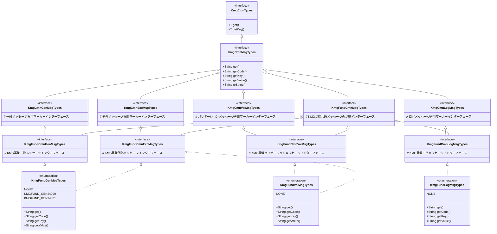
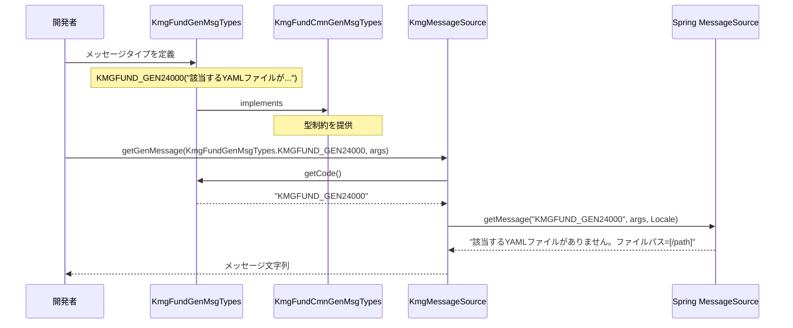
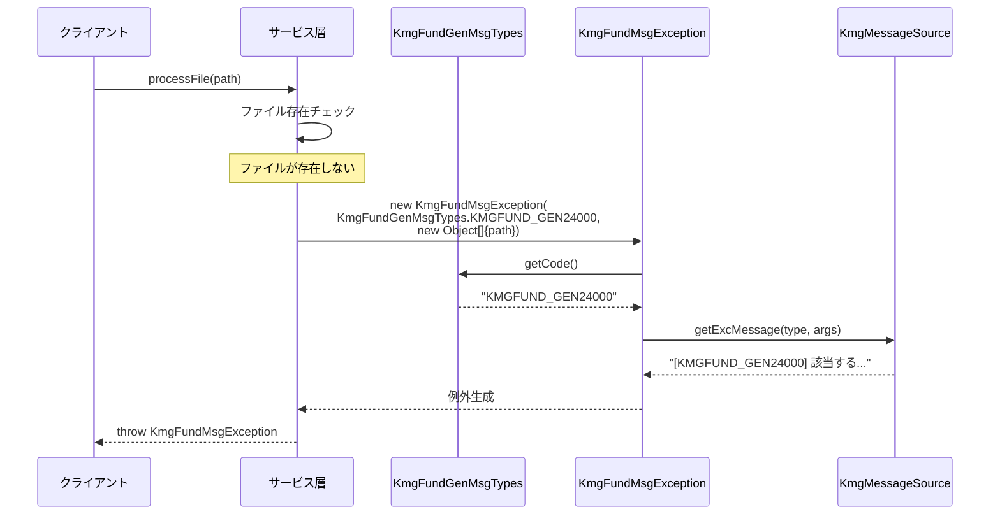
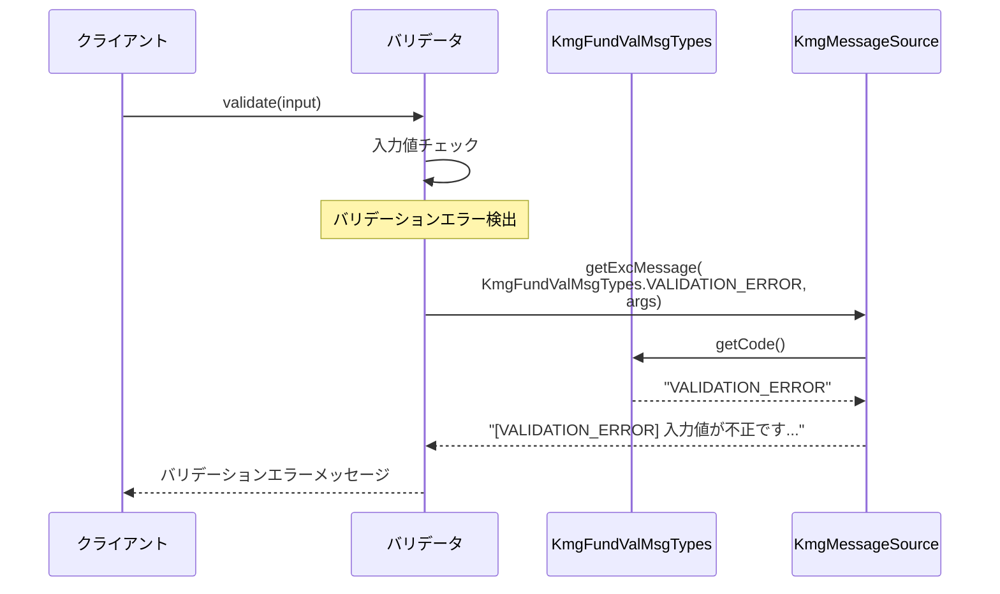

# インフラストラクチャ層共通層の設計書

## 1. 概要

共通メッセージ定義層は、KMG 基盤全体で使用するメッセージタイプのインターフェース定義を提供します。
このパッケージは、例外メッセージ、一般メッセージ、ログメッセージ、バリデーションメッセージなどの分類に応じたインターフェースを定義し、各モジュールで実装される具体的なメッセージ列挙型の型安全性を保証します。

## 2. パッケージ構成

```text
kmg.fund.infrastructure.cmn
├── msg
│   ├── KmgFundCmnMsgTypes.java
│   ├── KmgFundCmnExcMsgTypes.java
│   ├── KmgFundCmnGenMsgTypes.java
│   ├── KmgFundCmnLogMsgTypes.java
│   ├── KmgFundCmnValMsgTypes.java
│   └── package-info.java
└── package-info.java
```

## 3. クラス図



## 4. インターフェース詳細

### 4.1 KmgFundCmnMsgTypes

#### 4.1.1 概要

KMG 基盤における全メッセージタイプの基底インターフェースです。
`kmg.core.infrastructure.cmn.msg.KmgCmnMsgTypes` を継承し、KMG 基盤固有のメッセージタイプ定義の起点となります。

#### 4.1.2 継承関係

```java
public interface KmgFundCmnMsgTypes extends KmgCmnMsgTypes
```

**継承元:**

- `KmgCmnMsgTypes` (kmg-core)

**継承先:**

- `KmgFundCmnExcMsgTypes`
- `KmgFundCmnGenMsgTypes`
- `KmgFundCmnLogMsgTypes`
- `KmgFundCmnValMsgTypes`

#### 4.1.3 責務

- KMG 基盤のメッセージタイプの型階層の基底として機能
- 全てのメッセージタイプに共通のメソッド仕様を継承
  - `get()`: メッセージキーの取得
  - `getCode()`: メッセージコードの取得
  - `getKey()`: メッセージキーの取得
  - `getValue()`: メッセージ値の取得
  - `toString()`: 文字列表現の取得

### 4.2 KmgFundCmnExcMsgTypes

#### 4.2.1 概要

例外メッセージ専用のインターフェースです。
例外発生時に使用されるメッセージタイプを定義する列挙型が実装するマーカーインターフェースとして機能します。

#### 4.2.2 継承関係

```java
public interface KmgFundCmnExcMsgTypes extends KmgFundCmnMsgTypes, KmgCmnExcMsgTypes
```

**継承元:**

- `KmgFundCmnMsgTypes` (kmg-fund)
- `KmgCmnExcMsgTypes` (kmg-core)

**実装クラス:**

- `KmgFundGenMsgTypes` (enum) - 一般メッセージだが例外にも使用可能
- `KmgFundValMsgTypes` (enum) - バリデーションメッセージだが例外にも使用可能

#### 4.2.3 用途

- 例外クラス（`KmgFundMsgException` など）のコンストラクタパラメータ型として使用
- 例外メッセージのコード埋め込み時に `KmgMessageSource.getExcMessage()` で使用
- 型安全な例外メッセージの管理を実現

### 4.3 KmgFundCmnGenMsgTypes

#### 4.3.1 概要

一般メッセージ専用のインターフェースです。
ユーザー向けの通知、画面表示、システム出力などに使用されるメッセージタイプを定義する列挙型が実装します。

#### 4.3.2 継承関係

```java
public interface KmgFundCmnGenMsgTypes extends KmgFundCmnMsgTypes, KmgCmnGenMsgTypes
```

**継承元:**

- `KmgFundCmnMsgTypes` (kmg-fund)
- `KmgCmnGenMsgTypes` (kmg-core)

**実装クラス:**

- `KmgFundGenMsgTypes` (enum)

#### 4.3.3 用途

- ユーザー向け通知メッセージ
- 画面表示メッセージ
- 処理結果の通知
- コード埋め込みが不要な一般的なメッセージ

### 4.4 KmgFundCmnLogMsgTypes

#### 4.4.1 概要

ログメッセージ専用のインターフェースです。
システムログ、アプリケーションログに出力されるメッセージタイプを定義する列挙型が実装します。

#### 4.4.2 継承関係

```java
public interface KmgFundCmnLogMsgTypes extends KmgFundCmnMsgTypes, KmgCmnLogMsgTypes
```

**継承元:**

- `KmgFundCmnMsgTypes` (kmg-fund)
- `KmgCmnLogMsgTypes` (kmg-core)

**実装クラス:**

- `KmgFundLogMsgTypes` (enum)

#### 4.4.3 用途

- システムログへの出力
- デバッグログの記録
- 処理トレースの記録
- コード埋め込みありでログ出力

### 4.5 KmgFundCmnValMsgTypes

#### 4.5.1 概要

バリデーションメッセージ専用のインターフェースです。
入力値検証時に使用されるメッセージタイプを定義する列挙型が実装します。
`KmgCmnValMsgTypes` は `KmgCmnExcMsgTypes` を継承しているため、バリデーションエラー時に例外としても使用可能です。

#### 4.5.2 継承関係

```java
public interface KmgFundCmnValMsgTypes extends KmgFundCmnMsgTypes, KmgCmnValMsgTypes
```

**継承元:**

- `KmgFundCmnMsgTypes` (kmg-fund)
- `KmgCmnValMsgTypes` (kmg-core) - これは `KmgCmnExcMsgTypes` を継承

**実装クラス:**

- `KmgFundValMsgTypes` (enum)

#### 4.5.3 用途

- 入力値のバリデーションエラーメッセージ
- 形式チェックエラーメッセージ
- 必須項目チェックエラーメッセージ
- バリデーション例外のメッセージ

## 5. インターフェースと実装の関係

### 5.1 実装パターン

インターフェースは `kmg.fund.infrastructure.cmn.msg` パッケージで定義され、
実装は `kmg.fund.infrastructure.types.msg` パッケージの列挙型で行われます。

```java
// インターフェース定義（cmn.msg パッケージ）
public interface KmgFundCmnGenMsgTypes extends KmgFundCmnMsgTypes, KmgCmnGenMsgTypes {
    // マーカーインターフェース
}

// 列挙型実装（types.msg パッケージ）
public enum KmgFundGenMsgTypes implements KmgFundCmnGenMsgTypes, KmgFundCmnExcMsgTypes {

    NONE("指定無し"),
    KMGFUND_GEN24000("該当するYAMLファイルがありません。ファイルパス=[{0}]"),
    KMGFUND_GEN24001("YAMLにロードするファイルの読み込みに失敗しました。ファイルパス=[{0}]"),
    // ...

    private final String value;

    private KmgFundGenMsgTypes(String value) {
        this.value = value;
    }

    @Override
    public String get() {
        return this.name();
    }

    @Override
    public String getCode() {
        return this.name();
    }

    @Override
    public String getKey() {
        return this.name();
    }

    @Override
    public String getValue() {
        return this.value;
    }
}
```

### 5.2 複数インターフェース実装のパターン

一般メッセージの列挙型が例外メッセージとしても使用できるように、複数のインターフェースを実装するパターンが採用されています。

```java
// 一般メッセージだが例外にも使用可能
public enum KmgFundGenMsgTypes
    implements KmgFundCmnGenMsgTypes, KmgFundCmnExcMsgTypes {
    // ...
}

// バリデーションメッセージだが例外にも使用可能
public enum KmgFundValMsgTypes
    implements KmgFundCmnValMsgTypes, KmgFundCmnExcMsgTypes {
    // ...
}
```

これにより、以下のような柔軟な使用が可能になります：

```java
// 一般メッセージとして使用
String message = messageSource.getGenMessage(KmgFundGenMsgTypes.KMGFUND_GEN24000, args);

// 例外メッセージとして使用
throw new KmgFundMsgException(KmgFundGenMsgTypes.KMGFUND_GEN24000, args);
```

## 6. シーケンス図

### 6.1 メッセージタイプの定義と使用の流れ



### 6.2 例外発生時のメッセージタイプ使用



### 6.3 バリデーション時のメッセージタイプ使用



## 7. 使用例

### 7.1 一般メッセージの使用

```java
@Service
public class FileService {

    @Autowired
    private KmgMessageSource messageSource;

    public void notifyFileNotFound(Path filePath) {
        // 一般メッセージとして取得（コード埋め込みなし）
        String message = messageSource.getGenMessage(
            KmgFundGenMsgTypes.KMGFUND_GEN24000,
            new Object[] { filePath.toString() }
        );
        // => "該当するYAMLファイルがありません。ファイルパス=[/path/to/file.yml]"

        // ユーザーに通知
        notifyUser(message);
    }
}
```

### 7.2 例外メッセージの使用

```java
@Service
public class YamlLoaderService {

    public void loadYaml(Path filePath) throws KmgFundMsgException {
        if (!Files.exists(filePath)) {
            // 同じメッセージタイプを例外として使用（コード埋め込みあり）
            throw new KmgFundMsgException(
                KmgFundGenMsgTypes.KMGFUND_GEN24000,
                new Object[] { filePath.toString() }
            );
            // => 例外メッセージ: "[KMGFUND_GEN24000] 該当するYAMLファイルがありません。ファイルパス=[/path/to/file.yml]"
        }

        try {
            // YAML読み込み処理
            loadYamlFile(filePath);
        } catch (IOException e) {
            throw new KmgFundMsgException(
                KmgFundGenMsgTypes.KMGFUND_GEN24001,
                new Object[] { filePath.toString() },
                e
            );
        }
    }
}
```

### 7.3 ログメッセージの使用

```java
@Service
public class ProcessService {

    @Autowired
    private KmgMessageSource messageSource;

    private static final Logger logger = LoggerFactory.getLogger(ProcessService.class);

    public void executeProcess(String processName) {
        // ログメッセージ取得（コード埋め込みあり）
        String startMessage = messageSource.getLogMessage(
            KmgFundLogMsgTypes.PROCESS_START,
            new Object[] { processName }
        );
        logger.info(startMessage);
        // => ログ: "[PROCESS_START] 処理を開始しました。処理名=[データ取り込み]"

        long startTime = System.currentTimeMillis();

        // 処理実行
        doProcess(processName);

        long elapsed = System.currentTimeMillis() - startTime;
        String endMessage = messageSource.getLogMessage(
            KmgFundLogMsgTypes.PROCESS_END,
            new Object[] { processName, elapsed }
        );
        logger.info(endMessage);
        // => ログ: "[PROCESS_END] 処理が完了しました。処理名=[データ取り込み], 経過時間=[1234]ms"
    }
}
```

### 7.4 バリデーションメッセージの使用

```java
@Service
public class InputValidator {

    @Autowired
    private KmgMessageSource messageSource;

    public void validateInput(String fieldName, String value) throws KmgFundMsgException {
        if (value == null || value.isEmpty()) {
            // バリデーションエラーメッセージ（例外として使用）
            throw new KmgFundMsgException(
                KmgFundValMsgTypes.REQUIRED_FIELD_ERROR,
                new Object[] { fieldName }
            );
            // => "[REQUIRED_FIELD_ERROR] 必須項目が未入力です。フィールド=[ユーザー名]"
        }

        if (!value.matches("[a-zA-Z0-9]+")) {
            throw new KmgFundMsgException(
                KmgFundValMsgTypes.INVALID_FORMAT_ERROR,
                new Object[] { fieldName, value }
            );
            // => "[INVALID_FORMAT_ERROR] 入力値が不正です。フィールド=[ユーザー名], 値=[無効な値]"
        }
    }
}
```

### 7.5 メッセージタイプの新規追加

```java
// ステップ1: 列挙型にメッセージタイプを追加
public enum KmgFundGenMsgTypes implements KmgFundCmnGenMsgTypes, KmgFundCmnExcMsgTypes {

    NONE("指定無し"),
    KMGFUND_GEN24000("該当するYAMLファイルがありません。ファイルパス=[{0}]"),
    KMGFUND_GEN24001("YAMLにロードするファイルの読み込みに失敗しました。ファイルパス=[{0}]"),

    // 新規追加
    /**
     * データベース接続に失敗しました。接続先=[{0}]
     *
     * @since 0.2.0
     */
    KMGFUND_GEN24002("データベース接続に失敗しました。接続先=[{0}]"),

    // ...
}
```

```properties
# ステップ2: メッセージリソースファイルに追加
# messages/kmg-fund.properties

KMGFUND_GEN24000=該当するYAMLファイルがありません。ファイルパス=[{0}]
KMGFUND_GEN24001=YAMLにロードするファイルの読み込みに失敗しました。ファイルパス=[{0}]
KMGFUND_GEN24002=データベース接続に失敗しました。接続先=[{0}]
```

```java
// ステップ3: アプリケーションで使用
@Service
public class DatabaseService {

    public void connect(String url) throws KmgFundMsgException {
        try {
            // 接続処理
            establishConnection(url);
        } catch (SQLException e) {
            throw new KmgFundMsgException(
                KmgFundGenMsgTypes.KMGFUND_GEN24002,
                new Object[] { url },
                e
            );
        }
    }
}
```

## 8. 設計上の注意点

### 8.1 インターフェース設計の原則

**マーカーインターフェースの活用:**

- 各メッセージタイプのインターフェースは、マーカーインターフェースとして機能
- メソッドの実装は基底の `KmgCmnMsgTypes` で定義
- 型制約による安全性を提供

**多重継承の活用:**

- Java のインターフェースは多重継承が可能
- `KmgFundGenMsgTypes` は一般メッセージでありながら例外メッセージとしても使用可能
- 柔軟性と型安全性の両立

### 8.2 命名規則

**インターフェース名:**

- `KmgFund` + `Cmn` + メッセージ種別 + `MsgTypes`
  - `KmgFund`: KMG 基盤を示す
  - `Cmn`: Common（共通）の略
  - メッセージ種別: `Exc`（例外）、`Gen`（一般）、`Log`（ログ）、`Val`（バリデーション）
  - `MsgTypes`: Message Types の略

**列挙型名（実装クラス）:**

- `KmgFund` + メッセージ種別 + `MsgTypes`
  - 例: `KmgFundGenMsgTypes`、`KmgFundLogMsgTypes`

**メッセージコード:**

- `KMGFUND_` + メッセージ種別略称 + 5 桁の連番
  - 例: `KMGFUND_GEN24000`、`KMGFUND_VAL30000`

### 8.3 メッセージタイプの選択基準

| メッセージタイプ | 使用場所                   | コード埋め込み | 例外として使用 |
| ---------------- | -------------------------- | -------------- | -------------- |
| 一般メッセージ   | ユーザー向け通知、画面表示 | なし           | 可能           |
| 例外メッセージ   | 例外のメッセージ           | あり           | 必須           |
| ログメッセージ   | ログ出力                   | あり           | 不可           |
| バリデーション   | 入力値検証エラー           | あり           | 可能           |

### 8.4 拡張性の確保

**新規メッセージタイプの追加手順:**

1. インターフェースは変更不要（マーカーとして機能）
2. 列挙型に新しい定数を追加
3. メッセージリソースファイルに対応するメッセージを追加
4. 必要に応じて Javadoc を記述

**バージョン管理:**

- `@since` タグで導入バージョンを明記
- 削除予定のメッセージには `@deprecated` を付与

### 8.5 国際化対応

**メッセージの多言語対応:**

```properties
# messages/kmg-fund.properties（日本語）
KMGFUND_GEN24000=該当するYAMLファイルがありません。ファイルパス=[{0}]

# messages/kmg-fund_en.properties（英語）
KMGFUND_GEN24000=YAML file not found. File path=[{0}]
```

**ロケールの指定:**

- デフォルトは `Locale.JAPANESE`
- 必要に応じて `KmgMessageSource` を拡張してロケール対応を強化

### 8.6 パフォーマンス考慮事項

**列挙型のパフォーマンス:**

- 列挙型は定数として事前に初期化される
- メッセージコードの取得（`getCode()`）はオーバーヘッドが小さい
- 頻繁に呼び出されても問題なし

**メッセージソースのキャッシュ:**

- Spring の `MessageSource` はデフォルトでキャッシュを行う
- 同じメッセージの繰り返し取得は高速

## 9. 関連パッケージとの関係

### 9.1 kmg-core との関係

```text
kmg-core (基底定義)
└── kmg.core.infrastructure.cmn.msg
    ├── KmgCmnMsgTypes (基底インターフェース)
    ├── KmgCmnExcMsgTypes
    ├── KmgCmnGenMsgTypes
    ├── KmgCmnLogMsgTypes
    └── KmgCmnValMsgTypes

↓ 継承

kmg-fund (基盤実装)
├── kmg.fund.infrastructure.cmn.msg (インターフェース定義)
│   ├── KmgFundCmnMsgTypes
│   ├── KmgFundCmnExcMsgTypes
│   ├── KmgFundCmnGenMsgTypes
│   ├── KmgFundCmnLogMsgTypes
│   └── KmgFundCmnValMsgTypes
└── kmg.fund.infrastructure.types.msg (列挙型実装)
    ├── KmgFundGenMsgTypes (enum)
    ├── KmgFundLogMsgTypes (enum)
    └── KmgFundValMsgTypes (enum)
```

### 9.2 context パッケージとの連携

```java
// KmgMessageSource が cmn.msg のインターフェースを活用
@Component
public class KmgMessageSource {

    // 例外メッセージ取得
    public String getExcMessage(KmgCmnExcMsgTypes type) {
        return getMessage(type, null, true);
    }

    // 一般メッセージ取得
    public String getGenMessage(KmgCmnGenMsgTypes type) {
        return getMessage(type, null, false);
    }

    // ログメッセージ取得
    public String getLogMessage(KmgCmnLogMsgTypes type) {
        return getMessage(type, null, true);
    }
}
```

### 9.3 exception パッケージとの連携

```java
// 例外クラスが KmgFundCmnExcMsgTypes を使用
public class KmgFundMsgException extends KmgException {

    public KmgFundMsgException(KmgFundCmnExcMsgTypes msgType) {
        super(createMessage(msgType, null));
    }

    public KmgFundMsgException(KmgFundCmnExcMsgTypes msgType, Object[] args) {
        super(createMessage(msgType, args));
    }
}
```

## 10. 今後の拡張

### 10.1 メッセージカテゴリの追加

新しいメッセージカテゴリが必要になった場合の追加方法：

```java
// 新しいカテゴリのインターフェース追加
package kmg.fund.infrastructure.cmn.msg;

import kmg.core.infrastructure.cmn.msg.KmgCmnMsgTypes;

/**
 * KMG 基盤警告メッセージの種類のインタフェース
 */
public interface KmgFundCmnWarnMsgTypes extends KmgFundCmnMsgTypes {
    // マーカーインターフェース
}

// 実装列挙型
package kmg.fund.infrastructure.types.msg;

public enum KmgFundWarnMsgTypes implements KmgFundCmnWarnMsgTypes {
    NONE("指定無し"),
    KMGFUND_WARN50000("この操作は推奨されません。理由=[{0}]"),
    // ...
}
```

### 10.2 動的メッセージ管理

データベースからメッセージを動的に読み込む拡張：

```java
@Component
public class DynamicMessageSource extends KmgMessageSource {

    @Autowired
    private MessageRepository messageRepository;

    @Override
    public String getMessage(KmgCmnMsgTypes type, Object[] args, boolean codeEmbeddingFlag) {
        // データベースからメッセージを取得
        Optional<Message> dbMessage = messageRepository.findByCode(type.getCode());

        if (dbMessage.isPresent()) {
            String message = formatMessage(dbMessage.get().getTemplate(), args);
            if (codeEmbeddingFlag) {
                return String.format(CODE_EMBEDDING_FORMAT, type.getCode(), message);
            }
            return message;
        }

        // フォールバック: プロパティファイルから取得
        return super.getMessage(type, args, codeEmbeddingFlag);
    }
}
```

### 10.3 メッセージ監査ログ

メッセージ使用状況の監査ログ記録：

```java
@Aspect
@Component
public class MessageAuditAspect {

    private static final Logger auditLogger = LoggerFactory.getLogger("MESSAGE_AUDIT");

    @Around("execution(* kmg.fund.infrastructure.context.KmgMessageSource.get*Message(..))")
    public Object auditMessageAccess(ProceedingJoinPoint joinPoint) throws Throwable {
        Object[] args = joinPoint.getArgs();
        if (args.length > 0 && args[0] instanceof KmgCmnMsgTypes) {
            KmgCmnMsgTypes msgType = (KmgCmnMsgTypes) args[0];
            auditLogger.info("Message accessed: code={}, method={}",
                msgType.getCode(), joinPoint.getSignature().getName());
        }

        return joinPoint.proceed();
    }
}
```

### 10.4 メッセージバリデーション

開発時にメッセージコードとリソースファイルの整合性を検証：

```java
@Component
public class MessageDefinitionValidator implements ApplicationListener<ContextRefreshedEvent> {

    @Autowired
    private MessageSource messageSource;

    @Override
    public void onApplicationEvent(ContextRefreshedEvent event) {
        validateMessageDefinitions(KmgFundGenMsgTypes.values());
        validateMessageDefinitions(KmgFundLogMsgTypes.values());
        validateMessageDefinitions(KmgFundValMsgTypes.values());
    }

    private void validateMessageDefinitions(KmgCmnMsgTypes[] types) {
        for (KmgCmnMsgTypes type : types) {
            try {
                messageSource.getMessage(type.getCode(), null, Locale.JAPANESE);
            } catch (NoSuchMessageException e) {
                throw new IllegalStateException(
                    "Message not defined in properties file: " + type.getCode(), e);
            }
        }
    }
}
```

## 11. まとめ

`kmg.fund.infrastructure.cmn.msg` パッケージは、KMG 基盤のメッセージタイプ定義の基盤を提供します。

**主要な特徴:**

- **型安全性**: インターフェースによる型制約でメッセージタイプの誤用を防止
- **拡張性**: マーカーインターフェースパターンで容易な拡張を実現
- **柔軟性**: 多重継承により一つのメッセージを複数の用途で使用可能
- **保守性**: 明確な命名規則と階層構造で理解しやすい設計

このパッケージは、アプリケーション全体のメッセージ管理の基盤として、一貫性のあるメッセージ処理を実現します。
