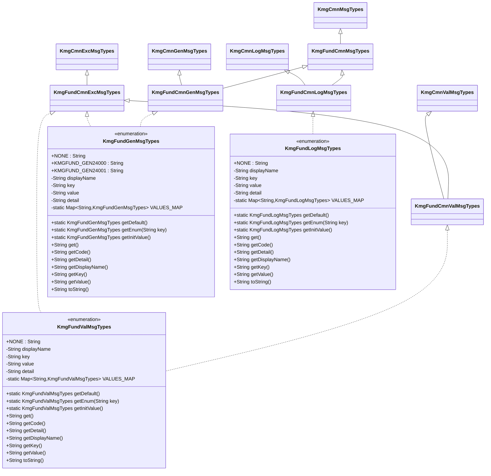

# インフラストラクチャ層型定義層の設計書

## 1. 概要

型定義層は、メッセージの種類を定義する列挙型を提供します。
kmg-core のメッセージインターフェースを実装し、型安全なメッセージ管理を実現します。

## 2. パッケージ構成

```text
kmg.fund.infrastructure.types
└── msg
    ├── KmgFundGenMsgTypes.java
    ├── KmgFundLogMsgTypes.java
    ├── KmgFundValMsgTypes.java
    └── package-info.java
```

## 3. クラス図



## 4. KmgFundGenMsgTypes の詳細

### 4.1 概要

KMG 基盤の一般メッセージの種類を定義する列挙型です。
例外メッセージとしても使用できます（`KmgFundCmnExcMsgTypes`を実装）。

### 4.2 実装インターフェース

- `KmgFundCmnGenMsgTypes`: 一般メッセージインターフェース
- `KmgFundCmnExcMsgTypes`: 例外メッセージインターフェース（兼用）

### 4.3 列挙定数

| 定数名           | キー               | 説明                                                                  |
| ---------------- | ------------------ | --------------------------------------------------------------------- |
| NONE             | "NONE"             | 指定無し                                                              |
| KMGFUND_GEN24000 | "KMGFUND_GEN24000" | 該当する YAML ファイルがありません。ファイルパス=[{0}]                |
| KMGFUND_GEN24001 | "KMGFUND_GEN24001" | YAML にロードするファイルの読み込みに失敗しました。ファイルパス=[{0}] |

### 4.4 フィールド

| フィールド名 | 型                              | 説明                                 |
| ------------ | ------------------------------- | ------------------------------------ |
| displayName  | String                          | 表示名                               |
| key          | String                          | メッセージのキー（enum 名）          |
| value        | String                          | メッセージの値（表示名と同じ）       |
| detail       | String                          | 詳細情報（表示名と同じ）             |
| VALUES_MAP   | Map<String, KmgFundGenMsgTypes> | キーから列挙型を取得するためのマップ |

### 4.5 メソッド

**静的メソッド:**

- `getDefault()`: デフォルト値（NONE）を返す
- `getEnum(String key)`: キーに該当する列挙型を返す
- `getInitValue()`: 初期値（NONE）を返す

**インスタンスメソッド:**

- `get()`: キーを返す
- `getCode()`: キー（コード）を返す
- `getDetail()`: 詳細情報を返す
- `getDisplayName()`: 表示名を返す
- `getKey()`: キーを返す
- `getValue()`: 値を返す
- `toString()`: キーを返す

## 5. KmgFundLogMsgTypes の詳細

### 5.1 概要

KMG 基盤のログメッセージの種類を定義する列挙型です。

### 5.2 実装インターフェース

- `KmgFundCmnLogMsgTypes`: ログメッセージインターフェース

### 5.3 列挙定数

| 定数名 | キー   | 説明     |
| ------ | ------ | -------- |
| NONE   | "NONE" | 指定無し |

**注:** 現在はプレースホルダーのみ。今後、ログメッセージが追加される予定。

### 5.4 構造

`KmgFundGenMsgTypes`と同じフィールドとメソッド構成を持ちます。

## 6. KmgFundValMsgTypes の詳細

### 6.1 概要

KMG 基盤のバリデーションメッセージの種類を定義する列挙型です。
例外メッセージとしても使用できます（`KmgFundCmnExcMsgTypes`を実装）。

### 6.2 実装インターフェース

- `KmgFundCmnValMsgTypes`: バリデーションメッセージインターフェース
- `KmgFundCmnExcMsgTypes`: 例外メッセージインターフェース（兼用）

### 6.3 列挙定数

| 定数名 | キー   | 説明     |
| ------ | ------ | -------- |
| NONE   | "NONE" | 指定無し |

**注:** 現在はプレースホルダーのみ。今後、バリデーションメッセージが追加される予定。

### 6.4 構造

`KmgFundGenMsgTypes`と同じフィールドとメソッド構成を持ちます。

## 7. メッセージリソースファイル

### 7.1 プロパティファイルの配置

メッセージは`src/main/resources/messages/`ディレクトリに配置されます。

```text
src/main/resources/
└── messages/
    └── kmg-fund.properties
```

### 7.2 プロパティファイルの内容

**messages/kmg-fund.properties:**

```properties
# 一般メッセージ
KMGFUND_GEN24000=該当するYAMLファイルがありません。ファイルパス=[{0}]
KMGFUND_GEN24001=YAMLにロードするファイルの読み込みに失敗しました。ファイルパス=[{0}]

# ログメッセージ
# （将来追加予定）

# バリデーションメッセージ
# （将来追加予定）
```

### 7.3 メッセージキーの命名規則

```text
KMG{MODULE}_{TYPE}{NUMBER}
```

- `MODULE`: モジュール名（FUND, TOOL など）
- `TYPE`: メッセージタイプ
  - `GEN`: 一般メッセージ
  - `LOG`: ログメッセージ
  - `VAL`: バリデーションメッセージ
- `NUMBER`: 5 桁の連番

**範囲:**

| メッセージタイプ         | 範囲        |
| ------------------------ | ----------- |
| 一般メッセージ           | 20000-29999 |
| ログメッセージ           | 10000-19999 |
| バリデーションメッセージ | 30000-39999 |

## 8. 使用例

### 8.1 例外でのメッセージ使用

```java
public class FileService {

    public void loadYaml(Path path) throws KmgFundMsgException {
        if (!Files.exists(path)) {
            throw new KmgFundMsgException(
                KmgFundGenMsgTypes.KMGFUND_GEN24000,
                new Object[] { path.toString() }
            );
        }

        try {
            // ファイル読み込み処理
        } catch (IOException e) {
            throw new KmgFundMsgException(
                KmgFundGenMsgTypes.KMGFUND_GEN24001,
                new Object[] { path.toString() },
                e
            );
        }
    }
}
```

### 8.2 メッセージソースでの使用

```java
@Service
public class NotificationService {

    @Autowired
    private KmgMessageSource messageSource;

    public void notifyFileError(Path path) {
        // 一般メッセージとして取得（コード埋め込みなし）
        String message = messageSource.getGenMessage(
            KmgFundGenMsgTypes.KMGFUND_GEN24000,
            new Object[] { path.toString() }
        );

        // ユーザーに通知
        notifyUser(message);
    }

    public void logFileError(Path path) {
        // 例外メッセージとして取得（コード埋め込みあり）
        String message = messageSource.getExcMessage(
            KmgFundGenMsgTypes.KMGFUND_GEN24000,
            new Object[] { path.toString() }
        );

        // ログ出力
        logger.error(message);
    }
}
```

### 8.3 メッセージタイプの判定

```java
public class ErrorHandler {

    public void handleException(KmgFundMsgException e) {
        KmgCmnExcMsgTypes messageType = e.getMessageTypes();

        if (messageType == KmgFundGenMsgTypes.KMGFUND_GEN24000) {
            // ファイル不存在エラーの処理
            handleFileNotFound(e);

        } else if (messageType == KmgFundGenMsgTypes.KMGFUND_GEN24001) {
            // ファイル読み込みエラーの処理
            handleFileReadError(e);

        } else {
            // その他のエラーの処理
            handleGenericError(e);
        }
    }
}
```

### 8.4 switch 文での使用

```java
public class MessageHandler {

    public void processMessage(KmgFundGenMsgTypes messageType, Object[] args) {
        switch (messageType) {
            case KMGFUND_GEN24000:
                // ファイル不存在の処理
                handleFileNotFound(args);
                break;

            case KMGFUND_GEN24001:
                // ファイル読み込みエラーの処理
                handleFileReadError(args);
                break;

            case NONE:
            default:
                // デフォルト処理
                break;
        }
    }
}
```

### 8.5 メッセージ情報の取得

```java
public class MessageInfo {

    public void printMessageInfo(KmgFundGenMsgTypes messageType) {
        System.out.println("コード: " + messageType.getCode());
        System.out.println("表示名: " + messageType.getDisplayName());
        System.out.println("値: " + messageType.getValue());
        System.out.println("詳細: " + messageType.getDetail());
        System.out.println("キー: " + messageType.getKey());
    }
}
```

出力例：

```text
コード: KMGFUND_GEN24000
表示名: 該当するYAMLファイルがありません。ファイルパス=[{0}]
値: 該当するYAMLファイルがありません。ファイルパス=[{0}]
詳細: 該当するYAMLファイルがありません。ファイルパス=[{0}]
キー: KMGFUND_GEN24000
```

## 9. 新しいメッセージの追加方法

### 9.1 列挙型への追加

```java
@SuppressWarnings("nls")
public enum KmgFundGenMsgTypes implements KmgFundCmnGenMsgTypes, KmgFundCmnExcMsgTypes {

    /* 既存定義 */
    NONE("指定無し"),
    KMGFUND_GEN24000("該当するYAMLファイルがありません。ファイルパス=[{0}]"),
    KMGFUND_GEN24001("YAMLにロードするファイルの読み込みに失敗しました。ファイルパス=[{0}]"),

    /* 新規追加 */
    KMGFUND_GEN24002("YAMLファイルの書き込みに失敗しました。ファイルパス=[{0}]"),
    KMGFUND_GEN24003("無効なYAMLフォーマットです。ファイルパス=[{0}]"),

    ;

    // 既存フィールドとメソッド
}
```

### 9.2 プロパティファイルへの追加

**messages/kmg-fund.properties:**

```properties
# 既存メッセージ
KMGFUND_GEN24000=該当するYAMLファイルがありません。ファイルパス=[{0}]
KMGFUND_GEN24001=YAMLにロードするファイルの読み込みに失敗しました。ファイルパス=[{0}]

# 新規メッセージ
KMGFUND_GEN24002=YAMLファイルの書き込みに失敗しました。ファイルパス=[{0}]
KMGFUND_GEN24003=無効なYAMLフォーマットです。ファイルパス=[{0}]
```

### 9.3 使用例

```java
public class YamlWriter {

    public void writeYaml(Path path, Map<String, Object> data) throws KmgFundMsgException {
        try {
            Files.writeString(path, yamlToString(data));

        } catch (IOException e) {
            throw new KmgFundMsgException(
                KmgFundGenMsgTypes.KMGFUND_GEN24002,  // 新しいメッセージ
                new Object[] { path.toString() },
                e
            );
        }
    }
}
```

## 10. 設計上の注意点

### 10.1 メッセージキーの一意性

- メッセージキーは全モジュール間で一意にする
- 既存のキーと重複しないように管理
- 命名規則に従う

### 10.2 メッセージパラメータ

- プレースホルダーは`{0}`, `{1}`, `{2}`...の形式
- 引数の数とプレースホルダーの数を一致させる
- 引数は適切な型で渡す

### 10.3 メッセージの多言語対応

- 英語版: `messages/kmg-fund_en.properties`
- 中国語版: `messages/kmg-fund_zh.properties`
- デフォルト: `messages/kmg-fund.properties`（日本語）

### 10.4 インターフェースの実装

- 一般メッセージ: `KmgFundCmnGenMsgTypes`を実装
- ログメッセージ: `KmgFundCmnLogMsgTypes`を実装
- バリデーションメッセージ: `KmgFundCmnValMsgTypes`を実装
- 例外として使用する場合: `KmgFundCmnExcMsgTypes`も実装

## 11. 今後の拡張

### 11.1 追加予定のメッセージ

**ログメッセージ:**

```java
KMGFUND_LOG10000("処理を開始しました。処理名=[{0}]"),
KMGFUND_LOG10001("処理が完了しました。処理名=[{0}], 経過時間=[{1}]ms"),
KMGFUND_LOG10002("処理中にエラーが発生しました。処理名=[{0}], エラー=[{1}]"),
```

**バリデーションメッセージ:**

```java
KMGFUND_VAL30000("入力値が不正です。フィールド=[{0}], 値=[{1}]"),
KMGFUND_VAL30001("必須項目が未入力です。フィールド=[{0}]"),
KMGFUND_VAL30002("値が範囲外です。フィールド=[{0}], 値=[{1}], 範囲=[{2}]~[{3}]"),
```

### 11.2 メッセージカテゴリの整理

| カテゴリ     | 範囲        | 用途                 |
| ------------ | ----------- | -------------------- |
| ファイル操作 | 24000-24999 | ファイル入出力関連   |
| データベース | 25000-25999 | データベース操作関連 |
| ネットワーク | 26000-26999 | ネットワーク通信関連 |
| 設定         | 27000-27999 | 設定ファイル関連     |

### 11.3 動的メッセージ生成

```java
public class DynamicMessageBuilder {

    public String buildMessage(KmgFundGenMsgTypes messageType, Object... args) {
        KmgMessageSource messageSource =
            SpringApplicationContextHelper.getBean(KmgMessageSource.class);

        return messageSource.getGenMessage(messageType, args);
    }

    public String buildExceptionMessage(KmgFundGenMsgTypes messageType, Object... args) {
        KmgMessageSource messageSource =
            SpringApplicationContextHelper.getBean(KmgMessageSource.class);

        return messageSource.getExcMessage(messageType, args);
    }
}
```

### 11.4 メッセージのバージョン管理

```java
public enum KmgFundGenMsgTypes implements KmgFundCmnGenMsgTypes, KmgFundCmnExcMsgTypes {

    /**
     * 該当するYAMLファイルがありません
     * @since 0.1.0
     * @deprecated 1.0.0 KMGFUND_GEN24010を使用してください
     */
    @Deprecated
    KMGFUND_GEN24000("該当するYAMLファイルがありません。ファイルパス=[{0}]"),

    /**
     * ファイルが見つかりません
     * @since 1.0.0
     */
    KMGFUND_GEN24010("ファイルが見つかりません。パス=[{0}], タイプ=[{1}]"),

    ;
}
```
