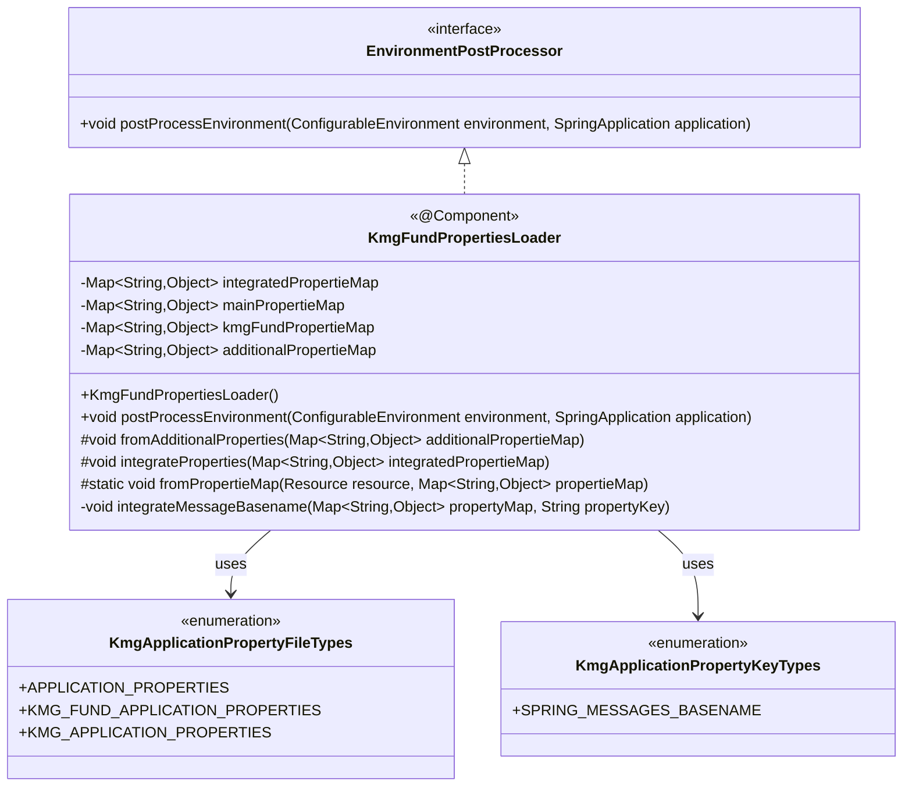
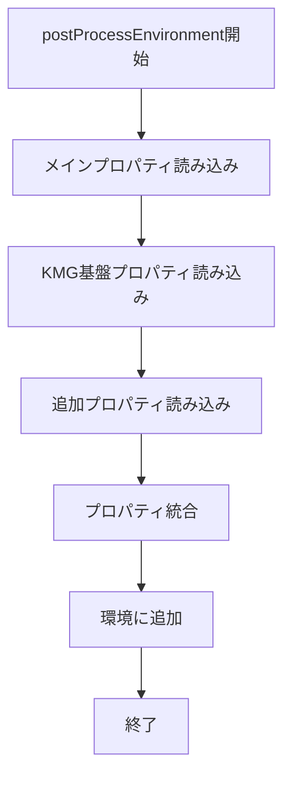
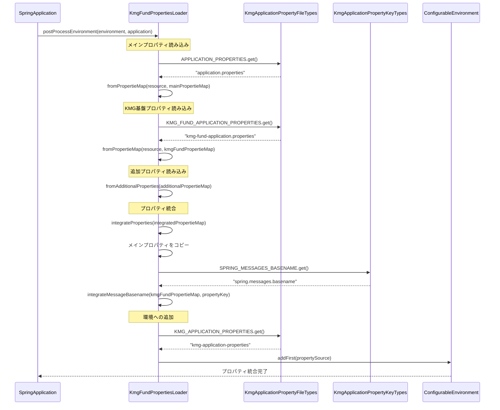
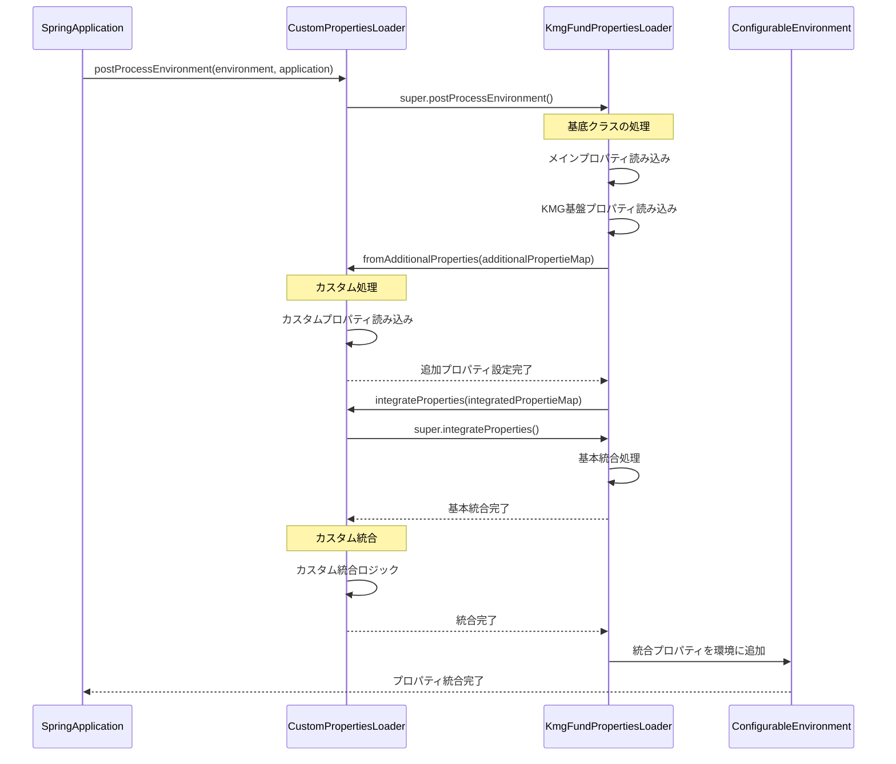

# インフラストラクチャ層設定機能層の設計書

## 1. 概要

設定機能層は、Spring Boot アプリケーションのプロパティファイルを統合管理する機能を提供します。
複数のプロパティファイルを読み込み、それらを統合して Spring 環境に登録する役割を担います。

## 2. パッケージ構成

```text
kmg.fund.infrastructure.config
├── KmgFundPropertiesLoader.java
└── package-info.java
```

## 3. クラス図



## 4. KmgFundPropertiesLoader の詳細

### 4.1 概要

`EnvironmentPostProcessor`インターフェースを実装し、Spring Boot 起動時に呼び出されるプロパティローダークラスです。

### 4.2 アノテーション

- `@Component`: Spring 管理 Bean として登録
- `@Order(10)`: 実行順序を指定（小さい値ほど先に実行）

### 4.3 フィールド

| フィールド名           | 型                  | 説明                                         |
| ---------------------- | ------------------- | -------------------------------------------- |
| integratedPropertieMap | Map<String, Object> | 全てのプロパティを統合して保持               |
| mainPropertieMap       | Map<String, Object> | application.properties の内容を保持          |
| kmgFundPropertieMap    | Map<String, Object> | kmg-fund-application.properties の内容を保持 |
| additionalPropertieMap | Map<String, Object> | サブクラスで追加されるプロパティを保持       |

### 4.4 メソッド

#### 4.4.1 コンストラクタ

```java
public KmgFundPropertiesLoader()
```

各プロパティマップを初期化します。

#### 4.4.2 postProcessEnvironment（公開メソッド）

```java
@Override
public void postProcessEnvironment(
    ConfigurableEnvironment environment,
    SpringApplication application)
```

Spring Boot 起動時に呼び出され、以下の処理を行います：

1. メインプロパティの読み込み（application.properties）
2. KMG 基盤プロパティの読み込み（kmg-fund-application.properties）
3. 追加プロパティの読み込み
4. 全プロパティの統合
5. 環境への統合プロパティの追加

**処理フロー:**



#### 4.4.3 fromPropertieMap（保護静的メソッド）

```java
protected static void fromPropertieMap(
    Resource resource,
    Map<String, Object> propertieMap)
```

リソースからプロパティを読み込み、マップに設定します。

**処理内容:**

1. リソースの存在確認
2. Properties オブジェクトの作成
3. InputStream からプロパティ読み込み
4. マップへの設定

**エラー処理:**

- ファイルが存在しない場合: 処理をスキップ
- 読み込みに失敗した場合: スタックトレースを出力して処理をスキップ

#### 4.4.4 fromAdditionalProperties（保護メソッド）

```java
protected void fromAdditionalProperties(
    Map<String, Object> additionalPropertieMap)
```

サブクラスでオーバーライドして、独自のプロパティファイルを読み込むことができます。

**デフォルトの実装:**

- 何も処理を行いません（拡張ポイント）

**サブクラスでの実装例:**

```java
@Override
protected void fromAdditionalProperties(Map<String, Object> additionalPropertieMap) {
    // カスタムプロパティファイルの読み込み
    Resource resource = new ClassPathResource("my-application.properties");
    KmgFundPropertiesLoader.fromPropertieMap(resource, additionalPropertieMap);
}
```

#### 4.4.5 integrateProperties（保護メソッド）

```java
protected void integrateProperties(
    Map<String, Object> integratedPropertieMap)
```

プロパティを統合します。サブクラスでオーバーライドして、独自の統合ロジックを実装できます。

**デフォルトの実装:**

1. メインプロパティを統合マップにコピー
2. `spring.messages.basename`プロパティのみを統合

**サブクラスでの実装例:**

```java
@Override
protected void integrateProperties(Map<String, Object> integratedPropertieMap) {
    super.integrateProperties(integratedPropertieMap);

    // カスタム統合ロジック
    String customKey = "my.custom.property";
    Object mainValue = this.mainPropertieMap.get(customKey);
    Object customValue = this.additionalPropertieMap.get(customKey);

    if (mainValue != null && customValue != null) {
        // 値の統合処理
        integratedPropertieMap.put(customKey, mergeValues(mainValue, customValue));
    }
}
```

#### 4.4.6 integrateMessageBasename（非公開メソッド）

```java
private void integrateMessageBasename(
    Map<String, Object> propertyMap,
    String propertyKey)
```

メッセージベース名を統合します。

**処理内容:**

1. プロパティマップから指定キーの値を取得
2. 統合マップの既存値と新しい値をカンマ区切りで結合
3. 統合した値を保存

**統合例:**

```text
# application.properties
spring.messages.basename=messages/app

# kmg-fund-application.properties
spring.messages.basename=messages/kmg-fund

# 統合結果
spring.messages.basename=messages/app,messages/kmg-fund
```

## 5. シーケンス図

### 5.1 起動時のプロパティ読み込み



### 5.2 サブクラスでのカスタマイズ



## 6. 使用例

### 6.1 基本的な使用

デフォルトの実装では、自動的に以下のプロパティファイルを読み込みます：

- `application.properties`
- `kmg-fund-application.properties`

**application.properties:**

```properties
# アプリケーション名
spring.application.name=MyApplication

# メッセージベース名
spring.messages.basename=messages/app

# その他の設定
server.port=8080
```

**kmg-fund-application.properties:**

```properties
# KMG基盤メッセージ
spring.messages.basename=messages/kmg-fund

# KMG基盤固有の設定
kmg.fund.log.level=DEBUG
```

**統合結果:**

```properties
spring.application.name=MyApplication
spring.messages.basename=messages/app,messages/kmg-fund
server.port=8080
kmg.fund.log.level=DEBUG
```

### 6.2 カスタムプロパティローダーの実装

```java
@Component
@Order(20)  // KmgFundPropertiesLoader（Order=10）の後に実行
public class MyPropertiesLoader extends KmgFundPropertiesLoader {

    /**
     * 追加プロパティの読み込み
     */
    @Override
    protected void fromAdditionalProperties(Map<String, Object> additionalPropertieMap) {
        // カスタムプロパティファイルの読み込み
        Resource resource = new ClassPathResource("my-application.properties");
        KmgFundPropertiesLoader.fromPropertieMap(resource, additionalPropertieMap);

        // 環境別プロパティの読み込み
        String profile = System.getProperty("spring.profiles.active", "dev");
        Resource profileResource = new ClassPathResource(
            "my-application-" + profile + ".properties"
        );
        KmgFundPropertiesLoader.fromPropertieMap(profileResource, additionalPropertieMap);
    }

    /**
     * プロパティの統合
     */
    @Override
    protected void integrateProperties(Map<String, Object> integratedPropertieMap) {
        // 基底クラスの統合処理を実行
        super.integrateProperties(integratedPropertieMap);

        // カスタム統合ロジック: データソースURLの統合
        integrateDataSourceUrl(integratedPropertieMap);
    }

    /**
     * データソースURLの統合
     */
    private void integrateDataSourceUrl(Map<String, Object> integratedPropertieMap) {
        String mainUrl = (String) this.mainPropertieMap.get("spring.datasource.url");
        String customUrl = (String) this.additionalPropertieMap.get("spring.datasource.url");

        if (KmgString.isNotEmpty(customUrl)) {
            // カスタム設定が存在する場合は上書き
            integratedPropertieMap.put("spring.datasource.url", customUrl);
        } else if (KmgString.isNotEmpty(mainUrl)) {
            // メイン設定を使用
            integratedPropertieMap.put("spring.datasource.url", mainUrl);
        }
    }
}
```

### 6.3 条件付きプロパティ読み込み

```java
@Component
@Order(20)
public class ConditionalPropertiesLoader extends KmgFundPropertiesLoader {

    @Override
    protected void fromAdditionalProperties(Map<String, Object> additionalPropertieMap) {
        // 開発環境でのみ読み込むプロパティ
        if (isDevelopmentEnvironment()) {
            Resource devResource = new ClassPathResource("application-dev.properties");
            KmgFundPropertiesLoader.fromPropertieMap(devResource, additionalPropertieMap);
        }

        // 特定の機能が有効な場合のみ読み込むプロパティ
        if (isFeatureEnabled("advanced-logging")) {
            Resource logResource = new ClassPathResource("logging-advanced.properties");
            KmgFundPropertiesLoader.fromPropertieMap(logResource, additionalPropertieMap);
        }
    }

    private boolean isDevelopmentEnvironment() {
        String env = System.getProperty("spring.profiles.active");
        return "dev".equals(env) || "development".equals(env);
    }

    private boolean isFeatureEnabled(String featureName) {
        String enabled = System.getProperty("kmg.feature." + featureName);
        return "true".equalsIgnoreCase(enabled);
    }
}
```

### 6.4 プロパティのバリデーション

```java
@Component
@Order(20)
public class ValidatingPropertiesLoader extends KmgFundPropertiesLoader {

    @Override
    protected void integrateProperties(Map<String, Object> integratedPropertieMap) {
        super.integrateProperties(integratedPropertieMap);

        // 必須プロパティの検証
        validateRequiredProperties(integratedPropertieMap);
    }

    private void validateRequiredProperties(Map<String, Object> propertieMap) {
        List<String> requiredKeys = Arrays.asList(
            "spring.application.name",
            "spring.datasource.url",
            "spring.datasource.username"
        );

        for (String key : requiredKeys) {
            if (!propertieMap.containsKey(key) ||
                KmgString.isEmpty((String) propertieMap.get(key))) {
                throw new IllegalStateException(
                    "必須プロパティが設定されていません: " + key
                );
            }
        }
    }
}
```

## 7. 設計上の注意点

### 7.1 実行順序

`@Order`アノテーションで実行順序を制御します：

- 小さい値ほど先に実行される
- `KmgFundPropertiesLoader`は`@Order(10)`
- サブクラスは`@Order(20)`以降を推奨

### 7.2 プロパティの優先順位

統合後のプロパティは、以下の優先順位で環境に追加されます：

1. `addFirst()`で追加されるため、最高優先度
2. 統合マップ内では、後から`put()`された値が優先
3. デフォルトでは、メインプロパティが基準

### 7.3 サブクラス化のガイドライン

**推奨事項:**

- `fromAdditionalProperties()`で追加プロパティを読み込む
- `integrateProperties()`で統合ロジックを実装
- 必ず`super`メソッドを呼び出す

**非推奨事項:**

- `postProcessEnvironment()`の完全なオーバーライド
- `fromPropertieMap()`の変更
- static フィールドの追加

### 7.4 パフォーマンス考慮事項

- プロパティファイルは起動時に 1 回だけ読み込まれる
- マップのコピー処理は最小限に抑える
- 大量のプロパティを扱う場合は、統合ロジックを最適化

## 8. 今後の拡張

### 8.1 プロパティの暗号化

```java
@Component
@Order(20)
public class EncryptedPropertiesLoader extends KmgFundPropertiesLoader {

    @Override
    protected void integrateProperties(Map<String, Object> integratedPropertieMap) {
        super.integrateProperties(integratedPropertieMap);

        // 暗号化されたプロパティを復号化
        decryptProperties(integratedPropertieMap);
    }

    private void decryptProperties(Map<String, Object> propertieMap) {
        for (Map.Entry<String, Object> entry : propertieMap.entrySet()) {
            String key = entry.getKey();
            Object value = entry.getValue();

            if (value instanceof String && ((String) value).startsWith("ENC(")) {
                String encryptedValue = (String) value;
                String decryptedValue = decrypt(encryptedValue);
                propertieMap.put(key, decryptedValue);
            }
        }
    }
}
```

### 8.2 プロパティの動的更新

```java
@Component
public class DynamicPropertiesLoader extends KmgFundPropertiesLoader {

    private FileWatcher fileWatcher;

    @PostConstruct
    public void startWatching() {
        // プロパティファイルの変更を監視
        fileWatcher = new FileWatcher(Paths.get("application.properties"));
        fileWatcher.onChange(() -> reloadProperties());
    }

    private void reloadProperties() {
        // プロパティを再読み込み
        // 環境を更新
    }
}
```
