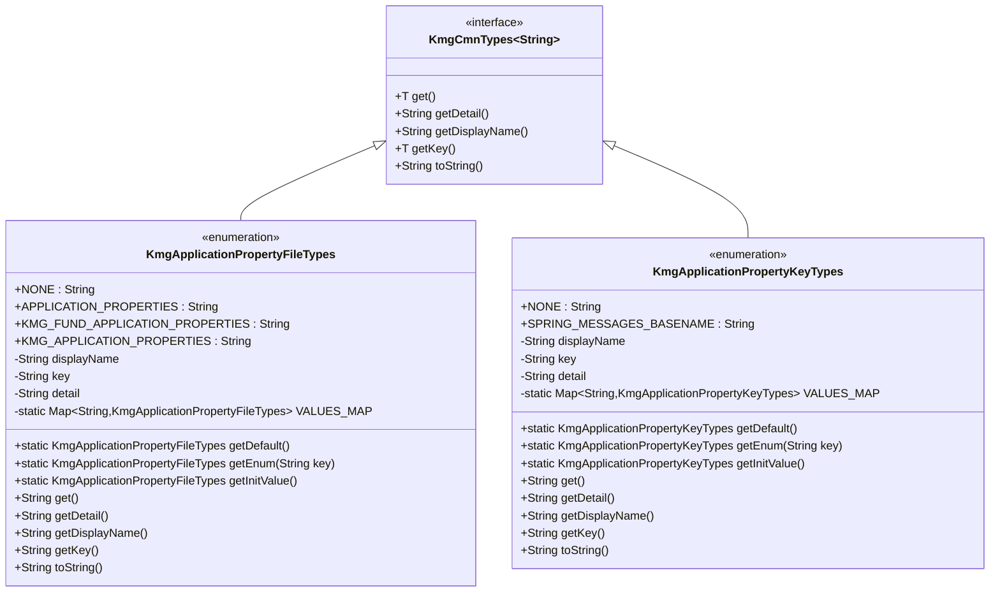

# ドメイン層の設計書

## 1. 概要

ドメイン層は、KMG 基盤（Foundation）のビジネスドメインに関する型定義を提供します。
主にアプリケーションプロパティに関する型定義を含んでいます。

## 2. パッケージ構成

```text
kmg.fund.domain
└── types
    ├── KmgApplicationPropertyFileTypes.java
    ├── KmgApplicationPropertyKeyTypes.java
    └── package-info.java
```

## 3. クラス図



## 4. 型定義の詳細

ドメイン層の型定義（`KmgApplicationPropertyFileTypes`、`KmgApplicationPropertyKeyTypes`）の詳細な仕様については、以下のドキュメントを参照してください。

**詳細:** [ドメイン層型定義の設計書](./ドメイン層型定義の設計書.md)

## 5. 設計原則

### 5.1 型安全性

- enum 型を使用することで、コンパイル時の型チェックを実現
- 文字列の直接使用を避け、定数による管理

### 5.2 拡張性

- 新しいプロパティファイルやキーの追加が容易
- `VALUES_MAP`による動的な列挙型の取得

### 5.3 統一性

- `KmgCmnTypes<String>`インターフェースを実装
- kmg-core の型定義と同じインターフェースを持つ

### 5.4 可読性

- 日本語の表示名を提供
- 詳細情報による説明

## 6. 使用例

ドメイン層型定義の詳細な使用例は、以下のドキュメントを参照してください。

**詳細:** [ドメイン層型定義の設計書](./ドメイン層型定義の設計書.md)

## 7. 今後の拡張

### 7.1 追加予定の定数

- 環境別プロパティファイル（dev, test, prod）
- モジュール別プロパティファイル
- カスタムプロパティキー

### 7.2 追加予定のメソッド

- プロパティファイルの存在確認
- プロパティファイルの優先順位管理
- プロパティキーのバリデーション

### 7.3 拡張例

```java
public enum KmgApplicationPropertyFileTypes implements KmgCmnTypes<String> {

    /* 既存定義 */
    NONE("指定無し", "None", "指定無し"),
    APPLICATION_PROPERTIES("アプリケーションプロパティ", "application.properties", "Springアプリケーションのプロパティファイル"),
    KMG_FUND_APPLICATION_PROPERTIES("KMG基盤アプリケーションプロパティ", "kmg-fund-application.properties", "KMG基盤アプリケーションのプロパティファイル"),

    /* 今後追加予定 */
    APPLICATION_DEV_PROPERTIES("開発環境プロパティ", "application-dev.properties", "開発環境用プロパティファイル"),
    APPLICATION_TEST_PROPERTIES("テスト環境プロパティ", "application-test.properties", "テスト環境用プロパティファイル"),
    APPLICATION_PROD_PROPERTIES("本番環境プロパティ", "application-prod.properties", "本番環境用プロパティファイル"),

    ;

    /* 既存フィールドとメソッド */

    /**
     * プロパティファイルが存在するか確認する
     */
    public boolean exists() {
        ClassPathResource resource = new ClassPathResource(this.key);
        return resource.exists();
    }
}
```
