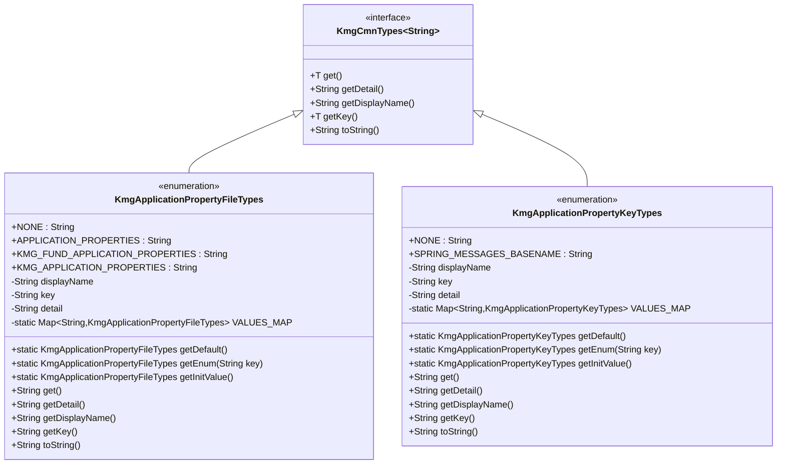

# ドメイン層の設計書

## 1. 概要

ドメイン層は、KMG 基盤（Foundation）のビジネスドメインに関する型定義を提供します。
主にアプリケーションプロパティに関する型定義を含んでいます。

## 2. パッケージ構成

```text
kmg.fund.domain
└── types
    ├── KmgApplicationPropertyFileTypes.java
    ├── KmgApplicationPropertyKeyTypes.java
    └── package-info.java
```

## 3. クラス図



## 4. 型定義の詳細

### 4.1 KmgApplicationPropertyFileTypes

アプリケーションプロパティファイルの種類を定義する列挙型です。

#### 4.1.1 列挙定数

| 定数名                          | キー                              | 説明                                         |
| ------------------------------- | --------------------------------- | -------------------------------------------- |
| NONE                            | "None"                            | 指定無し                                     |
| APPLICATION_PROPERTIES          | "application.properties"          | Spring アプリケーションのプロパティファイル  |
| KMG_FUND_APPLICATION_PROPERTIES | "kmg-fund-application.properties" | KMG 基盤アプリケーションのプロパティファイル |
| KMG_APPLICATION_PROPERTIES      | "kmg-application-properties"      | KMG アプリケーションのプロパティ名           |

#### 4.1.2 フィールド

- `displayName`: 表示名（日本語）
- `key`: キー（プロパティファイル名またはプロパティソース名）
- `detail`: 詳細情報
- `VALUES_MAP`: キーから列挙型を取得するためのマップ

#### 4.1.3 メソッド

静的メソッド:

- `getDefault()`: デフォルト値（NONE）を返す
- `getEnum(String key)`: キーに該当する列挙型を返す。存在しない場合は NONE を返す
- `getInitValue()`: 初期値（NONE）を返す

インスタンスメソッド:

- `get()`: キーを返す（`getKey()`と同じ）
- `getDetail()`: 詳細情報を返す
- `getDisplayName()`: 表示名を返す
- `getKey()`: キーを返す
- `toString()`: キーを返す

### 4.2 KmgApplicationPropertyKeyTypes

アプリケーションプロパティキーの種類を定義する列挙型です。

#### 4.2.1 列挙定数

| 定数名                   | キー                       | 説明                                         |
| ------------------------ | -------------------------- | -------------------------------------------- |
| NONE                     | "None"                     | 指定無し                                     |
| SPRING_MESSAGES_BASENAME | "spring.messages.basename" | メッセージのベース名を指定するプロパティキー |

#### 4.2.2 フィールド

- `displayName`: 表示名（日本語）
- `key`: キー（プロパティキー名）
- `detail`: 詳細情報
- `VALUES_MAP`: キーから列挙型を取得するためのマップ

#### 4.2.3 メソッド

静的メソッド:

- `getDefault()`: デフォルト値（NONE）を返す
- `getEnum(String key)`: キーに該当する列挙型を返す。存在しない場合は NONE を返す
- `getInitValue()`: 初期値（NONE）を返す

インスタンスメソッド:

- `get()`: キーを返す（`getKey()`と同じ）
- `getDetail()`: 詳細情報を返す
- `getDisplayName()`: 表示名を返す
- `getKey()`: キーを返す
- `toString()`: キーを返す

## 5. 設計原則

### 5.1 型安全性

- enum 型を使用することで、コンパイル時の型チェックを実現
- 文字列の直接使用を避け、定数による管理

### 5.2 拡張性

- 新しいプロパティファイルやキーの追加が容易
- `VALUES_MAP`による動的な列挙型の取得

### 5.3 統一性

- `KmgCmnTypes<String>`インターフェースを実装
- kmg-core の型定義と同じインターフェースを持つ

### 5.4 可読性

- 日本語の表示名を提供
- 詳細情報による説明

## 6. 使用例

### 6.1 プロパティファイル名の取得

```java
// プロパティファイル名を取得
String fileName = KmgApplicationPropertyFileTypes.APPLICATION_PROPERTIES.get();
// => "application.properties"

String kmgFundFileName = KmgApplicationPropertyFileTypes.KMG_FUND_APPLICATION_PROPERTIES.get();
// => "kmg-fund-application.properties"
```

### 6.2 プロパティキー名の取得

```java
// プロパティキー名を取得
String keyName = KmgApplicationPropertyKeyTypes.SPRING_MESSAGES_BASENAME.get();
// => "spring.messages.basename"
```

### 6.3 文字列からの列挙型取得

```java
// 文字列からプロパティファイルタイプを取得
String fileNameStr = "application.properties";
KmgApplicationPropertyFileTypes fileType =
    KmgApplicationPropertyFileTypes.getEnum(fileNameStr);

if (fileType != KmgApplicationPropertyFileTypes.NONE) {
    // プロパティファイルが定義されている
    String displayName = fileType.getDisplayName();
    // => "Springアプリケーションのプロパティファイル"
}
```

### 6.4 表示名と詳細情報の活用

```java
// 表示名を取得（UI表示などに使用）
String displayName = KmgApplicationPropertyFileTypes.APPLICATION_PROPERTIES.getDisplayName();
// => "Springアプリケーションのプロパティファイル"

// 詳細情報を取得（ログやドキュメント生成などに使用）
String detail = KmgApplicationPropertyFileTypes.APPLICATION_PROPERTIES.getDetail();
// => "Springアプリケーションのプロパティファイル"
```

### 6.5 プロパティローダーでの使用

```java
@Component
public class MyPropertiesLoader extends KmgFundPropertiesLoader {

    @Override
    protected void fromAdditionalProperties(Map<String, Object> additionalPropertieMap) {
        // APPLICATION_PROPERTIESの定数を使用
        Resource resource = new ClassPathResource(
            KmgApplicationPropertyFileTypes.APPLICATION_PROPERTIES.get()
        );
        KmgFundPropertiesLoader.fromPropertieMap(resource, additionalPropertieMap);
    }

    @Override
    protected void integrateProperties(Map<String, Object> integratedPropertieMap) {
        super.integrateProperties(integratedPropertieMap);

        // SPRING_MESSAGES_BASENAMEの定数を使用
        String messageBasenameKey =
            KmgApplicationPropertyKeyTypes.SPRING_MESSAGES_BASENAME.get();

        // カスタム統合ロジック
        Object value = integratedPropertieMap.get(messageBasenameKey);
        if (value != null) {
            // メッセージベース名の処理
        }
    }
}
```

### 6.6 switch 文での使用

```java
public void processPropertyFile(KmgApplicationPropertyFileTypes fileType) {
    switch (fileType) {
        case APPLICATION_PROPERTIES:
            // application.propertiesの処理
            loadApplicationProperties();
            break;

        case KMG_FUND_APPLICATION_PROPERTIES:
            // kmg-fund-application.propertiesの処理
            loadKmgFundProperties();
            break;

        case NONE:
        default:
            // デフォルト処理
            break;
    }
}
```

### 6.7 ログ出力での使用

```java
public void logPropertyInfo() {
    logger.info("プロパティファイル: {}, 説明: {}",
        KmgApplicationPropertyFileTypes.KMG_FUND_APPLICATION_PROPERTIES.getKey(),
        KmgApplicationPropertyFileTypes.KMG_FUND_APPLICATION_PROPERTIES.getDetail()
    );
    // => プロパティファイル: kmg-fund-application.properties,
    //    説明: KMG基盤アプリケーションのプロパティファイル
}
```

## 7. 今後の拡張

### 7.1 追加予定の定数

- 環境別プロパティファイル（dev, test, prod）
- モジュール別プロパティファイル
- カスタムプロパティキー

### 7.2 追加予定のメソッド

- プロパティファイルの存在確認
- プロパティファイルの優先順位管理
- プロパティキーのバリデーション

### 7.3 拡張例

```java
public enum KmgApplicationPropertyFileTypes implements KmgCmnTypes<String> {

    /* 既存定義 */
    NONE("指定無し", "None", "指定無し"),
    APPLICATION_PROPERTIES("アプリケーションプロパティ", "application.properties", "Springアプリケーションのプロパティファイル"),
    KMG_FUND_APPLICATION_PROPERTIES("KMG基盤アプリケーションプロパティ", "kmg-fund-application.properties", "KMG基盤アプリケーションのプロパティファイル"),

    /* 今後追加予定 */
    APPLICATION_DEV_PROPERTIES("開発環境プロパティ", "application-dev.properties", "開発環境用プロパティファイル"),
    APPLICATION_TEST_PROPERTIES("テスト環境プロパティ", "application-test.properties", "テスト環境用プロパティファイル"),
    APPLICATION_PROD_PROPERTIES("本番環境プロパティ", "application-prod.properties", "本番環境用プロパティファイル"),

    ;

    /* 既存フィールドとメソッド */

    /**
     * プロパティファイルが存在するか確認する
     */
    public boolean exists() {
        ClassPathResource resource = new ClassPathResource(this.key);
        return resource.exists();
    }
}
```
