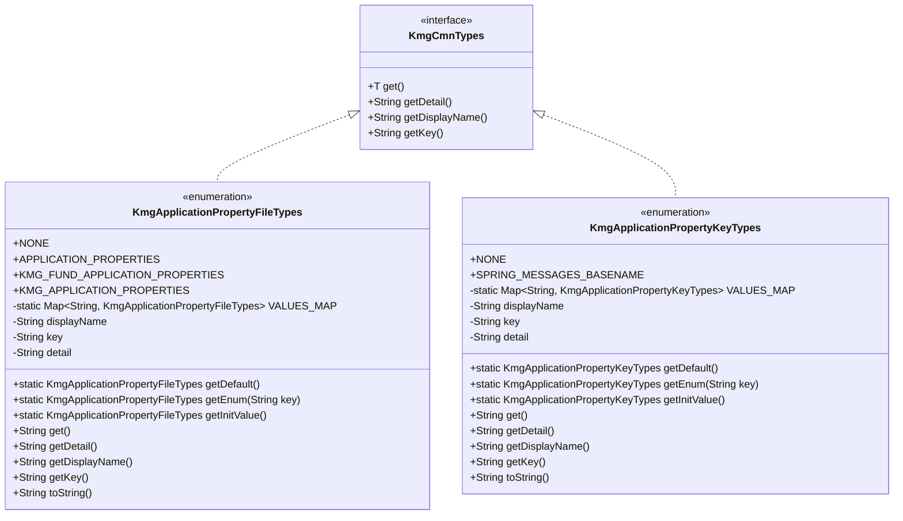
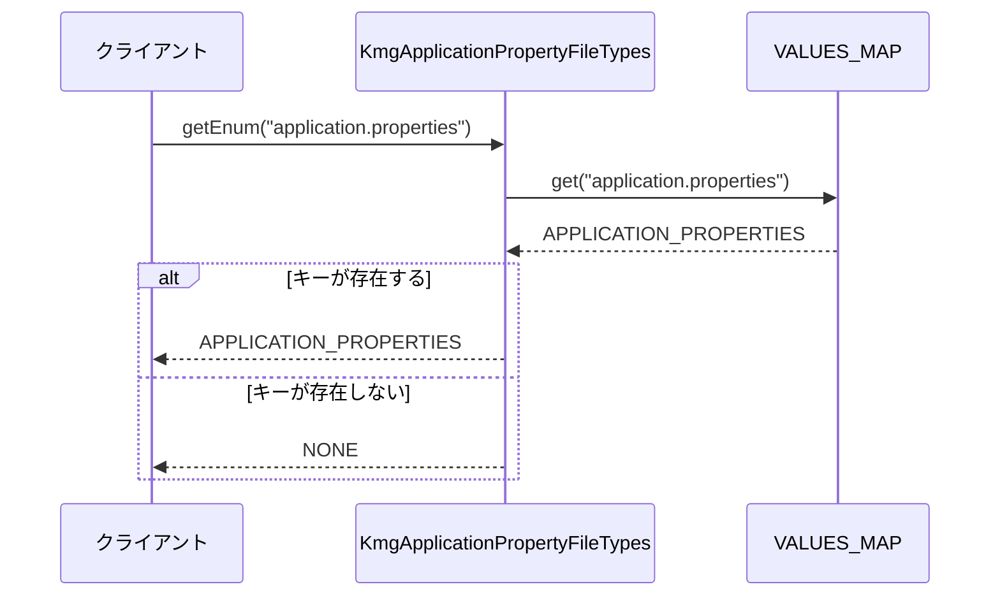
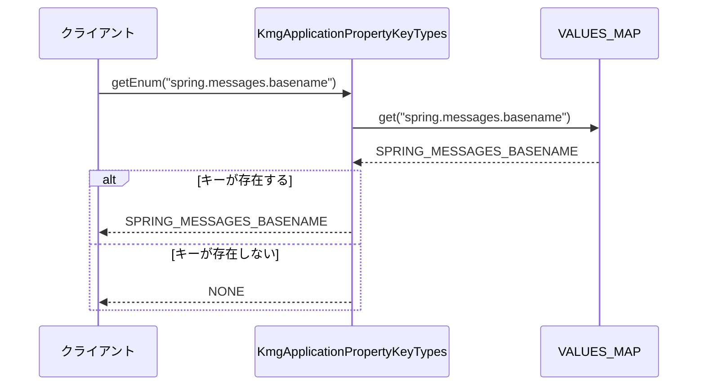
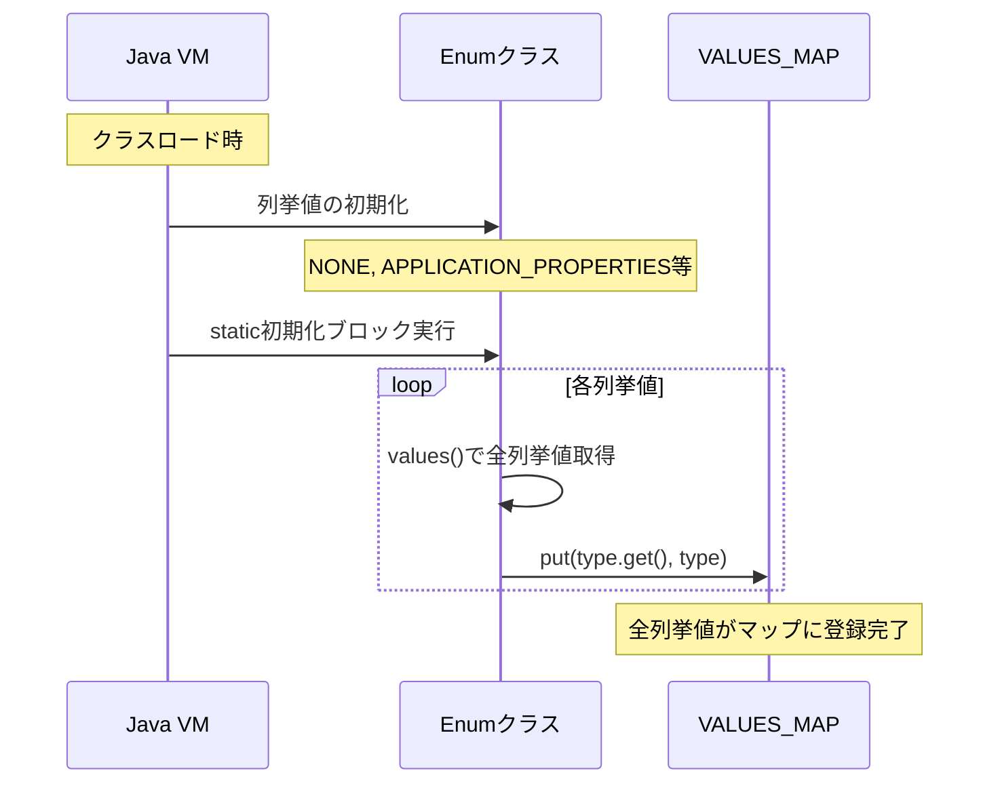

# ドメイン層型定義の設計書

## 1. 概要

ドメイン層型定義パッケージは、KMG 基盤アプリケーションで使用する型定義（主に enum）を提供します。
アプリケーションプロパティファイルの種類やプロパティキーの種類など、ドメイン固有の型定義を集約し、
型安全性とコードの可読性を向上させます。

## 2. パッケージ構成

```text
kmg.fund.domain.types
├── KmgApplicationPropertyFileTypes.java
├── KmgApplicationPropertyKeyTypes.java
└── package-info.java
```

## 3. クラス図



## 4. KmgApplicationPropertyFileTypes の詳細

### 4.1 概要

KMG アプリケーションで使用するプロパティファイルの種類を定義する enum クラスです。
プロパティファイルの識別と管理を型安全に行うための型定義です。

### 4.2 列挙値

| 列挙値                          | 表示名                             | キー                            | 詳細情報                                     |
| ------------------------------- | ---------------------------------- | ------------------------------- | -------------------------------------------- |
| NONE                            | 指定無し                           | None                            | 指定無し                                     |
| APPLICATION_PROPERTIES          | アプリケーションプロパティ         | application.properties          | Spring アプリケーションのプロパティファイル  |
| KMG_FUND_APPLICATION_PROPERTIES | KMG 基盤アプリケーションプロパティ | kmg-fund-application.properties | KMG 基盤アプリケーションのプロパティファイル |
| KMG_APPLICATION_PROPERTIES      | KMG アプリケーションプロパティ     | kmg-application-properties      | KMG アプリケーションのプロパティ名           |

### 4.3 定数フィールド

| フィールド名 | 型                                           | 修飾子         | 説明                                     |
| ------------ | -------------------------------------------- | -------------- | ---------------------------------------- |
| VALUES_MAP   | Map<String, KmgApplicationPropertyFileTypes> | private static | キーから列挙値を検索するための静的マップ |

### 4.4 インスタンスフィールド

| フィールド名 | 型     | 修飾子        | 説明                       |
| ------------ | ------ | ------------- | -------------------------- |
| displayName  | String | private final | 列挙値の表示名             |
| key          | String | private final | 列挙値のキー（識別子）     |
| detail       | String | private final | 列挙値の詳細情報（説明文） |

### 4.5 メソッド

#### 4.5.1 getDefault

```java
public static KmgApplicationPropertyFileTypes getDefault()
```

デフォルトの列挙値を返します。

**戻り値:**

- `NONE` - デフォルト値

**使用例:**

```java
KmgApplicationPropertyFileTypes defaultType =
    KmgApplicationPropertyFileTypes.getDefault();
// => NONE
```

#### 4.5.2 getEnum

```java
public static KmgApplicationPropertyFileTypes getEnum(final String key)
```

キーに該当する列挙値を返します。
キーが存在しない場合は`NONE`を返します。

**パラメータ:**

- `key`: 検索するキー

**戻り値:**

- キーに対応する列挙値。キーが存在しない場合は`NONE`

**使用例:**

```java
KmgApplicationPropertyFileTypes type =
    KmgApplicationPropertyFileTypes.getEnum("application.properties");
// => APPLICATION_PROPERTIES

KmgApplicationPropertyFileTypes unknownType =
    KmgApplicationPropertyFileTypes.getEnum("unknown.properties");
// => NONE
```

#### 4.5.3 getInitValue

```java
public static KmgApplicationPropertyFileTypes getInitValue()
```

初期値の列挙値を返します。

**戻り値:**

- `NONE` - 初期値

#### 4.5.4 get

```java
@Override
public String get()
```

列挙値のキーを返します（`KmgCmnTypes`インターフェースの実装）。

**戻り値:**

- キー文字列

#### 4.5.5 getDetail

```java
@Override
public String getDetail()
```

列挙値の詳細情報を返します。

**戻り値:**

- 詳細情報文字列

#### 4.5.6 getDisplayName

```java
@Override
public String getDisplayName()
```

列挙値の表示名を返します。

**戻り値:**

- 表示名文字列

#### 4.5.7 getKey

```java
@Override
public String getKey()
```

列挙値のキーを返します。

**戻り値:**

- キー文字列

#### 4.5.8 toString

```java
@Override
public String toString()
```

列挙値のキーを返します。

**戻り値:**

- キー文字列

## 5. KmgApplicationPropertyKeyTypes の詳細

### 5.1 概要

KMG アプリケーションで使用するプロパティキーの種類を定義する enum クラスです。
プロパティファイル内で使用されるキーの識別と管理を型安全に行うための型定義です。

### 5.2 列挙値

| 列挙値                   | 表示名               | キー                     | 詳細情報                                     |
| ------------------------ | -------------------- | ------------------------ | -------------------------------------------- |
| NONE                     | 指定無し             | None                     | 指定無し                                     |
| SPRING_MESSAGES_BASENAME | メッセージのベース名 | spring.messages.basename | メッセージのベース名を指定するプロパティキー |

### 5.3 定数フィールド

| フィールド名 | 型                                          | 修飾子         | 説明                                     |
| ------------ | ------------------------------------------- | -------------- | ---------------------------------------- |
| VALUES_MAP   | Map<String, KmgApplicationPropertyKeyTypes> | private static | キーから列挙値を検索するための静的マップ |

### 5.4 インスタンスフィールド

| フィールド名 | 型     | 修飾子        | 説明                       |
| ------------ | ------ | ------------- | -------------------------- |
| displayName  | String | private final | 列挙値の表示名             |
| key          | String | private final | 列挙値のキー（識別子）     |
| detail       | String | private final | 列挙値の詳細情報（説明文） |

### 5.5 メソッド

#### 5.5.1 getDefault

```java
public static KmgApplicationPropertyKeyTypes getDefault()
```

デフォルトの列挙値を返します。

**戻り値:**

- `NONE` - デフォルト値

**使用例:**

```java
KmgApplicationPropertyKeyTypes defaultType =
    KmgApplicationPropertyKeyTypes.getDefault();
// => NONE
```

#### 5.5.2 getEnum

```java
public static KmgApplicationPropertyKeyTypes getEnum(final String key)
```

キーに該当する列挙値を返します。
キーが存在しない場合は`NONE`を返します。

**パラメータ:**

- `key`: 検索するキー

**戻り値:**

- キーに対応する列挙値。キーが存在しない場合は`NONE`

**使用例:**

```java
KmgApplicationPropertyKeyTypes type =
    KmgApplicationPropertyKeyTypes.getEnum("spring.messages.basename");
// => SPRING_MESSAGES_BASENAME

KmgApplicationPropertyKeyTypes unknownType =
    KmgApplicationPropertyKeyTypes.getEnum("unknown.key");
// => NONE
```

#### 5.5.3 getInitValue

```java
public static KmgApplicationPropertyKeyTypes getInitValue()
```

初期値の列挙値を返します。

**戻り値:**

- `NONE` - 初期値

#### 5.5.4 get

```java
@Override
public String get()
```

列挙値のキーを返します（`KmgCmnTypes`インターフェースの実装）。

**戻り値:**

- キー文字列

#### 5.5.5 getDetail

```java
@Override
public String getDetail()
```

列挙値の詳細情報を返します。

**戻り値:**

- 詳細情報文字列

#### 5.5.6 getDisplayName

```java
@Override
public String getDisplayName()
```

列挙値の表示名を返します。

**戻り値:**

- 表示名文字列

#### 5.5.7 getKey

```java
@Override
public String getKey()
```

列挙値のキーを返します。

**戻り値:**

- キー文字列

#### 5.5.8 toString

```java
@Override
public String toString()
```

列挙値のキーを返します。

**戻り値:**

- キー文字列

## 6. シーケンス図

### 6.1 プロパティファイル種類の検索



### 6.2 プロパティキー種類の検索



### 6.3 静的マップの初期化



## 7. 使用例

### 7.1 プロパティファイル種類の判定

```java
public class PropertyFileLoader {

    public void loadPropertyFile(String fileName) {
        // ファイル名から種類を取得
        KmgApplicationPropertyFileTypes fileType =
            KmgApplicationPropertyFileTypes.getEnum(fileName);

        switch (fileType) {
            case APPLICATION_PROPERTIES:
                loadSpringProperties(fileName);
                break;
            case KMG_FUND_APPLICATION_PROPERTIES:
                loadKmgFundProperties(fileName);
                break;
            case NONE:
            default:
                logger.warn("未知のプロパティファイル: {}", fileName);
                break;
        }
    }

    private void loadSpringProperties(String fileName) {
        logger.info("Springプロパティファイルをロード: {}", fileName);
        // Springプロパティファイルのロード処理
    }

    private void loadKmgFundProperties(String fileName) {
        logger.info("KMG基盤プロパティファイルをロード: {}", fileName);
        // KMG基盤プロパティファイルのロード処理
    }
}
```

### 7.2 プロパティキーの型安全なアクセス

```java
@Service
public class MessageConfigurationService {

    @Autowired
    private Environment environment;

    public String getMessageBasename() {
        // 型安全にプロパティキーを使用
        String propertyKey =
            KmgApplicationPropertyKeyTypes.SPRING_MESSAGES_BASENAME.getKey();

        String basename = environment.getProperty(propertyKey);

        if (basename == null) {
            logger.warn("プロパティが未設定です: {}",
                KmgApplicationPropertyKeyTypes.SPRING_MESSAGES_BASENAME.getDisplayName());
            return "messages/default";
        }

        return basename;
    }
}
```

### 7.3 列挙値の表示名を使用したログ出力

```java
public class PropertyValidator {

    public void validatePropertyFile(String fileName) {
        KmgApplicationPropertyFileTypes fileType =
            KmgApplicationPropertyFileTypes.getEnum(fileName);

        if (fileType == KmgApplicationPropertyFileTypes.NONE) {
            logger.error("不明なプロパティファイル: {}", fileName);
            return;
        }

        // 表示名を使用した読みやすいログ出力
        logger.info("プロパティファイルの検証を開始: {} [{}]",
            fileType.getDisplayName(), fileType.getDetail());
    }
}
```

### 7.4 設定値の列挙

```java
public class PropertyConfigurationReporter {

    public void reportAvailablePropertyFiles() {
        logger.info("利用可能なプロパティファイル:");

        for (KmgApplicationPropertyFileTypes type :
                KmgApplicationPropertyFileTypes.values()) {

            if (type == KmgApplicationPropertyFileTypes.NONE) {
                continue; // NONEはスキップ
            }

            logger.info("  - {} ({}): {}",
                type.getDisplayName(),
                type.getKey(),
                type.getDetail());
        }
    }

    public void reportAvailablePropertyKeys() {
        logger.info("利用可能なプロパティキー:");

        for (KmgApplicationPropertyKeyTypes type :
                KmgApplicationPropertyKeyTypes.values()) {

            if (type == KmgApplicationPropertyKeyTypes.NONE) {
                continue; // NONEはスキップ
            }

            logger.info("  - {} ({}): {}",
                type.getDisplayName(),
                type.getKey(),
                type.getDetail());
        }
    }
}
```

### 7.5 デフォルト値の使用

```java
public class PropertyFileSelector {

    private KmgApplicationPropertyFileTypes selectedFileType =
        KmgApplicationPropertyFileTypes.getDefault();

    public void selectPropertyFile(String fileName) {
        if (fileName == null || fileName.isEmpty()) {
            // デフォルト値（NONE）を使用
            this.selectedFileType = KmgApplicationPropertyFileTypes.getDefault();
            logger.info("ファイル未選択のため、デフォルト値を使用");
            return;
        }

        this.selectedFileType =
            KmgApplicationPropertyFileTypes.getEnum(fileName);
    }

    public boolean hasValidSelection() {
        return this.selectedFileType != KmgApplicationPropertyFileTypes.NONE;
    }
}
```

### 7.6 マップベースの設定管理

```java
public class PropertyFileManager {

    private final Map<KmgApplicationPropertyFileTypes, Properties> propertiesMap =
        new EnumMap<>(KmgApplicationPropertyFileTypes.class);

    public void loadAllProperties() {
        // 各プロパティファイルをロード
        for (KmgApplicationPropertyFileTypes fileType :
                KmgApplicationPropertyFileTypes.values()) {

            if (fileType == KmgApplicationPropertyFileTypes.NONE) {
                continue;
            }

            Properties props = loadPropertiesFromFile(fileType.getKey());
            propertiesMap.put(fileType, props);

            logger.info("プロパティファイルをロード: {} - {}件のプロパティ",
                fileType.getDisplayName(), props.size());
        }
    }

    public String getProperty(
            KmgApplicationPropertyFileTypes fileType,
            KmgApplicationPropertyKeyTypes keyType) {

        Properties props = propertiesMap.get(fileType);

        if (props == null) {
            logger.warn("プロパティファイルが未ロード: {}",
                fileType.getDisplayName());
            return null;
        }

        return props.getProperty(keyType.getKey());
    }

    private Properties loadPropertiesFromFile(String fileName) {
        // プロパティファイルのロード処理
        Properties props = new Properties();
        // ... ファイル読み込み処理 ...
        return props;
    }
}
```

## 8. 設計上の注意点

### 8.1 列挙値の追加

新しいプロパティファイルやプロパティキーを追加する場合：

1. **列挙値の定義**

   ```java
   NEW_PROPERTY_FILE("新しいプロパティ", "new.properties", "説明文"),
   ```

2. **静的初期化ブロックの自動実行**

   - `VALUES_MAP`への登録は自動的に行われる
   - 手動での追加作業は不要

3. **命名規則の遵守**
   - 列挙値名: 大文字のスネークケース（例: `NEW_PROPERTY_FILE`）
   - キー: 実際のファイル名やプロパティキー（例: `"new.properties"`）

### 8.2 NONE 列挙値の使用

**NONE 列挙値の役割:**

- デフォルト値として使用
- 未知のキーに対するフォールバック値
- 初期化されていない状態を表現

**使用時の注意:**

```java
// 良い例：NONEチェックを実施
KmgApplicationPropertyFileTypes type = getEnum(fileName);
if (type == KmgApplicationPropertyFileTypes.NONE) {
    // エラーハンドリング
}

// 悪い例：NONEチェックなし
KmgApplicationPropertyFileTypes type = getEnum(fileName);
processFile(type); // NONEが渡される可能性がある
```

### 8.3 getEnum メソッドの安全性

**特徴:**

- `null`を返さない設計
- 未知のキーには`NONE`を返す
- `NullPointerException`のリスクを軽減

**使用例:**

```java
// nullチェック不要
KmgApplicationPropertyFileTypes type = getEnum(unknownKey);
if (type != KmgApplicationPropertyFileTypes.NONE) {
    // 有効な値の処理
}
```

### 8.4 型安全性の活用

**Enum を使用する利点:**

1. **コンパイル時の型チェック**

   ```java
   // コンパイルエラーになる
   // processFile("invalid-type");

   // 型安全
   processFile(KmgApplicationPropertyFileTypes.APPLICATION_PROPERTIES);
   ```

2. **IDE 補完の活用**

   - 列挙値の補完が効く
   - タイプミスを防止

3. **リファクタリング容易性**
   - 列挙値名の変更が一括で可能
   - 文字列リテラルよりも安全

### 8.5 VALUES_MAP のスレッドセーフティ

**設計の特徴:**

- 静的初期化ブロックで一度だけ初期化
- 初期化後は読み取り専用
- 追加のロック機構不要

**注意点:**

```java
// 安全：読み取りのみ
KmgApplicationPropertyFileTypes type = VALUES_MAP.get(key);

// 危険：変更しない（設計上private）
// VALUES_MAP.put(newKey, newValue); // コンパイルエラー
```

### 8.6 KmgCmnTypes インターフェースの実装

**インターフェースの目的:**

- 共通の型インターフェースを提供
- 統一されたアクセスメソッド
- 他の KMG 型定義との一貫性

**実装必須メソッド:**

- `get()`: キーの取得
- `getDetail()`: 詳細情報の取得
- `getDisplayName()`: 表示名の取得
- `getKey()`: キーの取得

## 9. 今後の拡張

### 9.1 バリデーション機能の追加

```java
public enum KmgApplicationPropertyKeyTypes implements KmgCmnTypes<String> {

    // ... 既存の列挙値 ...

    /**
     * キーの形式が妥当かを検証する
     */
    public boolean isValidFormat() {
        // NONEは無効
        if (this == NONE) {
            return false;
        }

        // キーが空でないことを確認
        return this.key != null && !this.key.isEmpty();
    }

    /**
     * プロパティキーがSpring標準のキーかを判定
     */
    public boolean isSpringStandardKey() {
        return this.key != null && this.key.startsWith("spring.");
    }
}
```

### 9.2 カテゴリ分類の追加

```java
public enum KmgApplicationPropertyFileTypes implements KmgCmnTypes<String> {

    // ... 既存の定義 ...

    /**
     * カテゴリ列挙型
     */
    public enum Category {
        SPRING_STANDARD,    // Spring標準
        KMG_FOUNDATION,     // KMG基盤
        KMG_APPLICATION,    // KMGアプリケーション
        OTHER               // その他
    }

    /**
     * カテゴリ
     */
    private final Category category;

    // コンストラクタにcategoryパラメータを追加
    KmgApplicationPropertyFileTypes(
            final String displayName,
            final String key,
            final String detail,
            final Category category) {
        this.displayName = displayName;
        this.key = key;
        this.detail = detail;
        this.category = category;
    }

    /**
     * カテゴリを返す
     */
    public Category getCategory() {
        return this.category;
    }

    /**
     * カテゴリでフィルタリング
     */
    public static List<KmgApplicationPropertyFileTypes> filterByCategory(Category category) {
        return Arrays.stream(values())
            .filter(type -> type.category == category)
            .collect(Collectors.toList());
    }
}
```

### 9.3 説明メッセージの国際化対応

```java
public enum KmgApplicationPropertyFileTypes implements KmgCmnTypes<String> {

    // ... 既存の定義 ...

    /**
     * ロケールに応じた表示名を返す
     */
    public String getDisplayName(Locale locale) {
        if (locale.equals(Locale.ENGLISH)) {
            return getEnglishDisplayName();
        }
        return this.displayName; // 日本語（デフォルト）
    }

    /**
     * 英語の表示名を返す
     */
    private String getEnglishDisplayName() {
        switch (this) {
            case APPLICATION_PROPERTIES:
                return "Application Properties";
            case KMG_FUND_APPLICATION_PROPERTIES:
                return "KMG Foundation Application Properties";
            case KMG_APPLICATION_PROPERTIES:
                return "KMG Application Properties";
            case NONE:
            default:
                return "None";
        }
    }
}
```

### 9.4 設定値のバリデータ

```java
public class PropertyTypeValidator {

    /**
     * プロパティファイル種類の妥当性を検証
     */
    public ValidationResult validate(
            KmgApplicationPropertyFileTypes fileType,
            Path filePath) {

        ValidationResult result = new ValidationResult();

        // NONEチェック
        if (fileType == KmgApplicationPropertyFileTypes.NONE) {
            result.addError("プロパティファイル種類が未指定です");
            return result;
        }

        // ファイル存在チェック
        if (!Files.exists(filePath)) {
            result.addError(String.format(
                "プロパティファイルが存在しません: %s [%s]",
                fileType.getDisplayName(),
                filePath));
        }

        // ファイル名の一致チェック
        String expectedFileName = fileType.getKey();
        String actualFileName = filePath.getFileName().toString();

        if (!expectedFileName.equals(actualFileName)) {
            result.addWarning(String.format(
                "ファイル名が期待値と異なります。期待値=[%s], 実際=[%s]",
                expectedFileName, actualFileName));
        }

        return result;
    }

    public static class ValidationResult {
        private final List<String> errors = new ArrayList<>();
        private final List<String> warnings = new ArrayList<>();

        public void addError(String message) {
            errors.add(message);
        }

        public void addWarning(String message) {
            warnings.add(message);
        }

        public boolean hasErrors() {
            return !errors.isEmpty();
        }

        public List<String> getErrors() {
            return Collections.unmodifiableList(errors);
        }

        public List<String> getWarnings() {
            return Collections.unmodifiableList(warnings);
        }
    }
}
```

### 9.5 プロパティキーグループ化

```java
public enum KmgApplicationPropertyKeyTypes implements KmgCmnTypes<String> {

    // ... 既存の定義 ...

    /**
     * プロパティキーのグループ
     */
    public enum KeyGroup {
        MESSAGE("メッセージ関連"),
        DATABASE("データベース関連"),
        LOGGING("ログ関連"),
        SECURITY("セキュリティ関連"),
        OTHER("その他");

        private final String description;

        KeyGroup(String description) {
            this.description = description;
        }

        public String getDescription() {
            return description;
        }
    }

    /**
     * キーグループを返す
     */
    public KeyGroup getKeyGroup() {
        // キーのプレフィックスから判定
        String key = this.getKey();

        if (key.contains("message")) {
            return KeyGroup.MESSAGE;
        } else if (key.contains("datasource") || key.contains("jpa")) {
            return KeyGroup.DATABASE;
        } else if (key.contains("logging")) {
            return KeyGroup.LOGGING;
        } else if (key.contains("security")) {
            return KeyGroup.SECURITY;
        }

        return KeyGroup.OTHER;
    }
}
```

## 10. テスト戦略

### 10.1 列挙値の検証テスト

```java
@Test
public void testAllEnumValuesHaveValidKeys() {
    for (KmgApplicationPropertyFileTypes type :
            KmgApplicationPropertyFileTypes.values()) {

        // キーがnullでないことを確認
        assertNotNull(type.getKey(),
            "キーがnullです: " + type.name());

        // キーが空でないことを確認（NONEを除く）
        if (type != KmgApplicationPropertyFileTypes.NONE) {
            assertFalse(type.getKey().isEmpty(),
                "キーが空です: " + type.name());
        }
    }
}
```

### 10.2 マップの整合性テスト

```java
@Test
public void testValuesMapConsistency() {
    // 全列挙値がマップに存在することを確認
    for (KmgApplicationPropertyFileTypes type :
            KmgApplicationPropertyFileTypes.values()) {

        KmgApplicationPropertyFileTypes mapped =
            KmgApplicationPropertyFileTypes.getEnum(type.getKey());

        assertEquals(type, mapped,
            "マップから取得した値が一致しません: " + type.name());
    }
}
```

### 10.3 NONE 値の動作テスト

```java
@Test
public void testNoneHandling() {
    // 未知のキーでNONEが返されることを確認
    KmgApplicationPropertyFileTypes unknown =
        KmgApplicationPropertyFileTypes.getEnum("unknown.key");

    assertEquals(KmgApplicationPropertyFileTypes.NONE, unknown);

    // デフォルト値がNONEであることを確認
    assertEquals(KmgApplicationPropertyFileTypes.NONE,
        KmgApplicationPropertyFileTypes.getDefault());
}
```
