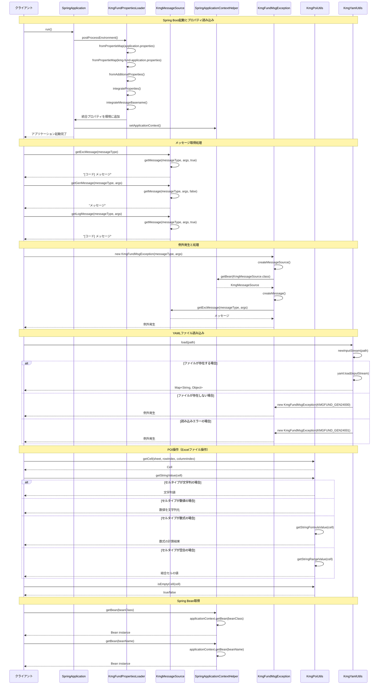

# 基盤全体の設計書

## 1. クラス図

```mermaid
classDiagram
    %% 例外クラス階層（kmg-coreから継承）
    KmgMsgException <|-- KmgFundMsgException
    KmgValException <|-- KmgFundValException

    %% メッセージタイプ階層（kmg-coreから継承）
    KmgFundCmnMsgTypes <|-- KmgFundCmnExcMsgTypes
    KmgFundCmnMsgTypes <|-- KmgFundCmnGenMsgTypes
    KmgFundCmnMsgTypes <|-- KmgFundCmnLogMsgTypes
    KmgFundCmnExcMsgTypes <|-- KmgFundCmnValMsgTypes

    KmgCmnMsgTypes <|-- KmgFundCmnMsgTypes
    KmgCmnExcMsgTypes <|-- KmgFundCmnExcMsgTypes
    KmgCmnGenMsgTypes <|-- KmgFundCmnGenMsgTypes
    KmgCmnLogMsgTypes <|-- KmgFundCmnLogMsgTypes
    KmgCmnValMsgTypes <|-- KmgFundCmnValMsgTypes

    %% ドメイン型定義（kmg-coreから継承）
    KmgCmnTypes~String~ <|-- KmgApplicationPropertyFileTypes
    KmgCmnTypes~String~ <|-- KmgApplicationPropertyKeyTypes

    %% メッセージタイプ実装
    KmgFundCmnGenMsgTypes <|.. KmgFundGenMsgTypes
    KmgFundCmnExcMsgTypes <|.. KmgFundGenMsgTypes
    KmgFundCmnLogMsgTypes <|.. KmgFundLogMsgTypes
    KmgFundCmnValMsgTypes <|.. KmgFundValMsgTypes
    KmgFundCmnExcMsgTypes <|.. KmgFundValMsgTypes

    %% モデルインターフェースと実装（kmg-coreから継承）
    KmgValDataModel <|-- KmgValDataModelImpl
    KmgValDataModelImpl <|-- KmgFundValDataModelImpl
    KmgValsModel <|-- KmgValsModelImpl
    KmgValsModelImpl <|-- KmgFundValsModelImpl

    %% Spring連携
    EnvironmentPostProcessor <|.. KmgFundPropertiesLoader
    ApplicationContextAware <|.. SpringApplicationContextHelper

    %% 例外クラス
    class KmgFundMsgException {
        -KmgMessageSource messageSource
        +KmgFundMsgException(KmgFundCmnExcMsgTypes messageTypes)
        +KmgFundMsgException(KmgFundCmnExcMsgTypes messageTypes, Object[] messageArgs)
        +KmgFundMsgException(KmgFundCmnExcMsgTypes messageTypes, Object[] messageArgs, Throwable cause)
        +KmgFundMsgException(KmgFundCmnExcMsgTypes messageTypes, Throwable cause)
        #String createMessage()
        #void createMessageSource()
    }

    class KmgFundValException {
        +KmgFundValException(KmgValsModel validationsModel)
        +KmgFundValException(KmgValsModel validationsModel, Throwable cause)
    }

    %% 共通メッセージインターフェース
    class KmgFundCmnMsgTypes {
        <<interface>>
    }

    class KmgFundCmnExcMsgTypes {
        <<interface>>
    }

    class KmgFundCmnGenMsgTypes {
        <<interface>>
    }

    class KmgFundCmnLogMsgTypes {
        <<interface>>
    }

    class KmgFundCmnValMsgTypes {
        <<interface>>
    }

    %% ドメイン型定義クラス
    class KmgApplicationPropertyFileTypes {
        <<enumeration>>
        +NONE, APPLICATION_PROPERTIES, KMG_FUND_APPLICATION_PROPERTIES, KMG_APPLICATION_PROPERTIES
        -String displayName
        -String key
        -String detail
        +static KmgApplicationPropertyFileTypes getDefault()
        +static KmgApplicationPropertyFileTypes getEnum(String key)
        +static KmgApplicationPropertyFileTypes getInitValue()
    }

    class KmgApplicationPropertyKeyTypes {
        <<enumeration>>
        +NONE, SPRING_MESSAGES_BASENAME
        -String displayName
        -String key
        -String detail
        +static KmgApplicationPropertyKeyTypes getDefault()
        +static KmgApplicationPropertyKeyTypes getEnum(String key)
        +static KmgApplicationPropertyKeyTypes getInitValue()
    }

    %% メッセージ型定義クラス
    class KmgFundGenMsgTypes {
        <<enumeration>>
        +NONE, KMGFUND_GEN24000, KMGFUND_GEN24001
        -String displayName
        -String key
        -String value
        -String detail
        +static KmgFundGenMsgTypes getDefault()
        +static KmgFundGenMsgTypes getEnum(String key)
        +static KmgFundGenMsgTypes getInitValue()
    }

    class KmgFundLogMsgTypes {
        <<enumeration>>
        +NONE
        -String displayName
        -String key
        -String value
        -String detail
        +static KmgFundLogMsgTypes getDefault()
        +static KmgFundLogMsgTypes getEnum(String key)
        +static KmgFundLogMsgTypes getInitValue()
    }

    class KmgFundValMsgTypes {
        <<enumeration>>
        +NONE
        -String displayName
        -String key
        -String value
        -String detail
        +static KmgFundValMsgTypes getDefault()
        +static KmgFundValMsgTypes getEnum(String key)
        +static KmgFundValMsgTypes getInitValue()
    }

    %% Spring設定クラス
    class KmgFundPropertiesLoader {
        -Map~String,Object~ integratedPropertieMap
        -Map~String,Object~ mainPropertieMap
        -Map~String,Object~ kmgFundPropertieMap
        -Map~String,Object~ additionalPropertieMap
        +KmgFundPropertiesLoader()
        +void postProcessEnvironment(ConfigurableEnvironment environment, SpringApplication application)
        #void fromAdditionalProperties(Map~String,Object~ additionalPropertieMap)
        #void integrateProperties(Map~String,Object~ integratedPropertieMap)
        #static void fromPropertieMap(Resource resource, Map~String,Object~ propertieMap)
        -void integrateMessageBasename(Map~String,Object~ propertyMap, String propertyKey)
    }

    %% Springコンテキストヘルパー
    class SpringApplicationContextHelper {
        -static ApplicationContext applicationContext
        +static ~T~ getBean(Class~T~ beanClass)
        +static ~T~ getBean(String beanName)
        +void setApplicationContext(ApplicationContext applicationContext)
        -SpringApplicationContextHelper()
    }

    %% メッセージソース
    class KmgMessageSource {
        -static String CODE_EMBEDDING_FORMAT
        -MessageSource messageSource
        +String getExcMessage(KmgCmnExcMsgTypes type)
        +String getExcMessage(KmgCmnExcMsgTypes type, Object[] args)
        +String getGenMessage(KmgCmnGenMsgTypes type)
        +String getGenMessage(KmgCmnGenMsgTypes type, Object[] args)
        +String getLogMessage(KmgCmnLogMsgTypes type)
        +String getLogMessage(KmgCmnLogMsgTypes type, Object[] args)
        +String getMessage(KmgCmnMsgTypes type, boolean codeEmbeddingFlag)
        +String getMessage(KmgCmnMsgTypes type, Object[] args, boolean codeEmbeddingFlag)
    }

    %% モデル実装クラス
    class KmgFundValDataModelImpl {
        -KmgMessageSource messageSource
        +KmgFundValDataModelImpl(KmgFundCmnValMsgTypes messageTypes, Object[] messageArgs)
        #String createMessage()
        #void createMessageSource()
    }

    class KmgFundValsModelImpl {
        +KmgFundValsModelImpl()
    }

    %% ユーティリティクラス
    class KmgPoiUtils {
        +static Cell getCell(Sheet sheet, int rowIndex, int columnIndex)
        +static String getStringValue(Cell cell)
        +static String getStringFormulaValue(Cell cell)
        +static String getStringRangeValue(Cell cell)
        +static boolean isEmptyCell(Cell cell)
        -KmgPoiUtils()
    }

    class KmgYamlUtils {
        +static Map~String,Object~ load(Path path)
        -KmgYamlUtils()
    }

    %% Springアプリケーション
    class KmgFundApplication {
        +static void main(String[] args)
    }

    %% 関係性
    KmgFundMsgException --> KmgFundCmnExcMsgTypes : uses
    KmgFundMsgException --> KmgMessageSource : uses
    KmgFundValException --> KmgValsModel : uses
    KmgFundPropertiesLoader --> KmgApplicationPropertyFileTypes : uses
    KmgFundPropertiesLoader --> KmgApplicationPropertyKeyTypes : uses
    KmgMessageSource --> KmgCmnMsgTypes : uses
    KmgFundValDataModelImpl --> KmgFundCmnValMsgTypes : uses
    KmgFundValDataModelImpl --> KmgMessageSource : uses
    KmgFundValDataModelImpl --> SpringApplicationContextHelper : uses
    KmgYamlUtils --> KmgFundMsgException : throws
    KmgYamlUtils --> KmgFundGenMsgTypes : uses
    SpringApplicationContextHelper --> ApplicationContext : uses
```



## 2. シーケンス図



## 3. パッケージ構造

kmg-fund は以下のパッケージ構造で構成されています：

### 3.1 ドメイン層 (domain)

アプリケーションプロパティに関する型定義を提供します。

- **types**: アプリケーションプロパティに関する型定義
  - `KmgApplicationPropertyFileTypes`: プロパティファイルの種類
  - `KmgApplicationPropertyKeyTypes`: プロパティキーの種類

**詳細:** [ドメイン層の設計書](./ドメイン層の設計書.md)

### 3.2 インフラストラクチャ層 (infrastructure)

KMG 基盤の技術的な実装を提供します。

#### 3.2.1 共通機能 (cmn)

メッセージタイプの基底インターフェースを提供します。

**詳細:** [インフラストラクチャ層共通層の設計書](./インフラストラクチャ層共通層の設計書.md)

#### 3.2.2 設定 (config)

Spring Boot プロパティファイルの統合管理機能を提供します。

**詳細:** [インフラストラクチャ層設定機能層の設計書](./インフラストラクチャ層設定機能層の設計書.md)

#### 3.2.3 コンテキスト (context)

Spring アプリケーションコンテキストとメッセージリソースへのアクセスを提供します。

**詳細:** [インフラストラクチャ層コンテキスト管理層の設計書](./インフラストラクチャ層コンテキスト管理層の設計書.md)

#### 3.2.4 例外処理 (exception)

KMG 基盤専用の例外クラスを提供します。

**詳細:** [インフラストラクチャ層例外処理層の設計書](./インフラストラクチャ層例外処理層の設計書.md)

#### 3.2.5 モデル (model)

バリデーション機能を提供するモデルクラスを提供します。

**詳細:** [インフラストラクチャ層モデル層の設計書](./インフラストラクチャ層モデル層の設計書.md)

#### 3.2.6 型定義 (types)

メッセージの種類を定義する列挙型を提供します。

**詳細:** [インフラストラクチャ層型定義層の設計書](./インフラストラクチャ層型定義層の設計書.md)

#### 3.2.7 ユーティリティ (utils)

ファイル操作に関する汎用的な機能を提供します。

**詳細:** [インフラストラクチャ層ユーティリティ層の設計書](./インフラストラクチャ層ユーティリティ層の設計書.md)

#### 3.2.8 テスト (test)

JUnit テスト用の基底クラスと検証メソッドを提供します。

**詳細:** [インフラストラクチャ層テスト支援層の設計書](./インフラストラクチャ層テスト支援層の設計書.md)

**インフラストラクチャ層全体の詳細:** [インフラストラクチャ層の設計書](./インフラストラクチャ層の設計書.md)

### 3.3 アプリケーション

- `KmgFundApplication`: KMG 基盤の Spring Boot アプリケーションクラス

## 4. 主要コンポーネント

### 4.1 プロパティ管理システム

Spring Boot アプリケーションのプロパティファイルを統合管理する機能を提供します。

**詳細:** [インフラストラクチャ層設定機能層の設計書](./インフラストラクチャ層設定機能層の設計書.md)

### 4.2 メッセージ管理システム

国際化対応のメッセージ管理機能を提供します（例外用、一般用、ログ用）。

**詳細:**

- [インフラストラクチャ層コンテキスト管理層の設計書](./インフラストラクチャ層コンテキスト管理層の設計書.md)
- [インフラストラクチャ層型定義層の設計書](./インフラストラクチャ層型定義層の設計書.md)

### 4.3 例外処理システム

kmg-core の例外クラスを拡張した基盤専用例外を提供します。

**詳細:** [インフラストラクチャ層例外処理層の設計書](./インフラストラクチャ層例外処理層の設計書.md)

### 4.4 Spring 統合機能

Spring Framework との統合機能を提供します。

**詳細:** [インフラストラクチャ層コンテキスト管理層の設計書](./インフラストラクチャ層コンテキスト管理層の設計書.md)

### 4.5 ユーティリティ機能

Excel（Apache POI）と YAML ファイルの操作機能を提供します。

**詳細:** [インフラストラクチャ層ユーティリティ層の設計書](./インフラストラクチャ層ユーティリティ層の設計書.md)

### 4.6 バリデーション機能

kmg-core のバリデーション機能を拡張し、Spring 統合されたバリデーションを提供します。

**詳細:** [インフラストラクチャ層モデル層の設計書](./インフラストラクチャ層モデル層の設計書.md)

### 4.7 テスト支援機能

JUnit テスト用の基底クラスと例外検証メソッドを提供します。

**詳細:** [インフラストラクチャ層テスト支援層の設計書](./インフラストラクチャ層テスト支援層の設計書.md)

## 5. 設計原則

### 5.1 Spring 統合

- Spring Boot のライフサイクルに統合
- Spring 管理 Bean の活用
- 設定ファイルの外部化

### 5.2 拡張性

- プロパティローダーのサブクラス化による機能拡張
- 追加プロパティの読み込み機構
- カスタム統合ロジックの実装

### 5.3 国際化対応

- Spring のメッセージソース機能を活用
- ロケールに応じたメッセージ提供
- メッセージコードによる一元管理

### 5.4 型安全性

- kmg-core の型定義システムを継承
- enum によるメッセージタイプの定義
- コンパイル時の型チェック

### 5.5 例外処理

- kmg-core の例外階層を継承
- Spring 管理のメッセージソースによる詳細なエラー情報
- 適切な例外の使い分け

### 5.6 テスト容易性

- テスト基底クラスの提供
- 例外検証メソッドの提供
- モック化しやすい設計

## 6. 使用例

各機能の詳細な使用例は、各層の設計書を参照してください。

### 6.1 プロパティ管理

プロパティファイルの読み込みと統合機能の使用例は、[インフラストラクチャ層設定機能層の設計書](./インフラストラクチャ層設定機能層の設計書.md) を参照してください。

### 6.2 メッセージ取得

メッセージの取得方法は、[インフラストラクチャ層コンテキスト管理層の設計書](./インフラストラクチャ層コンテキスト管理層の設計書.md) を参照してください。

### 6.3 例外処理

例外の発生とハンドリングの例は、[インフラストラクチャ層例外処理層の設計書](./インフラストラクチャ層例外処理層の設計書.md) を参照してください。

### 6.4 Spring Bean 取得

Spring 管理外のクラスからの Bean 取得方法は、[インフラストラクチャ層コンテキスト管理層の設計書](./インフラストラクチャ層コンテキスト管理層の設計書.md) を参照してください。

### 6.5 ファイル操作

Excel と YAML ファイルの操作例は、[インフラストラクチャ層ユーティリティ層の設計書](./インフラストラクチャ層ユーティリティ層の設計書.md) を参照してください。

### 6.6 バリデーション

バリデーション機能の使用例は、[インフラストラクチャ層モデル層の設計書](./インフラストラクチャ層モデル層の設計書.md) を参照してください。

### 6.7 テスト

テストでの例外検証方法は、[インフラストラクチャ層テスト支援層の設計書](./インフラストラクチャ層テスト支援層の設計書.md) を参照してください。

## 7. アーキテクチャ上の位置づけ

### 7.1 kmg-core との関係

kmg-fund は、kmg-core を基盤として以下の機能を追加します：

- **Spring 統合**: Spring Boot アプリケーションとしての機能
- **プロパティ管理**: 複数プロパティファイルの統合管理
- **メッセージ管理**: Spring メッセージソースとの統合
- **コンテキスト管理**: Spring 管理 Bean へのアクセス Helpers
- **ファイル操作**: Excel（POI）と YAML の操作

### 7.2 上位モジュールでの使用

kmg-fund は、以下のような上位モジュール（例: kmg-tool）の基盤として機能します：

- Spring Boot アプリケーションの起動と設定
- メッセージリソースの一元管理
- 共通例外処理
- ファイル操作の共通化
- テスト基盤の提供

### 7.3 レイヤーアーキテクチャ

```text
┌─────────────────────────────────────┐
│     上位アプリケーション層          │
│     (kmg-tool, etc.)                │
├─────────────────────────────────────┤
│     基盤層 (kmg-fund)               │
│  - Spring統合                       │
│  - メッセージ管理                   │
│  - プロパティ管理                   │
│  - ファイル操作ユーティリティ      │
├─────────────────────────────────────┤
│     コア層 (kmg-core)               │
│  - 基本的な型定義                   │
│  - 例外処理                         │
│  - 基本ユーティリティ              │
├─────────────────────────────────────┤
│     Java標準ライブラリ /            │
│     サードパーティライブラリ        │
│  (Spring, Apache POI, SnakeYAML)    │
└─────────────────────────────────────┘
```

## 8. 今後の拡張予定

### 8.1 追加メッセージタイプ

- より詳細なエラーメッセージの定義
- 国際化対応の拡充

### 8.2 追加ユーティリティ

- CSV ファイル操作
- JSON ファイル操作
- その他のファイル形式対応

### 8.3 設定管理の強化

- 環境別設定の管理
- 動的な設定の再読み込み
- 設定のバリデーション機能

### 8.4 ロギング機能の強化

- 構造化ログの出力
- ログレベルの動的変更
- ログのフィルタリング機能
