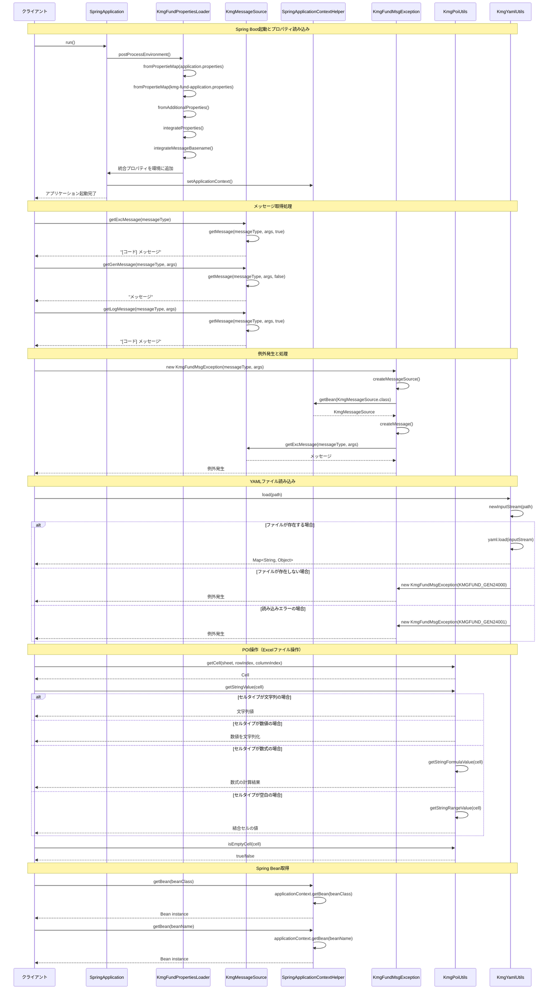

# 基盤全体の設計書

## 1. クラス図

```mermaid
classDiagram
    %% 例外クラス階層（kmg-coreから継承）
    KmgMsgException <|-- KmgFundMsgException
    KmgValException <|-- KmgFundValException

    %% メッセージタイプ階層（kmg-coreから継承）
    KmgFundCmnMsgTypes <|-- KmgFundCmnExcMsgTypes
    KmgFundCmnMsgTypes <|-- KmgFundCmnGenMsgTypes
    KmgFundCmnMsgTypes <|-- KmgFundCmnLogMsgTypes
    KmgFundCmnExcMsgTypes <|-- KmgFundCmnValMsgTypes

    KmgCmnMsgTypes <|-- KmgFundCmnMsgTypes
    KmgCmnExcMsgTypes <|-- KmgFundCmnExcMsgTypes
    KmgCmnGenMsgTypes <|-- KmgFundCmnGenMsgTypes
    KmgCmnLogMsgTypes <|-- KmgFundCmnLogMsgTypes
    KmgCmnValMsgTypes <|-- KmgFundCmnValMsgTypes

    %% ドメイン型定義（kmg-coreから継承）
    KmgCmnTypes~String~ <|-- KmgApplicationPropertyFileTypes
    KmgCmnTypes~String~ <|-- KmgApplicationPropertyKeyTypes

    %% メッセージタイプ実装
    KmgFundCmnGenMsgTypes <|.. KmgFundGenMsgTypes
    KmgFundCmnExcMsgTypes <|.. KmgFundGenMsgTypes
    KmgFundCmnLogMsgTypes <|.. KmgFundLogMsgTypes
    KmgFundCmnValMsgTypes <|.. KmgFundValMsgTypes
    KmgFundCmnExcMsgTypes <|.. KmgFundValMsgTypes

    %% モデルインターフェースと実装（kmg-coreから継承）
    KmgValDataModel <|-- KmgValDataModelImpl
    KmgValDataModelImpl <|-- KmgFundValDataModelImpl
    KmgValsModel <|-- KmgValsModelImpl
    KmgValsModelImpl <|-- KmgFundValsModelImpl

    %% Spring連携
    EnvironmentPostProcessor <|.. KmgFundPropertiesLoader
    ApplicationContextAware <|.. SpringApplicationContextHelper

    %% 例外クラス
    class KmgFundMsgException {
        -KmgMessageSource messageSource
        +KmgFundMsgException(KmgFundCmnExcMsgTypes messageTypes)
        +KmgFundMsgException(KmgFundCmnExcMsgTypes messageTypes, Object[] messageArgs)
        +KmgFundMsgException(KmgFundCmnExcMsgTypes messageTypes, Object[] messageArgs, Throwable cause)
        +KmgFundMsgException(KmgFundCmnExcMsgTypes messageTypes, Throwable cause)
        #String createMessage()
        #void createMessageSource()
    }

    class KmgFundValException {
        +KmgFundValException(KmgValsModel validationsModel)
        +KmgFundValException(KmgValsModel validationsModel, Throwable cause)
    }

    %% 共通メッセージインターフェース
    class KmgFundCmnMsgTypes {
        <<interface>>
    }

    class KmgFundCmnExcMsgTypes {
        <<interface>>
    }

    class KmgFundCmnGenMsgTypes {
        <<interface>>
    }

    class KmgFundCmnLogMsgTypes {
        <<interface>>
    }

    class KmgFundCmnValMsgTypes {
        <<interface>>
    }

    %% ドメイン型定義クラス
    class KmgApplicationPropertyFileTypes {
        <<enumeration>>
        +NONE, APPLICATION_PROPERTIES, KMG_FUND_APPLICATION_PROPERTIES, KMG_APPLICATION_PROPERTIES
        -String displayName
        -String key
        -String detail
        +static KmgApplicationPropertyFileTypes getDefault()
        +static KmgApplicationPropertyFileTypes getEnum(String key)
        +static KmgApplicationPropertyFileTypes getInitValue()
    }

    class KmgApplicationPropertyKeyTypes {
        <<enumeration>>
        +NONE, SPRING_MESSAGES_BASENAME
        -String displayName
        -String key
        -String detail
        +static KmgApplicationPropertyKeyTypes getDefault()
        +static KmgApplicationPropertyKeyTypes getEnum(String key)
        +static KmgApplicationPropertyKeyTypes getInitValue()
    }

    %% メッセージ型定義クラス
    class KmgFundGenMsgTypes {
        <<enumeration>>
        +NONE, KMGFUND_GEN24000, KMGFUND_GEN24001
        -String displayName
        -String key
        -String value
        -String detail
        +static KmgFundGenMsgTypes getDefault()
        +static KmgFundGenMsgTypes getEnum(String key)
        +static KmgFundGenMsgTypes getInitValue()
    }

    class KmgFundLogMsgTypes {
        <<enumeration>>
        +NONE
        -String displayName
        -String key
        -String value
        -String detail
        +static KmgFundLogMsgTypes getDefault()
        +static KmgFundLogMsgTypes getEnum(String key)
        +static KmgFundLogMsgTypes getInitValue()
    }

    class KmgFundValMsgTypes {
        <<enumeration>>
        +NONE
        -String displayName
        -String key
        -String value
        -String detail
        +static KmgFundValMsgTypes getDefault()
        +static KmgFundValMsgTypes getEnum(String key)
        +static KmgFundValMsgTypes getInitValue()
    }

    %% Spring設定クラス
    class KmgFundPropertiesLoader {
        -Map~String,Object~ integratedPropertieMap
        -Map~String,Object~ mainPropertieMap
        -Map~String,Object~ kmgFundPropertieMap
        -Map~String,Object~ additionalPropertieMap
        +KmgFundPropertiesLoader()
        +void postProcessEnvironment(ConfigurableEnvironment environment, SpringApplication application)
        #void fromAdditionalProperties(Map~String,Object~ additionalPropertieMap)
        #void integrateProperties(Map~String,Object~ integratedPropertieMap)
        #static void fromPropertieMap(Resource resource, Map~String,Object~ propertieMap)
        -void integrateMessageBasename(Map~String,Object~ propertyMap, String propertyKey)
    }

    %% Springコンテキストヘルパー
    class SpringApplicationContextHelper {
        -static ApplicationContext applicationContext
        +static ~T~ getBean(Class~T~ beanClass)
        +static ~T~ getBean(String beanName)
        +void setApplicationContext(ApplicationContext applicationContext)
        -SpringApplicationContextHelper()
    }

    %% メッセージソース
    class KmgMessageSource {
        -static String CODE_EMBEDDING_FORMAT
        -MessageSource messageSource
        +String getExcMessage(KmgCmnExcMsgTypes type)
        +String getExcMessage(KmgCmnExcMsgTypes type, Object[] args)
        +String getGenMessage(KmgCmnGenMsgTypes type)
        +String getGenMessage(KmgCmnGenMsgTypes type, Object[] args)
        +String getLogMessage(KmgCmnLogMsgTypes type)
        +String getLogMessage(KmgCmnLogMsgTypes type, Object[] args)
        +String getMessage(KmgCmnMsgTypes type, boolean codeEmbeddingFlag)
        +String getMessage(KmgCmnMsgTypes type, Object[] args, boolean codeEmbeddingFlag)
    }

    %% モデル実装クラス
    class KmgFundValDataModelImpl {
        -KmgMessageSource messageSource
        +KmgFundValDataModelImpl(KmgFundCmnValMsgTypes messageTypes, Object[] messageArgs)
        #String createMessage()
        #void createMessageSource()
    }

    class KmgFundValsModelImpl {
        +KmgFundValsModelImpl()
    }

    %% ユーティリティクラス
    class KmgPoiUtils {
        +static Cell getCell(Sheet sheet, int rowIndex, int columnIndex)
        +static String getStringValue(Cell cell)
        +static String getStringFormulaValue(Cell cell)
        +static String getStringRangeValue(Cell cell)
        +static boolean isEmptyCell(Cell cell)
        -KmgPoiUtils()
    }

    class KmgYamlUtils {
        +static Map~String,Object~ load(Path path)
        -KmgYamlUtils()
    }

    %% テスト基底クラス
    class AbstractKmgJunitTest {
        +AbstractKmgJunitTest()
        #void verifyKmgMsgException(KmgFundMsgException actualException, Class~?~ expectedCauseClass, String expectedDomainMessage, KmgFundCmnExcMsgTypes expectedMessageTypes)
        #void verifyKmgMsgException(KmgFundMsgException actualException, String expectedDomainMessage, KmgFundCmnExcMsgTypes expectedMessageTypes)
        #void verifyKmgMsgException(KmgMsgException actualException, Class~?~ expectedCauseClass, String expectedDomainMessage, KmgCmnGenMsgTypes expectedMessageTypes)
        #void verifyKmgMsgException(KmgMsgException actualException, String expectedDomainMessage, KmgCmnGenMsgTypes expectedMessageTypes)
    }

    %% Springアプリケーション
    class KmgFundApplication {
        +static void main(String[] args)
    }

    %% 関係性
    KmgFundMsgException --> KmgFundCmnExcMsgTypes : uses
    KmgFundMsgException --> KmgMessageSource : uses
    KmgFundValException --> KmgValsModel : uses
    KmgFundPropertiesLoader --> KmgApplicationPropertyFileTypes : uses
    KmgFundPropertiesLoader --> KmgApplicationPropertyKeyTypes : uses
    KmgMessageSource --> KmgCmnMsgTypes : uses
    KmgFundValDataModelImpl --> KmgFundCmnValMsgTypes : uses
    KmgFundValDataModelImpl --> KmgMessageSource : uses
    KmgFundValDataModelImpl --> SpringApplicationContextHelper : uses
    KmgYamlUtils --> KmgFundMsgException : throws
    KmgYamlUtils --> KmgFundGenMsgTypes : uses
    AbstractKmgJunitTest --> KmgFundMsgException : uses
    AbstractKmgJunitTest --> KmgFundCmnExcMsgTypes : uses
    SpringApplicationContextHelper --> ApplicationContext : uses
```



## 2. シーケンス図



## 3. パッケージ構造

kmg-fund は以下のパッケージ構造で構成されています：

### 3.1 ドメイン層 (domain)

- **types**: アプリケーションプロパティに関する型定義
  - `KmgApplicationPropertyFileTypes`: プロパティファイルの種類
  - `KmgApplicationPropertyKeyTypes`: プロパティキーの種類

### 3.2 インフラストラクチャ層 (infrastructure)

#### 3.2.1 共通機能 (cmn)

- **msg**: メッセージタイプの定義
  - `KmgFundCmnMsgTypes`: 基盤共通メッセージの種類インターフェース
  - `KmgFundCmnExcMsgTypes`: 基盤例外メッセージの種類インターフェース
  - `KmgFundCmnGenMsgTypes`: 基盤一般メッセージの種類インターフェース
  - `KmgFundCmnLogMsgTypes`: 基盤ログメッセージの種類インターフェース
  - `KmgFundCmnValMsgTypes`: 基盤バリデーションメッセージの種類インターフェース

#### 3.2.2 設定 (config)

- `KmgFundPropertiesLoader`: Spring Boot 起動時にプロパティファイルを読み込み、環境設定を行うクラス

#### 3.2.3 コンテキスト (context)

- `KmgMessageSource`: メッセージリソースを管理し、多言語対応のメッセージを提供するクラス
- `SpringApplicationContextHelper`: Spring のアプリケーションコンテキストへアクセスするための静的ヘルパークラス

#### 3.2.4 例外処理 (exception)

- `KmgFundMsgException`: KMG 基盤メッセージ例外クラス
- `KmgFundValException`: KMG 基盤バリデーション例外クラス

#### 3.2.5 モデル (model)

- **val/impl**: バリデーションモデル実装
  - `KmgFundValDataModelImpl`: バリデーションデータモデルの実装クラス
  - `KmgFundValsModelImpl`: バリデーション集合モデルの実装クラス

#### 3.2.6 型定義 (types)

- **msg**: メッセージ型の実装
  - `KmgFundGenMsgTypes`: 基盤一般メッセージの種類
  - `KmgFundLogMsgTypes`: 基盤ログメッセージの種類
  - `KmgFundValMsgTypes`: 基盤バリデーションメッセージの種類

#### 3.2.7 ユーティリティ (utils)

- `KmgPoiUtils`: Apache POI を使用した Excel ファイル操作のユーティリティクラス
- `KmgYamlUtils`: YAML ファイルの読み込みと解析を行うユーティリティクラス

#### 3.2.8 テスト (test)

- `AbstractKmgJunitTest`: JUnit テストの抽象基底クラス

### 3.3 アプリケーション

- `KmgFundApplication`: KMG 基盤の Spring Boot アプリケーションクラス

## 4. 主要コンポーネント

### 4.1 プロパティ管理システム

kmg-fund は Spring Boot アプリケーションのプロパティファイルを統合管理する機能を提供します：

1. **KmgFundPropertiesLoader**: `EnvironmentPostProcessor`を実装し、起動時に複数のプロパティファイルを読み込み統合

   - `application.properties`: メインプロパティファイル
   - `kmg-fund-application.properties`: KMG 基盤専用プロパティファイル
   - サブクラスで追加プロパティの読み込みが可能（拡張ポイント）

2. **プロパティ統合機能**:
   - メッセージベース名（`spring.messages.basename`）をカンマ区切りで統合
   - サブクラスで独自の統合ロジックを実装可能

### 4.2 メッセージ管理システム

国際化対応のメッセージ管理機能：

1. **KmgMessageSource**: Spring の`MessageSource`をラップし、メッセージを取得

   - 例外用メッセージ: コード埋め込みあり（例: `[E001] エラーメッセージ`）
   - 一般メッセージ: コード埋め込みなし
   - ログメッセージ: コード埋め込みあり

2. **メッセージタイプ**: 型安全なメッセージ管理
   - `KmgFundGenMsgTypes`: 一般メッセージ
   - `KmgFundLogMsgTypes`: ログメッセージ
   - `KmgFundValMsgTypes`: バリデーションメッセージ

### 4.3 例外処理システム

kmg-core の例外クラスを拡張した基盤専用例外：

1. **KmgFundMsgException**: メッセージ付き例外

   - Spring 管理のメッセージソースを使用
   - メッセージコードと引数による多言語対応

2. **KmgFundValException**: バリデーション例外
   - 複数のバリデーションエラーを保持

### 4.4 Spring 統合機能

Spring Framework との統合機能：

1. **SpringApplicationContextHelper**: 静的メソッドで Bean 取得

   - クラス型による Bean 取得
   - Bean 名による Bean 取得
   - 非 Spring 管理クラスからの Bean 取得を可能にする

2. **コンテキスト管理**: `ApplicationContextAware`を実装し、起動時にコンテキストを保持

### 4.5 ユーティリティ機能

#### 4.5.1 Excel 操作（KmgPoiUtils）

Apache POI を使用した Excel ファイル操作：

- セル値の取得（文字列、数値、真偽値）
- 数式セルの評価
- 結合セルの値取得
- 空セルの判定

#### 4.5.2 YAML 操作（KmgYamlUtils）

YAML ファイルの読み込みと解析：

- YAML ファイルを Map オブジェクトとして読み込み
- ファイル不存在、読み込みエラーの適切な例外処理

### 4.6 バリデーション機能

kmg-core のバリデーション機能を拡張：

1. **KmgFundValDataModelImpl**: Spring 管理のメッセージソースを使用したバリデーションデータ
2. **KmgFundValsModelImpl**: バリデーション集合の実装

### 4.7 テスト支援機能

JUnit テスト用の基底クラス：

- **AbstractKmgJunitTest**: 例外検証メソッドを提供
  - KmgFundMsgException の検証
  - KmgMsgException の検証
  - メッセージ内容、原因、メッセージタイプの検証

## 5. 設計原則

### 5.1 Spring 統合

- Spring Boot のライフサイクルに統合
- Spring 管理 Bean の活用
- 設定ファイルの外部化

### 5.2 拡張性

- プロパティローダーのサブクラス化による機能拡張
- 追加プロパティの読み込み機構
- カスタム統合ロジックの実装

### 5.3 国際化対応

- Spring のメッセージソース機能を活用
- ロケールに応じたメッセージ提供
- メッセージコードによる一元管理

### 5.4 型安全性

- kmg-core の型定義システムを継承
- enum によるメッセージタイプの定義
- コンパイル時の型チェック

### 5.5 例外処理

- kmg-core の例外階層を継承
- Spring 管理のメッセージソースによる詳細なエラー情報
- 適切な例外の使い分け

### 5.6 テスト容易性

- テスト基底クラスの提供
- 例外検証メソッドの提供
- モック化しやすい設計

## 6. 使用例

### 6.1 Spring Boot アプリケーションの起動

```java
@SpringBootApplication
public class MyApplication {
    public static void main(String[] args) {
        SpringApplication application = new SpringApplication(MyApplication.class);
        Properties properties = new Properties();
        properties.put("spring.config.name", "my-application");
        application.setDefaultProperties(properties);
        application.run(args);
    }
}
```

### 6.2 プロパティローダーのカスタマイズ

```java
@Component
@Order(20)
public class MyPropertiesLoader extends KmgFundPropertiesLoader {

    @Override
    protected void fromAdditionalProperties(Map<String, Object> additionalPropertieMap) {
        Resource resource = new ClassPathResource("my-application.properties");
        KmgFundPropertiesLoader.fromPropertieMap(resource, additionalPropertieMap);
    }

    @Override
    protected void integrateProperties(Map<String, Object> integratedPropertieMap) {
        super.integrateProperties(integratedPropertieMap);
        // カスタム統合ロジック
    }
}
```

### 6.3 メッセージの取得

```java
@Component
public class MyService {

    @Autowired
    private KmgMessageSource messageSource;

    public void doSomething() {
        // 例外用メッセージ（コード埋め込みあり）
        String excMessage = messageSource.getExcMessage(
            KmgFundGenMsgTypes.KMGFUND_GEN24000,
            new Object[] { "/path/to/file.yml" }
        );

        // 一般メッセージ（コード埋め込みなし）
        String genMessage = messageSource.getGenMessage(
            KmgFundGenMsgTypes.KMGFUND_GEN24000,
            new Object[] { "/path/to/file.yml" }
        );

        // ログメッセージ（コード埋め込みあり）
        String logMessage = messageSource.getLogMessage(
            KmgFundLogMsgTypes.NONE
        );
    }
}
```

### 6.4 例外の発生

```java
public void loadYamlFile(Path path) throws KmgFundMsgException {
    if (!Files.exists(path)) {
        throw new KmgFundMsgException(
            KmgFundGenMsgTypes.KMGFUND_GEN24000,
            new Object[] { path.toString() }
        );
    }
}
```

### 6.5 Spring Bean 取得

```java
// Spring管理外のクラスからBeanを取得
KmgMessageSource messageSource =
    SpringApplicationContextHelper.getBean(KmgMessageSource.class);

// Bean名から取得
MyService myService =
    SpringApplicationContextHelper.getBean("myService");
```

### 6.6 YAML ファイルの読み込み

```java
try {
    Path yamlPath = Paths.get("config.yml");
    Map<String, Object> config = KmgYamlUtils.load(yamlPath);

    String value = (String) config.get("key");

} catch (KmgFundMsgException e) {
    // ファイルが存在しない、または読み込みエラー
    logger.error(e.getMessage(), e);
}
```

### 6.7 Excel 操作

```java
try (InputStream is = Files.newInputStream(excelPath);
     Workbook workbook = WorkbookFactory.create(is)) {

    Sheet sheet = workbook.getSheetAt(0);

    // セル値の取得
    Cell cell = KmgPoiUtils.getCell(sheet, 0, 0);
    String value = KmgPoiUtils.getStringValue(cell);

    // 空セルのチェック
    if (KmgPoiUtils.isEmptyCell(cell)) {
        // 空セル処理
    }
}
```

### 6.8 バリデーション

```java
KmgFundValsModelImpl validations = new KmgFundValsModelImpl();

// バリデーション処理
if (input.isEmpty()) {
    KmgFundValDataModelImpl valData = new KmgFundValDataModelImpl(
        KmgFundValMsgTypes.SOME_VALIDATION_ERROR,
        new Object[] { "fieldName" }
    );
    validations.addData(valData);
}

// バリデーションエラーがある場合は例外を投げる
if (validations.isNotEmpty()) {
    throw new KmgFundValException(validations);
}
```

### 6.9 テストでの例外検証

```java
@Test
public void testException() {
    // テスト対象の実行
    KmgFundMsgException exception = assertThrows(
        KmgFundMsgException.class,
        () -> targetService.doSomething()
    );

    // 例外の検証
    verifyKmgMsgException(
        exception,
        null,  // 原因なし
        "[KMGFUND_GEN24000] 該当するYAMLファイルがありません。ファイルパス=[/test/path]",
        KmgFundGenMsgTypes.KMGFUND_GEN24000
    );
}
```

## 7. アーキテクチャ上の位置づけ

### 7.1 kmg-core との関係

kmg-fund は、kmg-core を基盤として以下の機能を追加します：

- **Spring 統合**: Spring Boot アプリケーションとしての機能
- **プロパティ管理**: 複数プロパティファイルの統合管理
- **メッセージ管理**: Spring メッセージソースとの統合
- **コンテキスト管理**: Spring 管理 Bean へのアクセス Helpers
- **ファイル操作**: Excel（POI）と YAML の操作

### 7.2 上位モジュールでの使用

kmg-fund は、以下のような上位モジュール（例: kmg-tool）の基盤として機能します：

- Spring Boot アプリケーションの起動と設定
- メッセージリソースの一元管理
- 共通例外処理
- ファイル操作の共通化
- テスト基盤の提供

### 7.3 レイヤーアーキテクチャ

```text
┌─────────────────────────────────────┐
│     上位アプリケーション層          │
│     (kmg-tool, etc.)                │
├─────────────────────────────────────┤
│     基盤層 (kmg-fund)               │
│  - Spring統合                       │
│  - メッセージ管理                   │
│  - プロパティ管理                   │
│  - ファイル操作ユーティリティ      │
├─────────────────────────────────────┤
│     コア層 (kmg-core)               │
│  - 基本的な型定義                   │
│  - 例外処理                         │
│  - 基本ユーティリティ              │
├─────────────────────────────────────┤
│     Java標準ライブラリ /            │
│     サードパーティライブラリ        │
│  (Spring, Apache POI, SnakeYAML)    │
└─────────────────────────────────────┘
```

## 8. 今後の拡張予定

### 8.1 追加メッセージタイプ

- より詳細なエラーメッセージの定義
- 国際化対応の拡充

### 8.2 追加ユーティリティ

- CSV ファイル操作
- JSON ファイル操作
- その他のファイル形式対応

### 8.3 設定管理の強化

- 環境別設定の管理
- 動的な設定の再読み込み
- 設定のバリデーション機能

### 8.4 ロギング機能の強化

- 構造化ログの出力
- ログレベルの動的変更
- ログのフィルタリング機能
